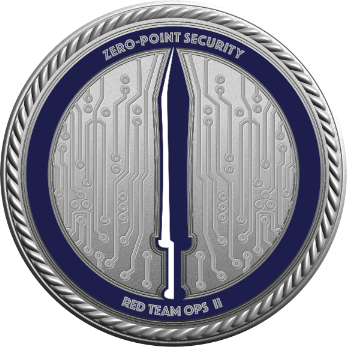
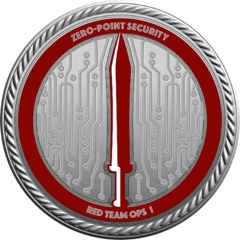
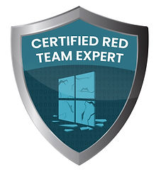

# Welcome, dear visitor!

# Whoami?
I am Jethro, a cybersecurity professional with specialization on offensive security (AD, Network, and web penetration testing). I also do research Defense Evasion and Restriction bypasses focused in Windows Environment. I am also active on joining CTFs and passionate on doing some personal projects. I mainly have experience on Web, reverse engineering, binary exploitation, and malware analysis challenges. You may see the writeups available here if you are interested. 

# Certifications

#### Offensive Security Certified Professional (OSCP)
{: .img-icon }

#### Certified Red Team Lead (CRTL / CRTO II)
{: .img-icon }

#### Certified Red Team Operator (CRTO)
{: .img-icon }

#### eLearnSecurity Certified Penetration Tester eXtreme (eCPTX)
{: .img-icon }

#### Certified Red Team Expert (CRTE)
{: .img-icon }

