# [Reversing] Knight's Quest
The following challenge description has been given: 
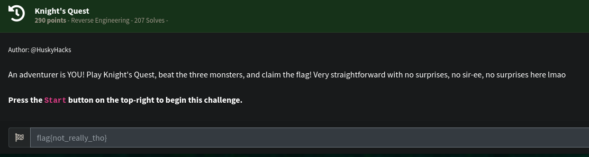 
Once the challenge is started, we can access the website. Here is the landing page: 
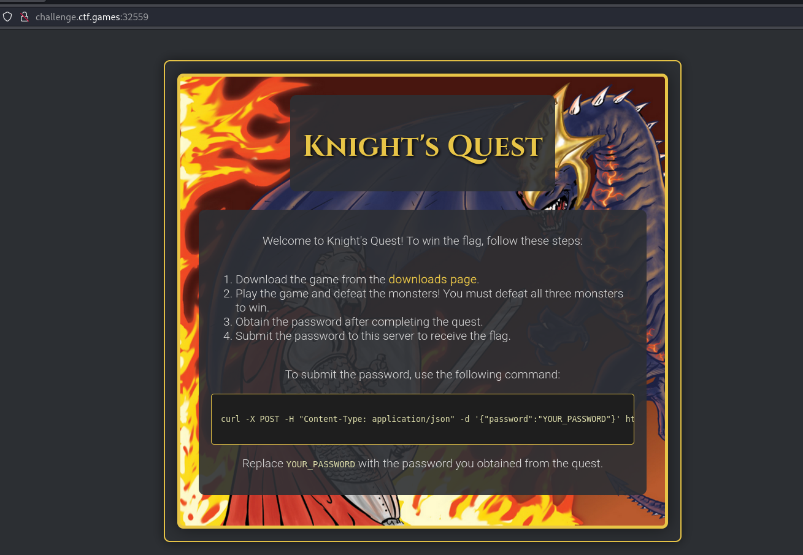 
It instructs us to play the game and win to get the password to get the flag. We can download the game in the "downloads page" to play the game. 
We downloaded the file. 
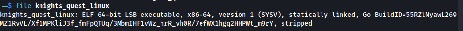 
We run the binary and we tried to play the game. 
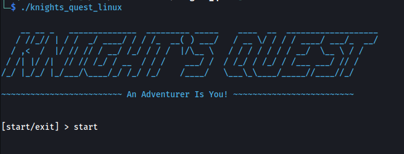 
The first boss is a spider: 
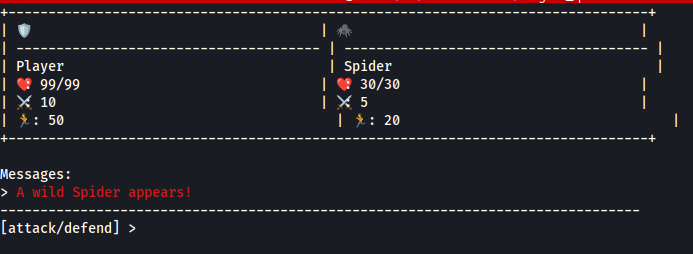 
The second boss is a ogre: 
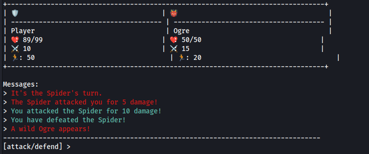 
The last boss is Gorthmog, Destroyer of worlds with ridiculously health and attack points: 
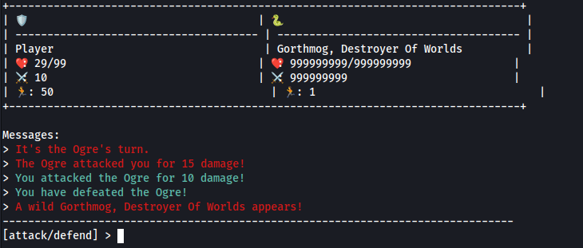 
Of course we lost that one. One of the ways we can defeat Gorthmog is to have a very high attack power as well or if we can just reduce the health points to 1. We proceeded with the latter. The plan is if the health points is already hardcoded within the game binary, perhaps we can patch it to only set it to 1. So we get the hex value of the Gorthmog's health points. 
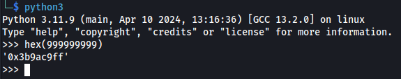 
It's 0x3b9ac9ff. We opened the binary to hexed.it and find the byte sequence `ff c9 9a 3b` and and set it to `01 00 00 00`. We actually found it 
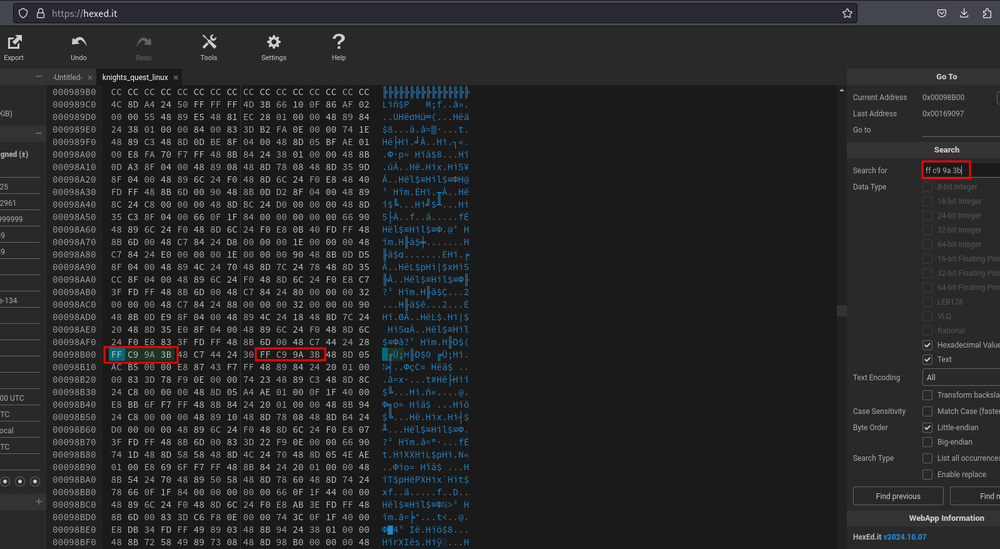 
Then we patched it. 
 
We saved the patched game and replayed it. After defeating the first two bosses, we can see the Gorthmog's health points is just 1 now. This is sure win since we always get to attack first. 
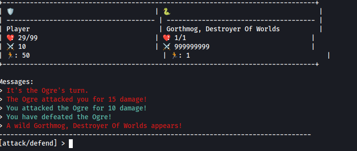 
We got the password. 
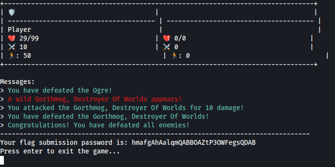 
We submitted it to the challenge URL and got the flag. 
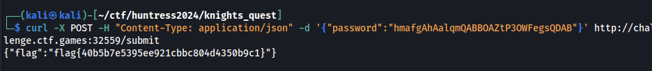 
