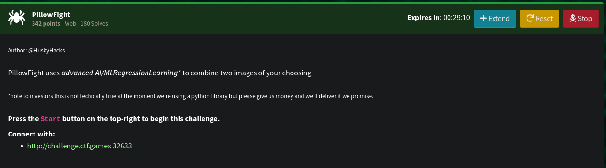
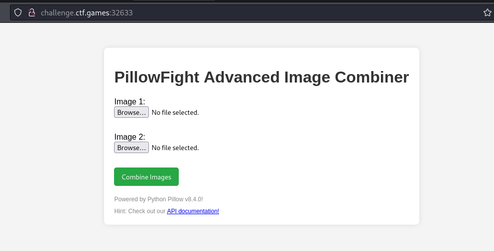
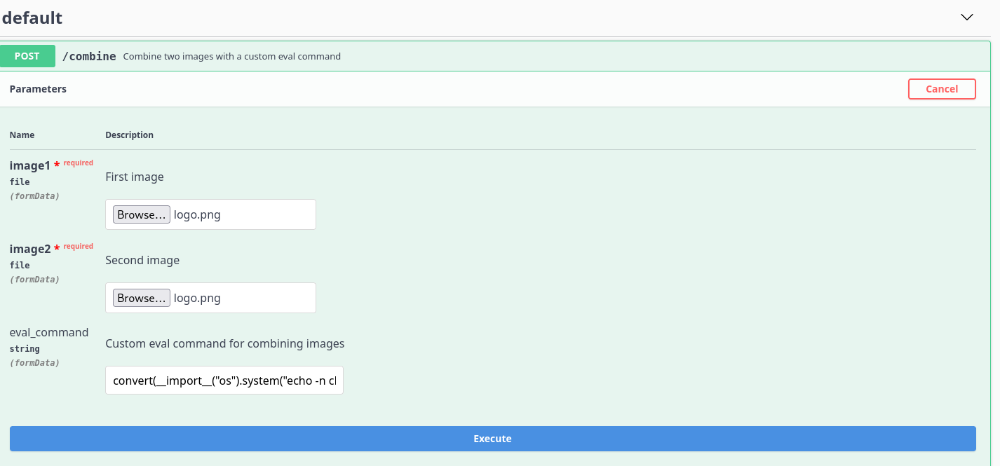
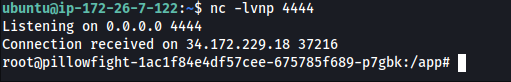
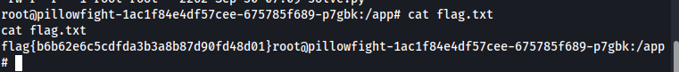

# [Web] Pillow Fight
The following challenge description has been given: 
 
Below is the landing page: 
 
We can also see access the Swagger UI for the available APIs. 
 
Since it accepts "eval\_command", we imagine that it's going to be inserted in an actual `eval()` python command. So we treat the `img1` as an actual variable. We can then substitute this into an actual payload where we can use `__import__('os')...` syntax. As can be seen below, we have tried executing it in place of `img1`.  
 
We received a shell and it's already root! We also got the flag afterwards. 
 
 

