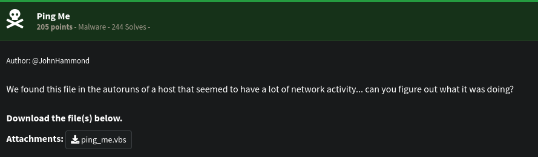
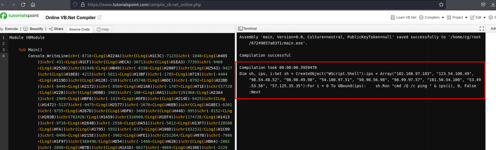

# [Malware] Ping Me
The following challenge description has been given: 
 
We are greeted with a lot of obfuscated VBS code upon opening up the file. 
 
We copied the code after the "Execute" and pasted it on the Console.WriteLine on Tutorialspoint. We have the following output. 
 
It seems that there's nothing more with the deobfuscated code but pinging only the IP addresses obtained. However, if we are to treat each octet as an actual number and convert it to ASCII, it creates a readable string. It's actually the flag: 
 
