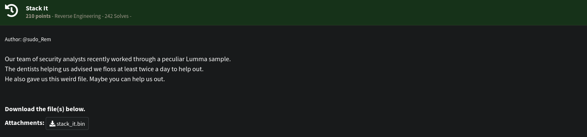
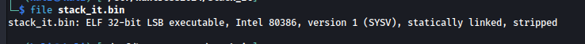
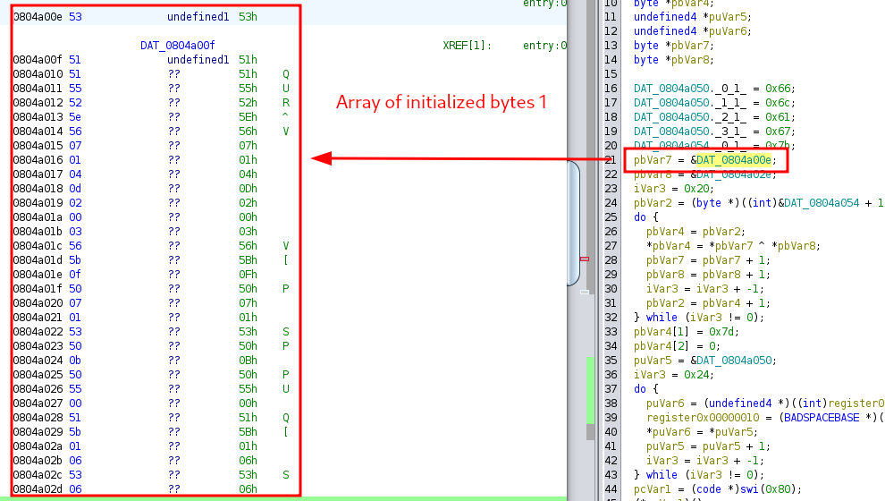
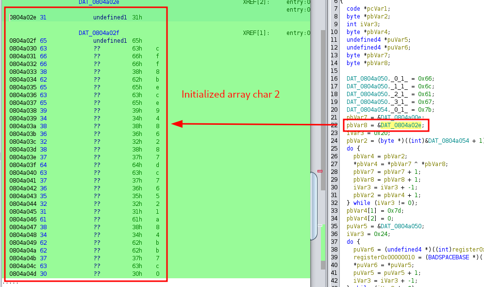
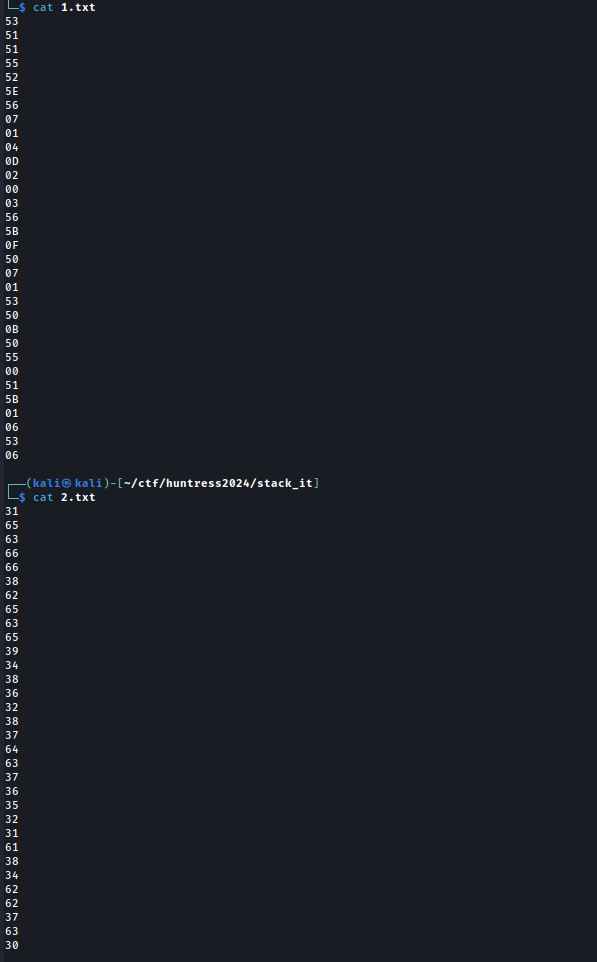
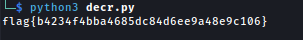

# [Reversing] Stack It
The following challenge description has been given:<br />
<br />
Below is the file type:<br />
<br />
Opening up Ghidra and analyzing the stack\_it.bin, below is what we concluded.<br />
<br />
The initialized two byte arrays were identified and extracted the hex contents.<br />
Byte array 1:<br />
<br />
Byte array 2:<br />
<br />
We then XOR them together and got the flag. The following code has been used:
<br />
```python
with open("1.txt", "r") as rf:
    one = rf.read().strip().split("\n")

with open("2.txt", "r") as rf:
    two = rf.read().strip().split("\n")

print("flag{",end="")
for i in range(len(one)):
    print(chr(int(one[i],16) ^ int(two[i],16)),end="")
print("}")
```
<br /><br />
<br />
