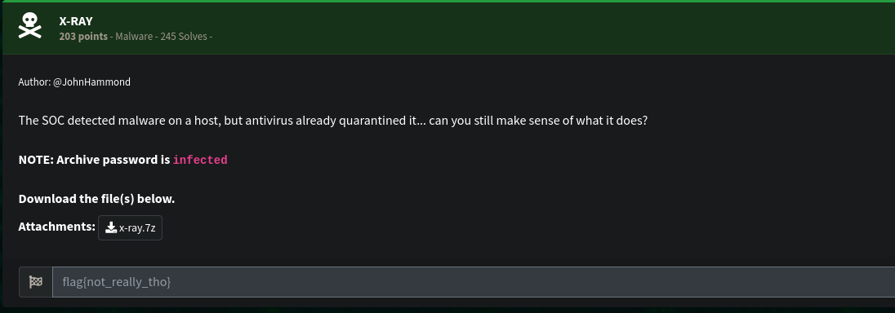
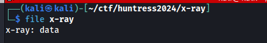
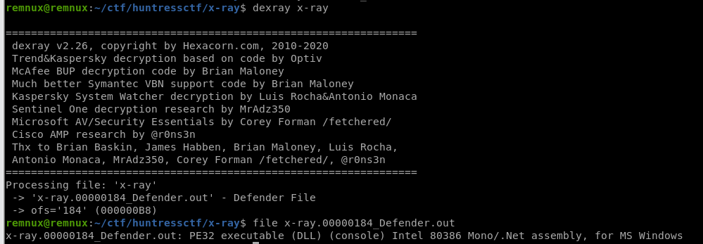
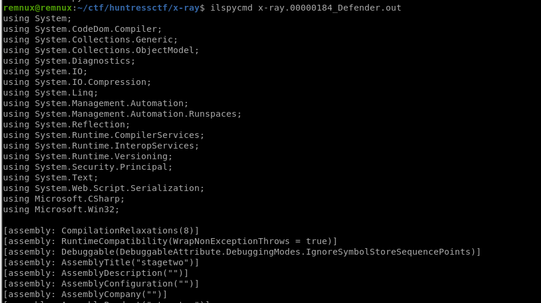
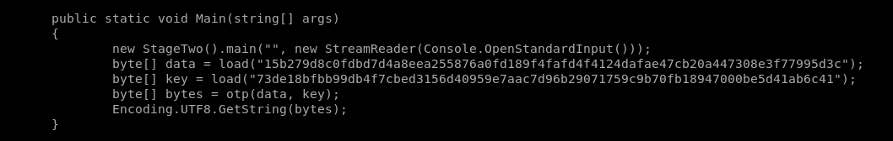
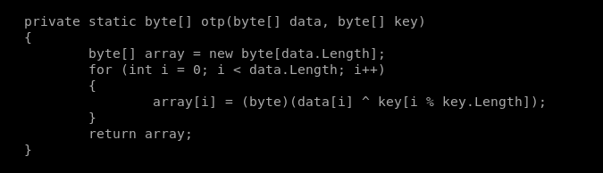
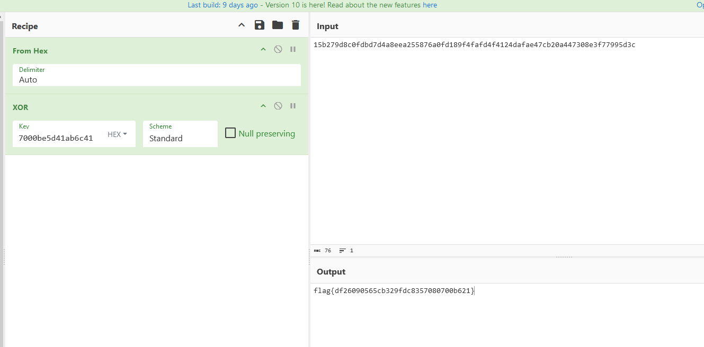

# [Malware] X-Ray
The following challenge description has been given: 
 
We checked the filetype of the given file but it didn't return notable. 
 
We have a hunch that it may be a quarantined version of the malware created by Windows Defender. We ran `dexray` with it. 
 
It worked! And it's a dotnet so it's easy to decompile with ilSpy. 
 
We looked at the Main function and we can see two hex blob loaded. 
 
We are also curious about the `otp()` function. Turns out that the two bytes are just being XORed together. 
 
We used Cyberchef to do the XOR operation and got the flag. 
 

