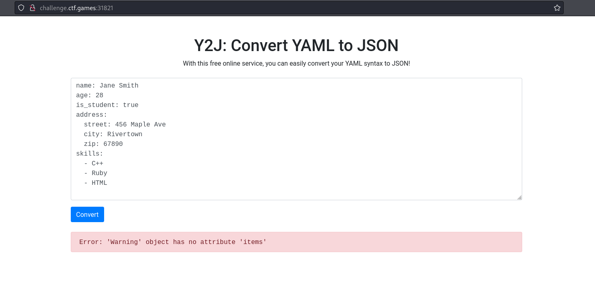
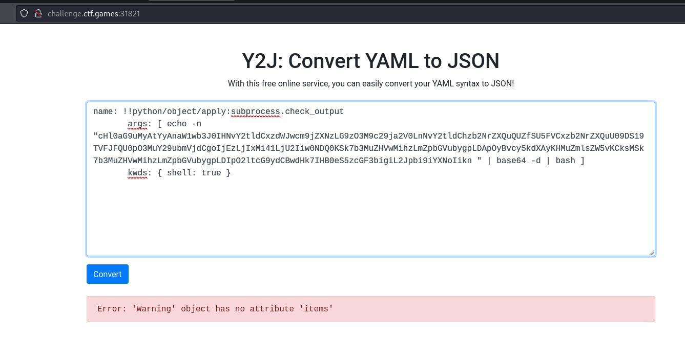
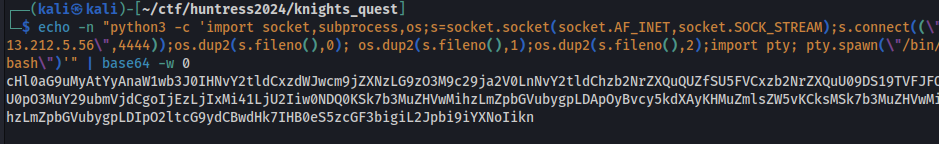
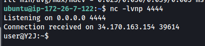
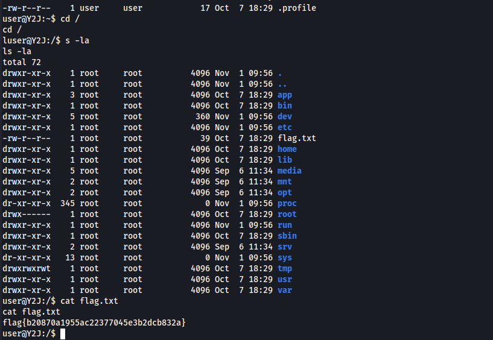

# [Web] Y2J
The following landing page can be seen: 
 
We set a following payload to execute code on insecure YAML Deserialization. 
 
The original base64 payload can be seen below: 
 
We received shell upon execution. We also got the flag from the / directory 
 
 
