# [Misc] Chillt Out - 50 Pts.

<br />
We're given with this wav file.<br />
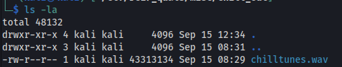
<br />A teammate of mine, EnGyn, managed to pull out an ELF file out of the WAV file using [deepsound](http://jpinsoft.net/deepsound/documentation.aspx)<br />
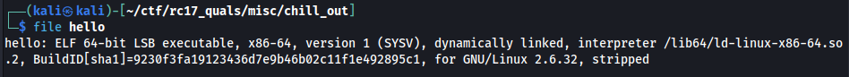
<br />We ran `strings` command on the `hello` binary file and and found a `PyInstaller` keyword in there.<br />
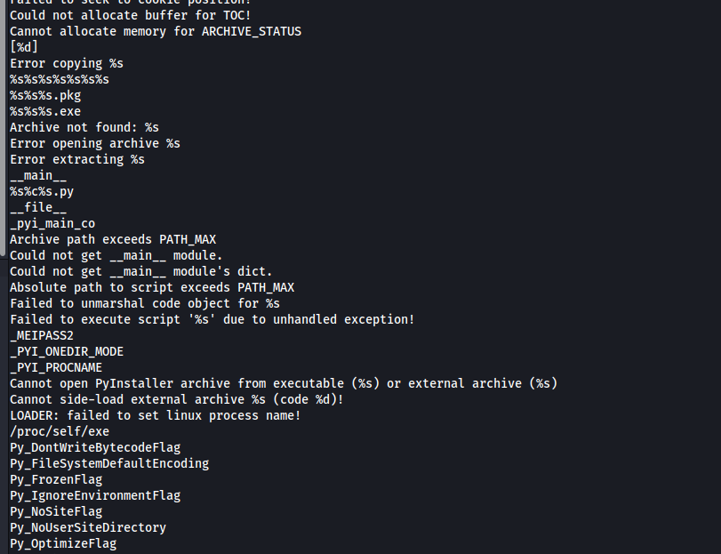
<br />Suspecting that it may have been compiled using PyInstaller, we extracted that contents using [pyinstxtractor.py](https://github.com/extremecoders-re/pyinstxtractor). However, there is a problem when we tried it in my Kali Linux. A warning has appeared.<br />
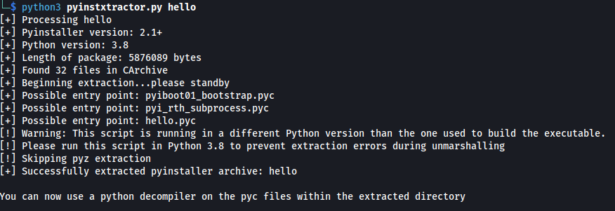
<br />Since the python3 version I have is 3.11.2, there's likely going to have a problem later when we try to reverse engineer the files further. I don't want to brick my python3 also by installing another version. So we switched to my Remnux Box which has a compatible python3 version. In there, we ran the pyinstxtractor.py
<br />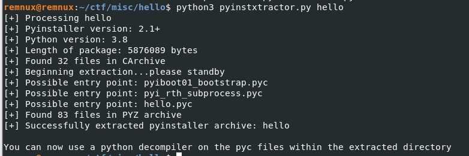<br />
`hello_extracted` folder has been created.<br />
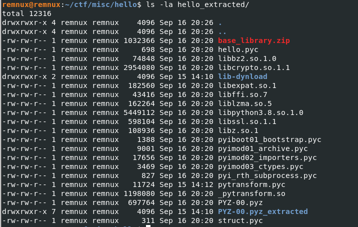<br />
As instructed also, we tried reverting .pyc file to .py and hopefully retrieve the original python script. We used [uncompyle6](https://pypi.org/project/uncompyle6/)
<br />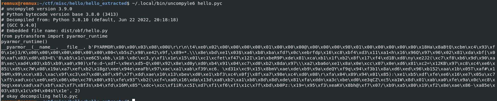<br />
Turns out as well that it's protected by [PyArmor](https://github.com/dashingsoft/pyarmor). Any debofuscation scripts we have used didn't work. The plan now is to dump the memory of the script when the pyarmor has already deobfuscated the script for us. We used this [memory dumper](https://gist.githubusercontent.com/Dbof/b9244cfc607cf2d33438826bee6f5056/raw/aa4b75ddb55a58e2007bf12e17daadb0ebebecba/memdump.py).
<br />We will attempt the steps below:

1) Run a waiting one-liner command where if it sees the .pyc is running, it will retrieve its PID and use it to dump the memory immediately.
2) Run the .pyc file. 
3) Analyze the dumped memory
<br />However, the above steps can only work if we can manage to run the script in the first place. Fortunately, we can. We just have to put `hello.pyc`, `\_pytransform.so`, and `pytransform.pyc` in the same directory.
<br />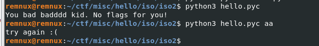
<br />We also noticed that the script requires an argument.<br />
The following bash one-liner is used to wait and dump the memory of the target pyc script:
<br />
```bash

while true;do x=$( ps -aux | grep hello.pyc | grep grep -v | awk '{ print $2 }'); if [ ${#x} -ge 1 ]; then ( sleep 0.05; python3 memdump.py $x); fi;done

```
<br />Also notice that we put `sleep 0.05` in there. The waiting command is too fast and dumps the memory immediately while the pyarmor is yet to deobfuscate the script. The `sleep` serves as a waiting mechanism to give time pyarmor to deobfuscate the script.
<br />We executed the one-liner and once it sees the running pyc file, it will attempt to dump it.
<br />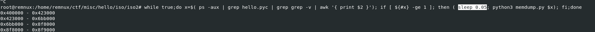
<br />The dump is then output to 161043.dump

<br />

<br />Next is to analyze the dump. First, we just output the strings. We found a string that pertains to the CTF organizers with heart symbol on it. 

<br />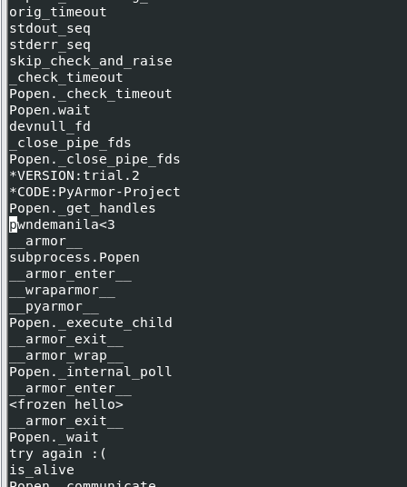

<br />We tried this as the argument:

<br />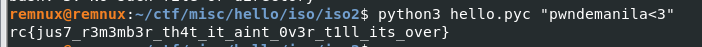

<br />We got the flag: `rc{jus7_r3m3mb3r_th4t_it_aint_0v3r_t1ll_its_over}`


<br />Author's note: This technique is a hit or miss. Many tries have been done before a remarkable result has been obtained since this is a race-condition based approach.
