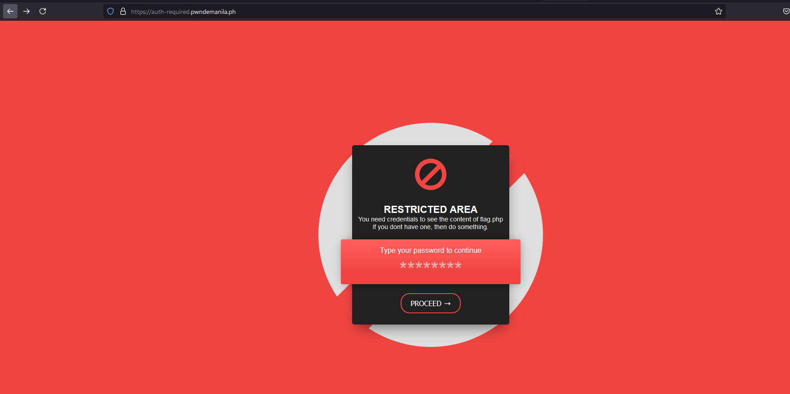
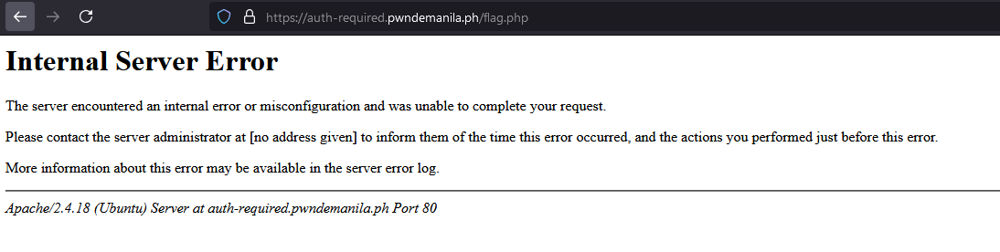
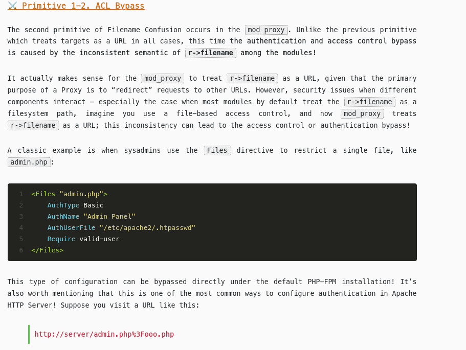
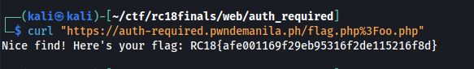

# [Web] Auth Required
We're given with the link `https://auth-required.pwndemanila.ph` 
 
When we accessed the `/flag.php`, it asks for username and password as part of HTTP Basic authentication. 
 
We tried entering any credentials and it shows us the 500 error message. 
 
We tried searching for ".htaccess bypasses" or "Apache 403/401 bypasses" and we came across the Orange Tsai's writeup for some bypasses and exploits within Apache Server [here](https://blog.orange.tw/posts/2024-08-confusion-attacks-en/) 
On the `ACL Bypasses`, we found out that we can insert `%3F` on the end of flag.php and append something after it. 
 
Then we tried it on the challenge and we got the flag. 
 
