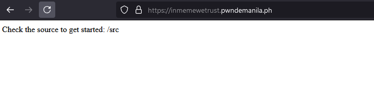
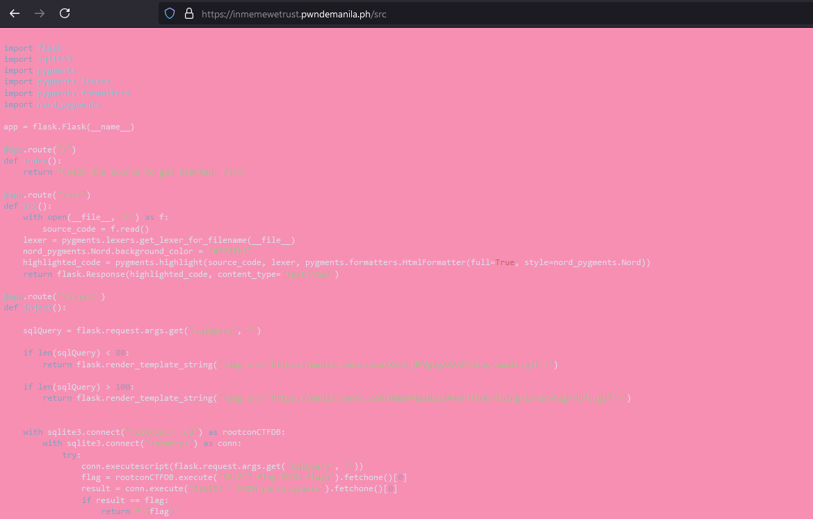
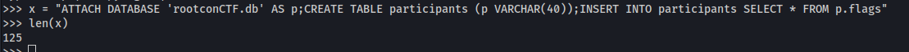
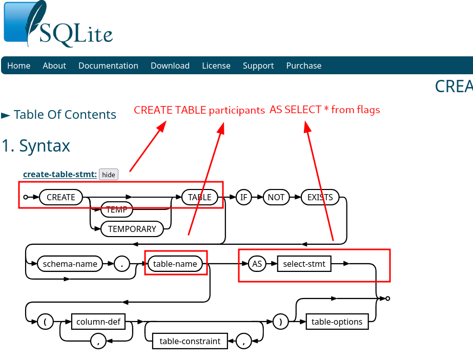
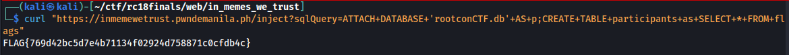

# [Web] In Memes We Trust
We're given with the link `https://inmemewetrust.pwndemanila.ph`<br />
<br />
We then checked the source code and oh maaan...<br />
<br />
We just downloaded the source code:
<br />
```python
import flask
import sqlite3
import pygments
import pygments.lexers
import pygments.formatters
import nord_pygments

app = flask.Flask(__name__)

@app.route("/")
def index():
    return "Check the source to get started: /src"

@app.route("/src")
def src():
    with open(__file__, 'r') as f:
        source_code = f.read()
    lexer = pygments.lexers.get_lexer_for_filename(__file__)
    nord_pygments.Nord.background_color = "#f78fb3"
    highlighted_code = pygments.highlight(source_code, lexer, pygments.formatters.HtmlFormatter(full=True, style=nord_pygments.Nord))
    return flask.Response(highlighted_code, content_type='text/html')

@app.route("/inject")
def inject():

    sqlQuery = flask.request.args.get("sqlQuery", "")

    if len(sqlQuery) < 80:
        return flask.render_template_string("")

    if len(sqlQuery) > 100:
        return flask.render_template_string("")
    

    with sqlite3.connect("rootconCTF.db") as rootconCTFDB:
        with sqlite3.connect(":memory:") as conn:
            try:
                conn.executescript(flask.request.args.get("sqlQuery", ""))
                flag = rootconCTFDB.execute("SELECT flag FROM flags").fetchone()[0]
                result = conn.execute("SELECT * FROM participants").fetchone()[0]
                if result == flag:
                    return f"{flag}"
            except sqlite3.OperationalError as e:
                return f"An error courred: {str(e)}", 400
            except:
                pass
    return flask.render_template_string("")

def createTable():
    try:
        with sqlite3.connect("rootconCTF.db") as conn:
            conn.execute("DROP TABLE IF EXISTS flags")
            conn.execute("CREATE TABLE flags (flag VARCHAR(40) PRIMARY KEY)")
            conn.execute("INSERT INTO flags VALUES ('FLAG{sample_flag}')")
    except sqlite3.Error as e:
        return f"Database error: {e}"
    except Exception as e:
        return f"An error occured: {e}"

if __name__ == "__main__":
    createTable()
    app.run("0.0.0.0", 80)

```
<br />The whole point of the source code is that if `/inject` is visited, it expects `sqlQuery` parameter. The parameter content is then treated as an actual SQL script and being executed on the backend. With the SQL script you submitted, you must be able to:
<br />
1. Open `rootconCTF.db`
2. Create a table called `paticipants`
3. Get the contents of rootconCTF.db `flags` table and replicate it on `participants` table.

<br />The catch is that you can only have more than 80 but less than 100 SQL payload.<br />
So we setup our own instance and removed the high limit. We came up with the working payload:<br />
<br />
We brought up the SQL documentation and syntaxes for SQLite and we found out that the CREATE TABLE and INSERT TABLE can be merged into one which could make the payload significantly smaller.<br />
<br />
We executed the new payload and we got the flag.<br />
<br />
