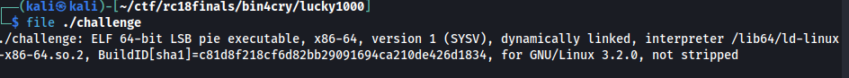
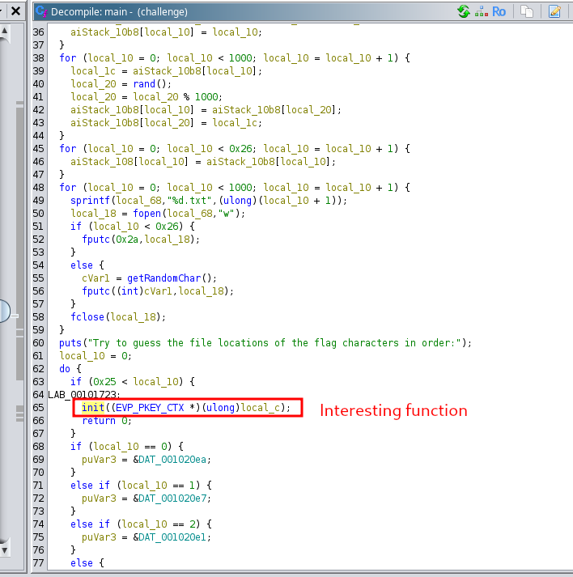
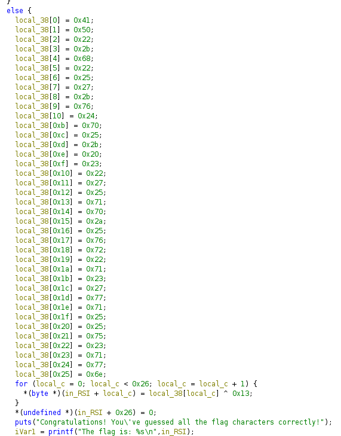
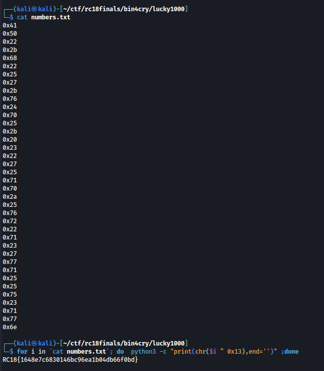

# [BinForCry] Lucky 1000
We're given with this file. 
 
Output states that it's an ELF file. 
We loaded it on Ghidra and checked out main function. There seems to be an interesting function called `init` 
 
Checking it out, there is the sequence of bytes that's being XORed to 0x13 and then printing it as the flag. 
 
We extracted the values and XORed them to 0x13 and got the flag. 
 
