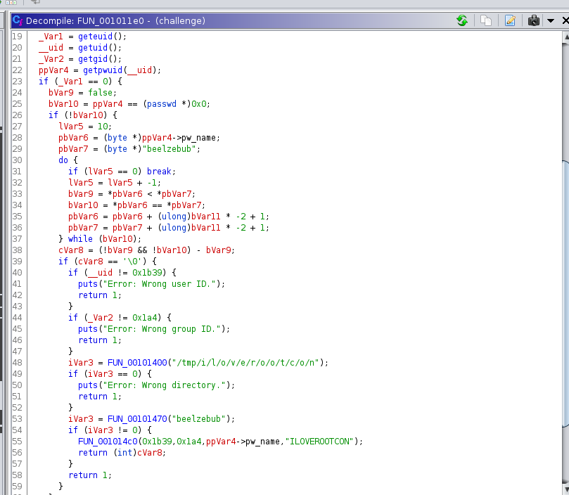
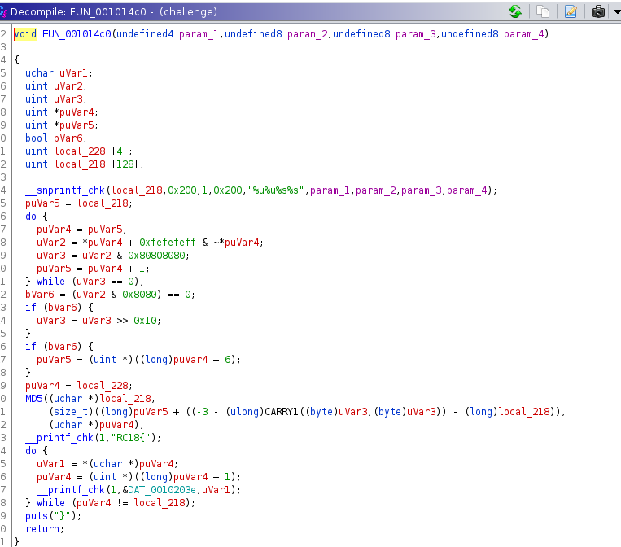
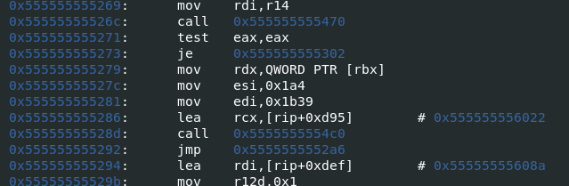
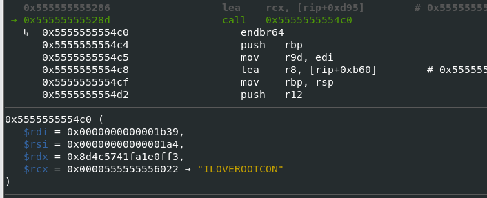
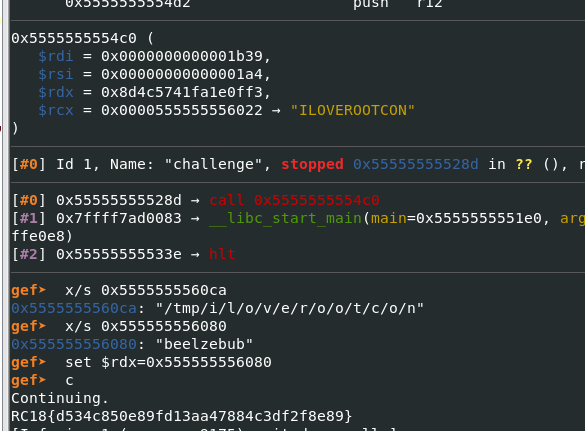

# [BinForCry] Beelzebub - 100 Pts.
 
We're given with this file. 
 
Output states that it's an ELF file.
 

We loaded it on Ghidra and checked out main function. 
 
There are a lot of checks going on within the main function however what we want is inside `FUN_001014c0`: 
 
As can be seen, it prints `RC18{` thus we can say that this function prints the flag. Let's investigate the required parameters. 
 
We can try `beelzebub` as the 3rd parameter by setting RDX register to an address where string `beelzebub` is stored when that function is called in gdb. 
We need to find the setting of 0x1b39, 0x1a4, and "ILOVEROOTCON" series of instruction. It can be found starting on `0x55555555527c`. 
 
By setting the RIP register to 0x555555555279 (I set the RIP register after breaking on the `main` function), it will then setup the parameters required for the print flag function. We then set a break point to the 0x55555555528d, calling `0x5555555554c0` which is the "print flag" function. 
 
As can be seen, RDX registry makes no sense so we can set it to an address where string "beelzebub" is stores. We know these exists because they are present in the decompiled code. Within the main function, we found it on `0x555555556080`. We set the RDX to that address and continued execution. Upon execution, it printed the flag. 
 

