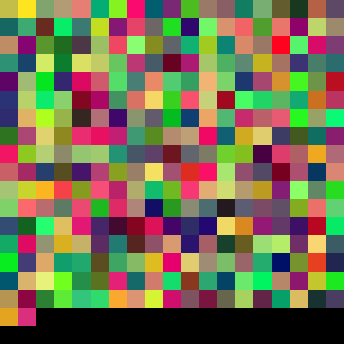
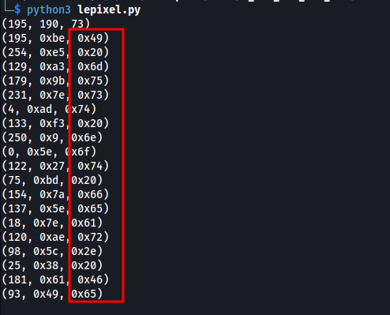
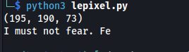
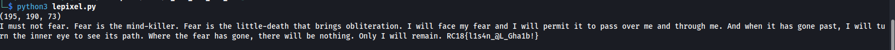

# [Misc] I Can See The End.
We're given with the image below.<br />
<br />
We tried gathering the pixel RGB values of it and try to analyze what could be hidden in there. Simple python3 code has been used with PIL image library. We extracted the RGB values of the different squares from left to right on the first level. The following values have been seen and it looks like the 8 bit Blue value are within readable ASCII range.<br />
<br />
We tried to get the ASCII value and they are forming words!<br />
<br />
The following code has been used to fully extract the RGB<br /><br />
```python
from PIL import Image
 
# creating a image object
im = Image.open("./see.png")
px = im.load()
print (px[4, 4])

def get_pic_pixel(px, x, y):
    
    intervals = 20
    return px[intervals * x, intervals * y]

#while True:
for y in range(19):
    for x in range(19):
        curr_pix = get_pic_pixel(px, x,y)
        print("{}".format(chr(curr_pix[2])),end="")
print()
```
<br />The follwoing message has been extracted!<br />
<br />
