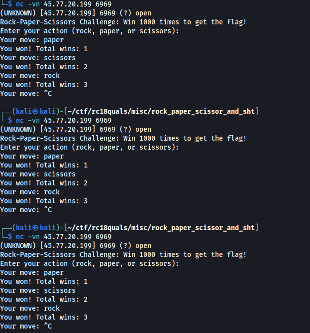
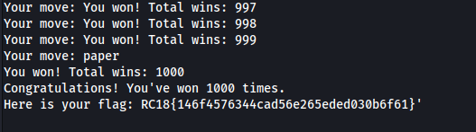

# [Misc] Rock Paper Scissors Sh\*\*t
We're given an IP and a port to connect to - `45.77.20.199:6969`<br />
<br />
We tried connecting to it and it's a rock paper scissor game. We tried poking around with it and we discovered that each iteration, the winning sequence is the same. We built a python code to interface with the input and output. The idea is as follows:
<br />
1. Send the known correct winning sequence. It will stop on an iteration number where no known winning move is reached.
2. Set the current iteration number.
3. Send input: rock, paper, and scissors. If the input is losing, return to step 1 to try the next input until a winning move is accepted.
4. Save the current iteration number along the winning input adding it to the known winning sequence.
5. Repeat until step 1000

<br />The following code is used to do this automatically:
<br />

```python
from pwn import *
import json

winning_sequence = {
    0 : b"paper",
    1 : b"scissors",
    2 : b"rock",
    3 : b"paper"
}

def guess_winning_move(curr_round):

    choices = [b"rock", b"paper", b"scissors"]

    for c in choices:

        r = remote('45.77.20.199', 6969)

        x = list([ v for k,v in winning_sequence.items()])

        r.sendline(b"\n".join(x))

        for j in range(len(x)+1):
            print(r.recvuntil(b"move: "))
        
        print("Sending {}...".format(c))
        r.sendline(c)

        res = r.recvuntil(b"move: ")

        print(res)

        if b"You won!" in res:

            print("{} is winning on round {}".format(str(c), curr_round+1))
            r.close()
            return (curr_round, c)

        r.close()

def save_winning_sequence():

    with open("winning_sequence.txt", "w") as wf:
        wf.write(str(winning_sequence))

wins = 0


for i in range (4,1001):
    print("Guess winning move of rnd {}...".format(i+1))
    curr_round, winning_move = guess_winning_move(i)
    winning_sequence[curr_round] = winning_move
    print(str(winning_sequence))
    save_winning_sequence()
```
<br />We found the sequence and therefore the flag:<br />
<br />
