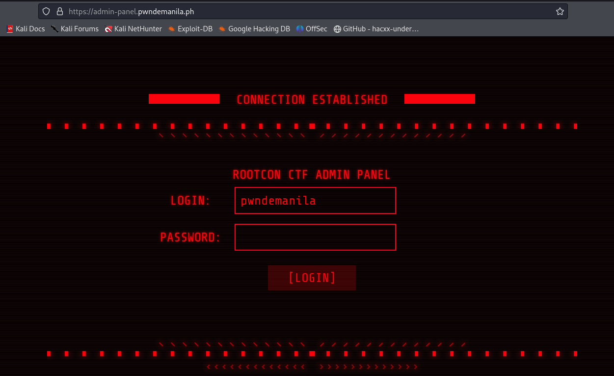
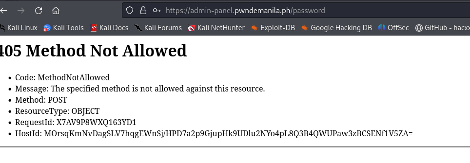
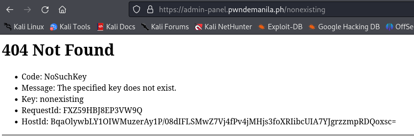
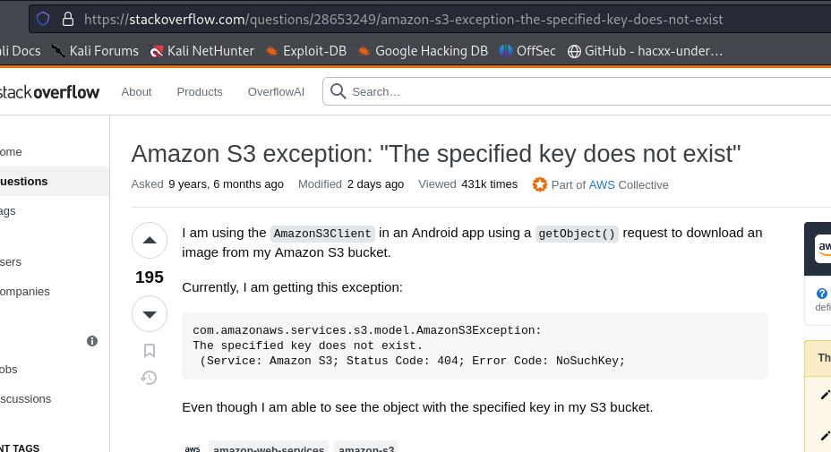
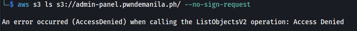
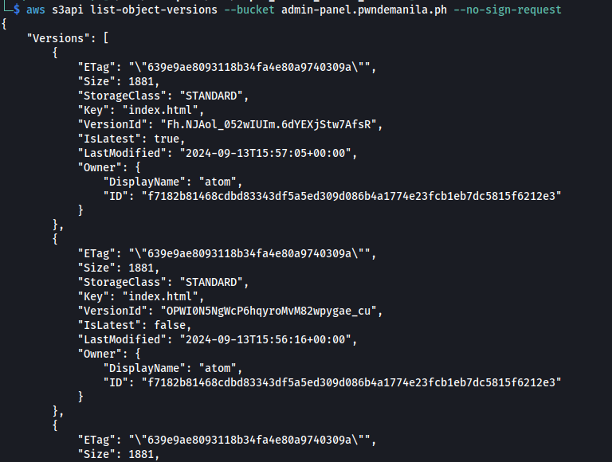
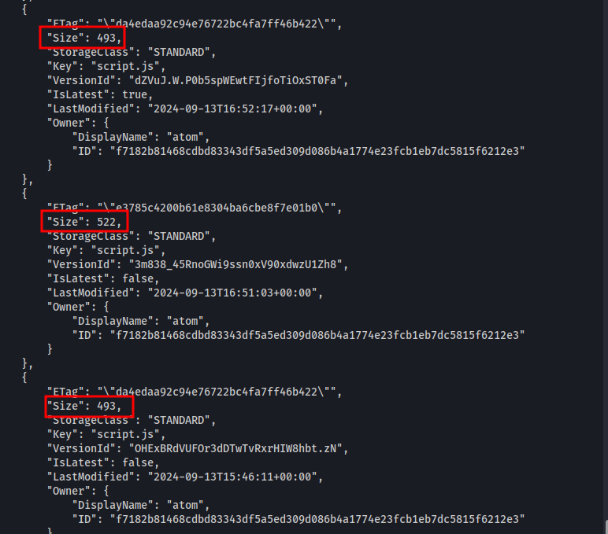
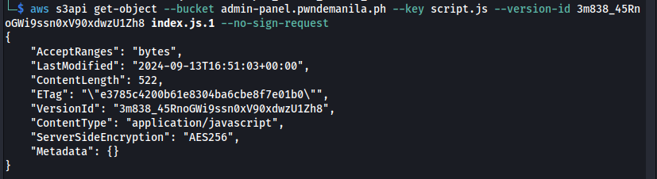
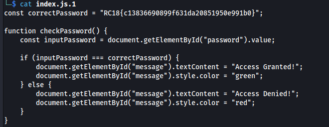

# [Web] Super Secure Static Website - 100 Pts.
 
We're given link to `https://admin-panel.pwndemanila.ph`. Below is the landing page. 
 
When the `/password` is visited, it gives **405 Method not allowed** 
 
Below what looks like if we access a nonexisting endpoint.  
 
After a bit of googling, they turned out to be AWS bucket error HTTP responses indicating that the website is an S3 bucket. A stackoverflow answer below helped with the recon: 
 
 
With this, we tried accessing and do basic recon on the website using AWS cli. 
 
The above check has "access denied" response. We have done some more recon with the AWS cli with no success and the next command we tried returned something. The command is `s3api list-objects-version`. 
 
After a bit of research again, turns out that these are versions of the file hosted on the website. We examined the metadata and the one that stood out on the output is the file size between different versions of `script.js` 
 
One of the `script.js` is 522 in size meaning there is more data in there. We tried downloading the file through the command below: 
 
It successfully downloaded! Viewing the file content, the flag is inside. 
 
