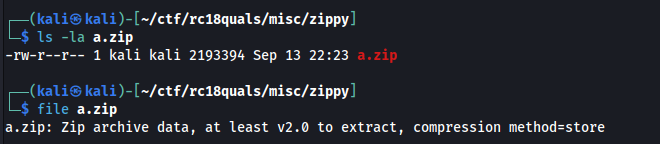
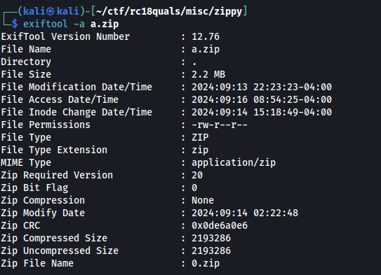
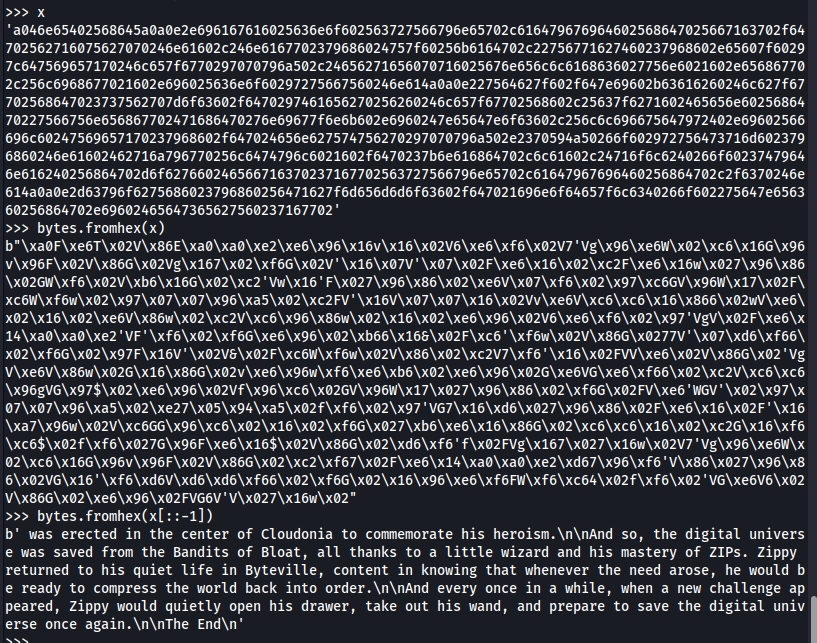

# [Misc] Zippy.
We're given a zip file<br />
<br />
Another zip file is stored within the given zip file:<br />
<br />
We tried extracting files manually first up for a few depth level and we noticed that the file names are always one character in length then appended by the `.zip` extension.<br />
We created a script that extracts the zip file recursively until a non zip file is seen or the file name of a zip file is not a single character. We also saved the single characters found during the extraction:
<br />

```python
import os
from zipfile import ZipFile

ZIP_NAME = 'a.zip'
TMP_ZIP_NAME = 'tmp_' + ZIP_NAME

done = False

buffer = ""

while not done:
    # rename to a temporary file
	# extraction will result in creating a file of the same name
	# (this is an assumption, but it holds true for this problem)
	# (if the assumption were wrong, the script would fail after unzipping some number of layers)
    buffer += ZIP_NAME[0]
    os.rename(ZIP_NAME, TMP_ZIP_NAME)
    with ZipFile(TMP_ZIP_NAME, 'r') as zp:
        zp.namelist()
        zp.extractall()
		
		# quit if there is more than one file in the archive
		# quite if the file in the archive is not the name we expect
		
        if len(zp.namelist()) != 1 or len(zp.namelist()[0]) != 5 or os.stat(zp.namelist()[0]).st_size < 23:#ZIP_NAME = zp.namelist()[0]
            done = True
        
        ZIP_NAME = zp.namelist()[0]

    os.remove(TMP_ZIP_NAME)

print(buffer)
```
<br />We didn't find any other non zip file nor any filenames that is not single character zip file. So we looked at the buffer and we noticed that the character set is only 0-9 and a-f which is HEX chracter set. The following long hex value has been noted:<br />
`a046e65402568645a0a0e2e696167616025636e6f602563727566796e65702c616479676964602568647025667163702f64702562716075627070246e61602c246e6167702379686024757f60256b6164702c22756771627460237968602e65607f60297c647569657170246c657f6770297070796a502c24656271656070716025676e656c6c6168636027756e6021602e656867702c256c6968677021602e696025636e6f60297275667560246e614a0a0e227564627f602f647e69602b63616260246c627f67702568647023737562707d6f63602f6470297461656270256260246c657f67702568602c25637f6271602465656e6025686470227566756e656867702471686470276e69677f6e6b602e6960247e65647e6f63602c256c6c696675647972402e69602566696c60247569657170237968602f647024656e627574756270297070796a502e2370594a50266f602972756473716d6023796860246e61602462716a796770256c6474796c6021602f6470237b6e616864702c6c61602c24716f6c6240266f60237479646e616240256864702d6f627660246566716370237167702563727566796e65702c61647967696460256864702c2f6370246e614a0a0e2d63796f6275686023796860256471627f6d656d6d6f63602f647021696e6f64657f6c6340266f602275647e656360256864702e69602465647365627560237167702d696860266f60256574716473702160246e61602c2e6f6963737562707d6f6340266f6022756473716d646e61627740256864502371602e677f6e6b60256260246c657f6770297070796a502c24627167727f66602971646024716864702d6f6276602471686470246562716c636564602164716440276e696b4a0a0d9082ee2e627574756270227566756e602e616360237479646e616240256864702c24656070796a7023799082e47960237160276e6f6c602371402e25666163702479602075656b4c9082e02e2469616370297070796a502d9082ec24716f6c6260256864702c6c6160237e6961647e6f6360256c696660237968645c9082e02e276e696075656b6566616370227f666021676967402974616c402f647020796a7e2a50297e696470256864702465646e6168602c247e6168607d65796274702475726024656473757168687560277f6e602c297070796a50237160246562756568636021696e6f64657f6c6340266f60256c607f65607025686470246e61602164716440276e696b4a0a0e2465667163702371677021696e6f64657f6c634a0a0e2e69616761602e656563702562602f6470227566756e602c23746e616c6564737167702c6164796769646025686470266f6023786470756460256864702f647e696024656c666029756864502e2476656c602275677f60702f6e602461686024716f6c6240266f60237479646e616240256864702c23756c696660246564716f6c626022796568647024757f68647967502e2564716c602f6f647023716770247960247572402e246564757f6863702568602d9082e1256c626963737f607024799082ee6379602379686450212f6e4c9082e02e2665696c6562637964602e696024656271647370237375636875402e6961647071634a097070796a50266f6029736167656c4025686470246e616029727f647369665a0a0e24656e6961647e6f63602e65656260246168602d627f647370256864502e246e61686023796860266f602d6c616070256864702e696024796660246c657f63602479602c6c616d63702f6370237167702479402e256c696660297e69647025686470207570246c6568602c246e616473702f6470256c626160297c6562716260246e61602471656773702e6960246568636e656274602c297070796a5a0a0e20796a7e2a502a356c696660256c676e6963702160256469637e69602465607071627470237167702d627f647370256279647e6560256864702c297c6c616e6966602c69647e65702c22756075656460246e61602275607565646027756277602370594a50256864502e246563737562707d6f6360256275677023756c69666025627f6d60246e616025627f6d602371602e677f6460277f6c63702f6470246564727164737024716f6c6260266f602d627f647370276e696c6279677370256864502e297c6469607162702b6e69627863702f64702e616765626023756c696660256864702c246563737562776f6270702c6c656073702568647023714a0a0e2478756e6025686470256469637e696024656473756e60256e6f6028636165602c2275686475676f647024656070796a70256275677023756c696660256864702c256e6f60297260256e6f402e20796a7e22402f647e6960247960276e6963737562707d6f63602c256c696660227568647f6e61602465646461602568602e656864502e20796a7e21402f647e6960247960246563737562707d6f6360246e61649082e56c6966602567616d69602771627025647972616769676d2030313021649082e56e6f602473756762716c6025686470286479677024656472716473702568402e25636e6f6024716023756c696660246564716f6c6260256864702c6c61602e6f602c6c6560737023796860276e6964737163602e6167656260297070796a502c246168602568602275677f6070266f6025636e657f60297275667560276e696e6f6d6d65735a0a0d9082ee27756e60276e696864756d6f6370297274702f6470276e696f67602d699082e940212275676e6f6c60256c6474796c6021602473757a60227f666026666f602d65686470246c6f684c9082e02e246c696577402e6f6963737562707d6f6340256864702f647024757f6024656c6c616360297070796a502c2e6f6964716e696d627564756460246567756e656270286479675a0a0d9082e122656770256679637275736562702566796373716d602c256c676e69637021602e696024716f6c6260266f602d627f647370256279647e6560256864702071627470246c657f636029402c25636e6f602471602c6c61602d6568647023737562707d6f6360294026694c9082e02e247867657f6864702568602d9082ef3370594a50266f602e6961686360247165627760256e6f602e69602275686475676f647023756c696660256864702c6c61602473656e6e6f6360246c657f63602940266960247168675c9082ea0a0e21656469602e6160246168602568602c2e6f6964737571686875602d6f627660256370716c6c6f63602f647024757f62616023716770297070796a502371602473757a602c2e6568645a0a0e276e696d6c6568677275667f602371677023756c696660266f60256d657c6f667022756568637025686470247572602c256e696c6025686470246c6f68602f6470247375626022796568647024696460246c696577402e6f6963737562707d6f6340256864502e227568647f6e6160256469637e6960256c69666020594a50256e6f6024656473756e602568602371602e6f69647f6d60266f6022757c62602160246e616770237968602c297c6373756c656279647024656b627f6770297070796a502e2372757f6860227f6660246567616270256c64747162602568645a0e69616863402e6f6963737562707d6f63402471656277402568645a0a0e2e6f602f6370246e61602c20796a7e25402f647e696020796a7e24402e23727569716c60256679637275736562702f647e696022756075656460246e6160227560756564602d65686470276e696070796a702c227569716c60297260227569716c6023756c69666025686470276e6963737562707d6f63602e6167656260246e61602275677f607025627f6d602e6566756024656e6f6d6d6573702568402e266c65637d6968602f6470246562756474757d602568602d9082ec227560756564602f67602f64702566716860294c9082e02e28647165627260207565646021602b6f6f6470297070796a5a0a0e23737562707d6f63602f6470256c626963737f607d696024656d65656370247168647023756c6966602567616d6960277162702369647e6167696760246564716562736029756864702c256d69647023796864749082e3756c69666022756762716c602e6566756025647162756e6567602f6470237e6f696e696d60237968602465627564627f60246e616024656c62716e6370237375636875402e696164707163402e207570276e696679676024799082ee6562756770237479646e616240256864702475724a0a0e2370594a5024656473756e60266f60237569627563702160256469637e696020756564602465607071627470277f6e60237167702c24656e6961647e6f6360256260297c6562716260246c657f63602479602566796373716d602f637025636e6f602c256c696660256864502e22756c6c616d6370246e616022756c6c616d6370256c696660246564716f6c626025686470276e696b6e69627863702c2e6f69647365647f627070266f60227569716c60227568647f6e6160246564646160227569716c60286361654a0a0e20796a7e2340256469637e6960246563616c60702371677020796a7e22402c246e61677023796860266f602566716770227568647f6e616028647967702c2e656864502e20796a7e22402a3567616b63616070227568647f6e61602f647e696020796a7e2140276e6963616c60702c2c6c6560737025686470266f60227569716c602478756e6025686470246562757a6e6f63602568402e256e6f646024799082ee63716770297070796a502475724a0a0e20796a7e214024656c6562616c602567616b63616070256c6474796c602471656e6021602f647e696024656070796a70297c6564716964656d6d696023716770256c6966602f656469667025686470246e61602c246e616770237968602d6f6276602465647075727560247867696c60266f602863716c6660247e61696c6c6962726021402d9082e1237576796372757365625023757963737562707d6f634c9082e02a3e6f696471647e61636e696025686470246562756073796867702568602c246e61677023796860266f602b63696c6660216028647967502e227566727563502c6162747e65634025686470266f6023756471676025686470276e696a79627f6272756470237167702471686470256c6966602f6564696670246564716f6c62602c2566796373716d60216028647967702e61676562602568402e2c6c65607370237968602465627160756270702c256c6968677e61656d602c297070796a5a0a0e276e696863716273602d6f6276602d65647379737025686470276e696075656b602c277f6c6660216471646025686470246567616e616d60237275626d656d60246c69657760227568647f6025686470256c696867702c256c626963737f60702371602863657d6023716023756c696660256864702b6e69627863702f64702e6f6963737562707d6f63402373756c63737f6c4022756860246563757021676967402974616c402e2d656864702e6961647e6f63602f64702275686475676f647024656b627f6770246c696577402e6f6963737562707d6f634025686470246e6160297070796a502c23756c69666027756e60266f602375667167702465686371656c6e6570237479646e616240256864702371402e2e6167656260256c64747162602568645a0a0e246562756474757d602568602d9082ec247168647024757f626160256563702c6c699082e5675c9082e02e24656375736f666024656e69616d65627024757260286475656470237968602465647479627760297070796a5a0a0d9082e12379686470266f602c6c616023737562707d6f63602e616360257f6970297167702f6e6023799082e562756864502121647164602e69602e677f6274602c6c69677021696e6f64657f6c634c9082e02e24656c6b63616360237375636875402e696164707163402d9082e12462716a796770256c6474796c602c2564716c602f6f64702562799082e57f695c9082ea0a0e25647371677025627f6d6025647162756e6567602f64702465657e69647e6f63602975686470237160276e69686765716c602c2275667275637025686470207f647160246568636275607025627567702c237375636875402e696164707163402c22756461656c6023757f69627166656e6022796568647029726024656c602c2375667c65637d65686470237479646e616240256864502e2473716c60256864702e61686470246564716f6c626025627f6d60246e616022756762716c60256e6f6028636165602c23756c6966602b6e657a60266f602d627f647370276e696c627967737021602972602465646e657f62727573702371677022756672756370256864502e2563716260227965686470207570247563702461686024716f6c6240266f60237479646e616240256864702562756867702c227566727563502c6162747e656340256864502a337f6168636025686470266f60247271656860256864702f6470297167702279656864702564616d60246c696577402e6f6963737562707d6f634025686470246e6160297070796a502c297164602478756e602568645a04716f6c6240266f60237479646e6162402568647024737e6961676140256c64747162402568645a0a0d9082ee257f697028647967702562799082e5675c9082e02e246564646f6e6021676967402974616c4a0a0d9082ee2b627f67702940256c696867702d656864702e6961647e6f63602f6470207c65686022757f69702465656e602c6c699082e940247572402e2370594a50266f6023727569716c60256469637e69602d656864702071627470246e61602e677f646023756c696660256864702b6e69627863702f64702e6f6963737562707d6f634025667963727573656250256375702c6c696770294c9082e02e2469616370297070796a502d9082ec2e616c607021602566716860294c9082e02e24656e696d62756475646024757260297271656770256275677029756864502e246c6965776025686470266f60237275626d656d60227568647f6025686470246e61602275686024716024656b6f6f6c60297070796a5a0a0d9082ee2c6c657660297c6271656e6025627160237d65647379737022757f402e25627f6d6025647162756e65676029756864702c23737562707d6f63602567702863657d60277f686022756474716d602f6e402e276e696d6c6568677275667f6025627160237275677f60702279656864702475724c9082e02e2e6f6964716e696d6275647564602864796770297c65656473702563696f6670227568602c246961637021676967402974616c402d9082ec237b65656770227f666024716f6c6240266f60237479646e61624025686470276e696478676966602e656562602566799082e5675c9082ea0a0e256a796370256c626963737f60702473756c6c616d6370237479602f64702e677f64602b6e6572786370237167702479602e656867702e656675602c24737f6c6022756675602371677021647164602f6e6024656275737e65602471686470256571796e686365647021649082ee6f6963737562707d6f63402373756c63737f6c40266f602275677f6070256864702465646c656967702f686770227f696272716770247e6567696c6c65647e6960246e61602563627569666021602c21676967402974616c4029726024656c6023716770246c69657760256864502e237566796863627160247371667023799082e1696e6f64657f6c6340266f60237e61696462716577602e65656260276e6f6c60246168602f68677023727567616e616d602164716460246e6160237275646f636024656c6c696b6370266f6020757f62776021602c246c696577402e6f6963737562707d6f634025686470266f60237275626d656d602568647024656e6f6d6d657370297c6b6369657170246e6160246564646f6e602164716440276e696b4a046c696577402e6f6963737562707d6f634025686470276e69647965727365625a0a0d9082ee207c6568602465656e602c6c699082e9402475724c9082e02e297c6564757c6f637562702c2469616370297070796a502d9082ec2479602f64602c6c699082e94c9082ea0a0e237f6168636025627f6d602e65667560276e69686371656c6e65702c24707572727f6360246c657f636023756c696660256864702c256b616473796d60256c676e69637021602e656675602564616d602568602669402e2e6f6963796365627070246e6160297762756e6560266f60247e657f6d6160247371667021602465627965717562702c6c65607370256864502e2863647163602160237167702562756864702475724a0a0e246f6f6760227f666024716f6c6260256864702971677160276e696b636f6c602c227568647f602863616560256469637e69602d6568647020716274702f64702f637c61602475726023756c6966602568647023737562707d6f6360297c6e6f60247f6e602f64702d696860277f6c6c6160246c657f67702c6c6560737023796864502e2e6f6963737562707d6f6340256679637275736562549082ec6c656073702c65766275677f607024737f6d6023796860256375702f64702566716860246c657f67702568402e2164716460247e61646e6574656270286479677024656473756e60297c60756564602f6f64702c2566796373716d602f6f6470256275677023756c696660256864502e24716f6c6260266f602c6566756c602379686470256c646e6168602f64702867657f6e656025626024799082ee646c657f6770237c6c656073702e6f6963737562707d6f63602c616573757023796860247168647027756e6b602568402e256e6563637025686470246569756672757370297070796a5a0a022124786769656770256864702275646e6570256370716c6c6f63602c6c6967702d6f64676e696b60256279647e6560256864702c2b6e657a6025627f6d6025647162756e6567602f647025657e69647e6f636029756864702669402e247e696f6070276e696b61656272602279656864702271656e6025627160237d656473797370256761627f64737022757f402e256c626160707f64737e65702562716024716f6c6240266f60237479646e616240256864502125637f6c602f6470256d6964702f6e6025667168602567502e24656679627271602566799082e57f6970237d686479627f676c6160256864702b6e61686452202e2563696f6670237968602e6960247e6564696675602665696c6562702c24656d69616c636875602164716440276e696b402221297070796a522a0a002e297271656770246e61602e627f6770276e696b6f6f6c602c2563616c61607023796860266f6023756471676025686470247160246f6f6473702f6867702c21696e6f64657f6c6340266f6022756c6572702473757a60246e61602563796770256864702c2164716440276e696b40297260246564756562776023716770297070796a5a0a0e256361607370256761627f647370227f6660256c626d61627363702f647021696e6f64657f6c6340266f60256c607f65607025686470276e6963757163602c2d656473797370256864702f647e6960246f6f6c6660246c657f6770216471646029727163737563656e6e6570266f60256671677027756e6021602c237564757e696d60277566602972756675402e23756c6966602b6e657a6025627f6d60276e69647162756e656760297c647e6164737e6f636025627567702975686470246e61602c227566727563702c6162747e65636025686470266f602c6f62747e6f63602e656b6164702461686024716f6c6240266f60237479646e616240256864702c2563727f675a0a0e237469627760256761627f647370207570276e6967676f6c6360246e6160237275677f647021647164602275667f60276e696b636f6e6b602c23747565627473702568647024656d616f62702375637162616471646024656a796d6964707f6e65702c276e696c677162707370246e61602c23747e656d65736f6460247875647023757f6d627f6e65602c23756c6966602f65646966702369647e61676967402e237e6f6f6c6c61626024656a79637275667f60256b696c6022796160256864702867657f62786470276e6964716f6c666023756c696660246564716f6c62602c2566796373716d602864796770246567676f6c6360237167702c2164716460266f602d616562747370276e69677f6c66602c276e6962756d6d696863702160297c6c6165737570237167702863696867702c297b6370256864502e2d696860246e657f627160237f6168636025686470266f60256c616363702275656863702568647029726024656e6e65747370237167702568602c21696e6f64657f6c63402e69602465667962727160297070796a502e6568675a037f61686340276e696d6c6568677275667f402568645a0a0e21696e6f64657f6c63402f6470246564727f60737e61627470256275677029756864702c247867696c60266f602863716c666021602864796770246e61602c256c6c69667564797240266f602567646560256864702471602c6164727f6070276e69677f6c676021602f6470297070796a5024656c602275676e656373756d602568645a0a022129716770256864702461656c42202e29246c657f63602568602371602c6c616470237160227f68202c6c616470276e69646e616473702c2469616370297070796a50222c207c6568602c6c699082e9422a0a0e237f616863602f647e69602e677f62786470256260246c657f6360246c627f67702c61647967696460256279647e6560256864702c2c6c6566602479602669402e237d6c61656270227568647f60256864702e65656774756260237e6f69647163696e657d6d6f6360246e616023777f6c66602164716460256864702c6c6160276e6967616e616d602c25636e616e6275667f67602c61647967696460266f602275647e65636025686470237167702c2d6f64676e696b60276e6964716f6c6660247165627760256864702c21696e6f64657f6c634a0a0e2375696479636160716360256761627f647370227965686470276e6964616f6c6275667f60297260237d6f64676e696b602c65766275677f607024737f6d60256864702e656675602e677f6460276e69627260246c657f6360297568647024716864702469616370237167702479402e25627f666562602d65686470246563616660227566756e6024616860247572602d6568647024757f62616023746e6567656c60246271656860246168602568402e247c61686021602f6470277f6c63702f6470237d656473797370246e61602863716273602f64702372756672756370276e6963627f66602c2164716460247e61646e6574656270266f602c6c65766023756c69666023757f6d627f6e656025647162756e6567602f64702974796c69626160227965686470227f66602e677f6e6b602c2563727566796e65702c61647967696460256864702e696023757f69627f647f6e60256275677024716f6c6240266f60237479646e616240256864502e24656e6564696770237569756023799082e97070796a5a0a0221207c65686022757f69702465656e602567502e23756c69666029727163737563656e6e65702c23757f6d627f6e656028647967702d656473797370256279647e656025686470276e69646f6f6c66602562772975686450212d6f64676e696b6022757f602e6f602b6361647471602e6160246568636e65716c60256671686024716f6c6240266f60237479646e61624025686450212275676e6164602566716277602e696023796021696e6f64657f6c6342202e28647165627260266f6024757f60297c6564756c607d6f636024656b6f6f6c602f6867702c2275676e656373756d602568647024656073716760222d712373733e64643d6f50743a7f597070713a7b783133425021257f6970246e657f66602566772940237e656671656860256864702b6e6168645021297070796a522a0a0e256c6c6966756479724025667f626160227166602c297b6370256864702e69602867696860246564716f6c66602863696867702c21696e6f64657f6c6340266f602d6f64676e696b60247165627760256864702d6f6276602275676e656373756d602369647e616276602160246e6966602f647024796024656e65607f60246e61602275667f602465696272757860297070796a502e227f6f6460256864702471602b636f6e6b6024657f6c602160237167702562756864702c297c6e6564646573502e237d686479627f676c61602465636e61667461602e6f602b6f6f62602160276e696461656270246e6160216564702972716e696260266f60207573602d627167702160276e6960707963702c2563757f6860256c6474796c60297a7f6360237968602e6960276e69647479637023716770297070796a502c276e696e627f6d60297a7565627260297c62716c6573696472716070256e6f4a01696e6f64657f6c63402e6960237963796273402568645a0a0e2e677f64602564696370757024656e6275747025626029716460256e6f60246c657f6770256c6c696675647972402e69602566696c6024756965717023796860247168647024656e6967616d6960227566756e6024616860297070796a502c22756675677f684a0a0a0e2974796c61657170297e6160276e69637f6c6024757f6864796770256a796370297e69647021602f64702e677f646024796023737562707d6f63602d65686470207c656860246c657f6770297070796a502c2164716460286362716563756270266f602972716272696c60256679637e65647875602e6160227f602f6564696670297c696d616660246c6f602e616025627f6473702f647024656465656e60256e6f656d6f637022756864756867502e24656a796e6167627f60246e61602471656e6023756c6966602279656864702075656b60256e6f697275667560276e69607c656860227f66602567616c6c696670237968602e69602465667f6c6d2c6c65677023716770297070796a502e237d61656274737021647164602567616e616d6d2f647d247c657369666669646023747960227f66602e677f6e6b602e6961647e657f6d60276e696275677f647021602c2564716274796240247e657f6d40266f60237c6c6968647f6f666025686470276e6f6c616024656c6473756e602c256c6c6966756479724024656c6c6163602567616c6c696670256c6474796c6024756965717021602e6960246566796c60297070796a5a0a022e2370594a52202371602e677f6e6b60237567616b63616070256c62616567616e616d602c297e6964702f647e69602e6f6964716d627f666e6960266f6023747e657f6d616023757f6d627f6e65602b6e69627863702f64702d6968602465677f6c6c6160247168647024727160247e6569636e61602e61649082e36967616d602e6f6963737562707d6f6360266f6022756473716d602160237167702568402e24766967602c65766275677f6070246e6160256571796e65702160246563737563737f6070297070796a50247572602c276e6f62747370297c62716c6573696472716070227f6e602c2c6c6164702972756670247f6e60237167702568402e297070796a5024656d616e602462716a796770276e696d657373716e65702c2c6c616d63702160246566796c602562756864702c237e6f6964716c6c6564737e6f6360256b696c602375696b63702568647020757024796c6025646f63602972716e696260266f60237d616562747370246e616023727566796270256b696c602465677f6c666021647164602562756867702563616c607021602c2563727566796e65702c61647967696460247371667025686470266f6022756e627f636021602e694a0a0462716a7967502e6f6963737562707d6f6340256c6474796c40256864702c297070796a50266f6023756275747e65667461402369607540256864`
<br />We tried unhexing it but garbage results has been obtained but when we reversed the order of the hexes, a readable message can be retrieved.<br />
<br />
If we decoded the whole message, we can also retrieved the flag<br />
<br />
