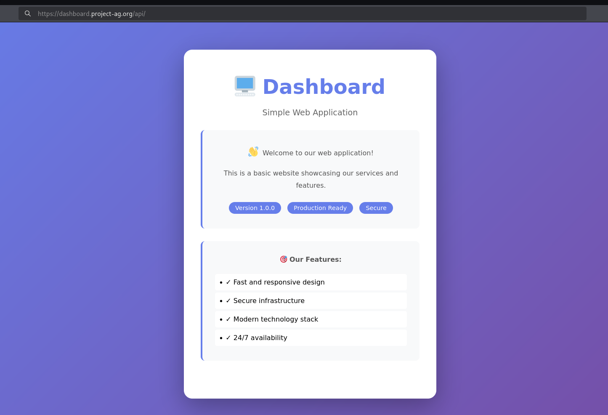
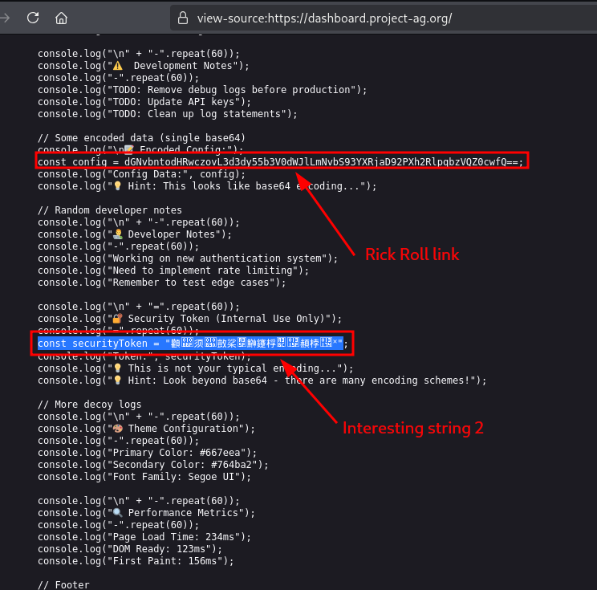
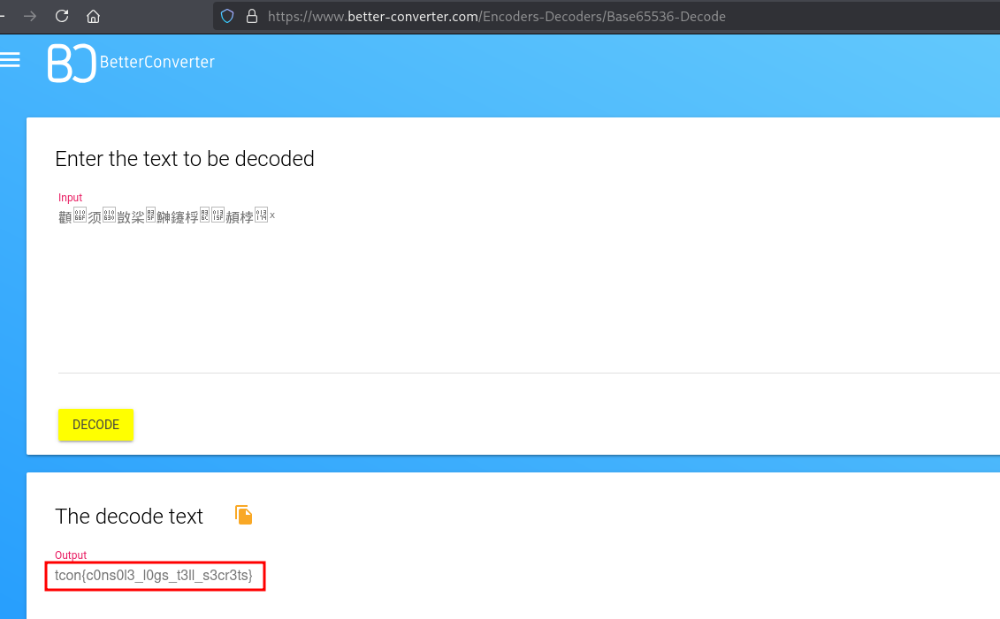

# [Web] Dashboard - 100

We are given with the link to to https://dashboard.project-ag.org

Looking at the HTML source code, we can see the following base64 and some chinese characters as securityToken.

Turns out, the chinese characters are base65535 encoded and we decoded and got the flag:

