# [Web] Keymaster part 1 - 400

We are given with the link to to https://keymaster.project-ag.org

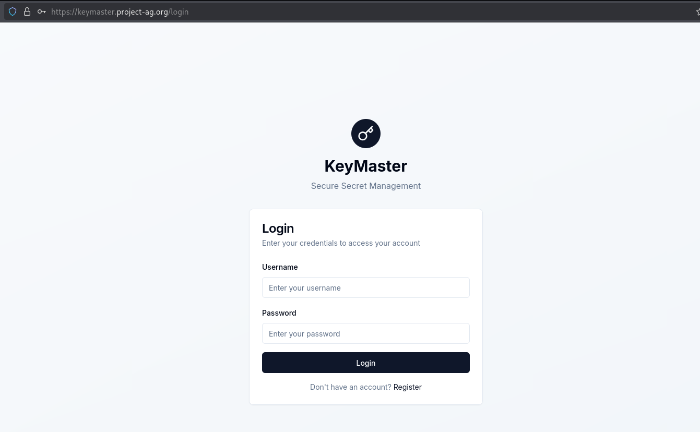

There's some registration functionality within the website we successfully registered an account.

When we tried logging in, it returns also a JWT string for succeeding authentications.

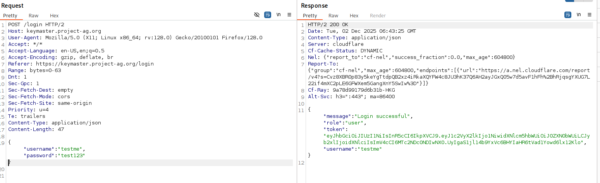

In the main UI (no screenshots, sorry :( ), you can create your own secret notes and then edit or delete them. As you can see below, we have no secrets yet.

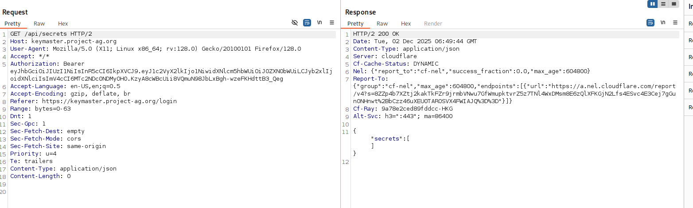

However, turns out there's an IDOR vulnerability allowing us to access other people's secret notes by adding a numeric value after `/api/secrets/` like `/api/secrets/1`.

So we tried extracting other secrets through scripting.

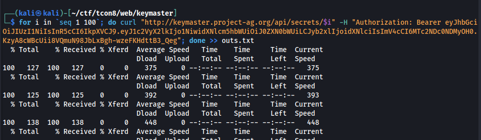

Once done, here's the result we managed to obtain:

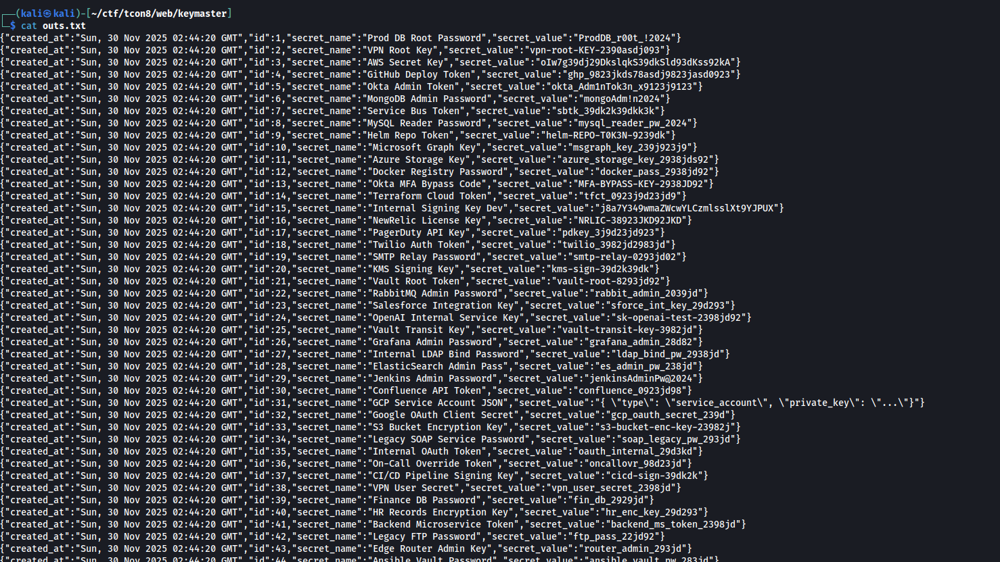

Out of all of this, what caught interest us is this specific secret note that seems to be a signing key for JWT.

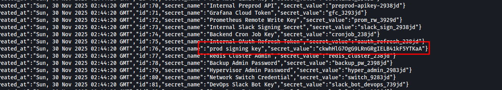

So we went to Cyberchef and sign our own JWT with admin privs...

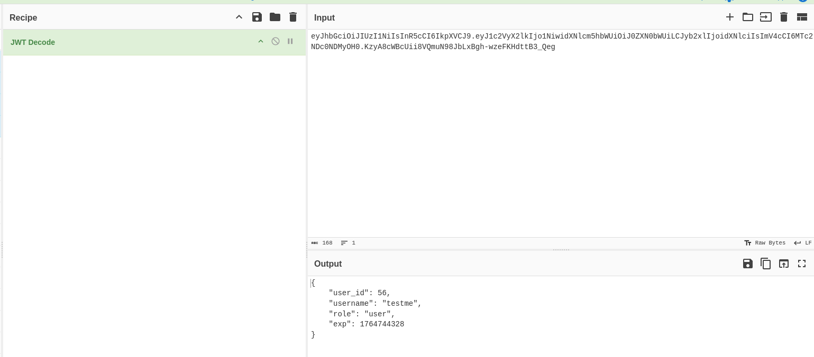

And when we set it on our Authorization header, it says that we are already admin!

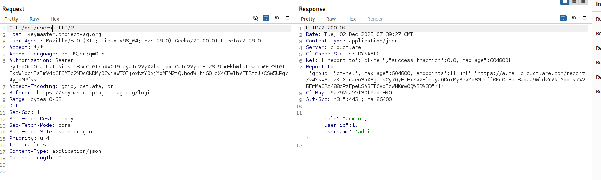

At this point of the challenge, we were stuck. Fortunately, we thought of trying to do insert an SQL Injection payload within the user\_id parameter from JWT body we have.

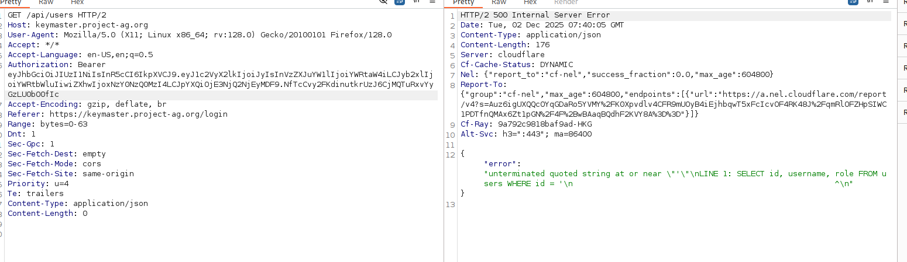

As can be seen above, an SQL error returned. So we proceeded with checking out the columns:

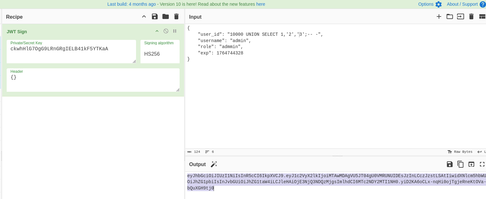

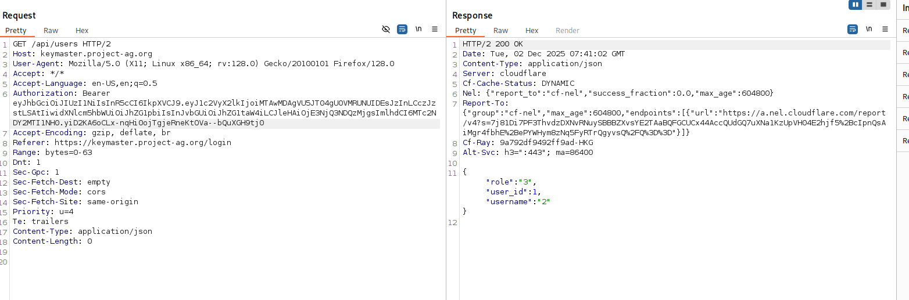

We successfully reflected UNION injection with 1,2,3 columns values. Next we tried to see what database we're targetting. What worked is `version()` in the second column.

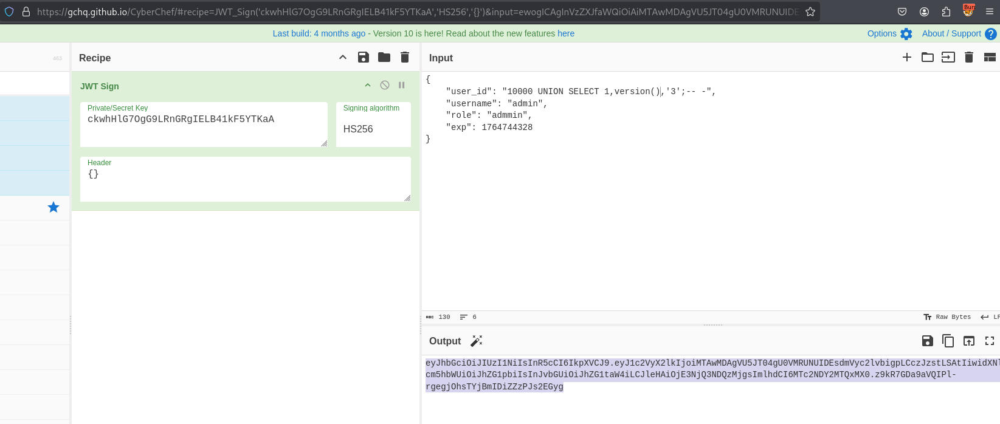

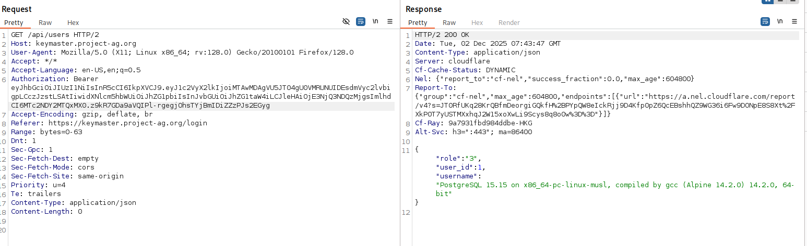

And we confirmed it's a PostgresQL database. Then we tried grabbing all tables from PostgreSQL server.

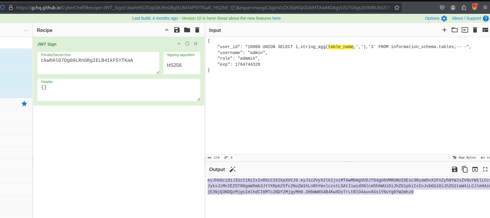

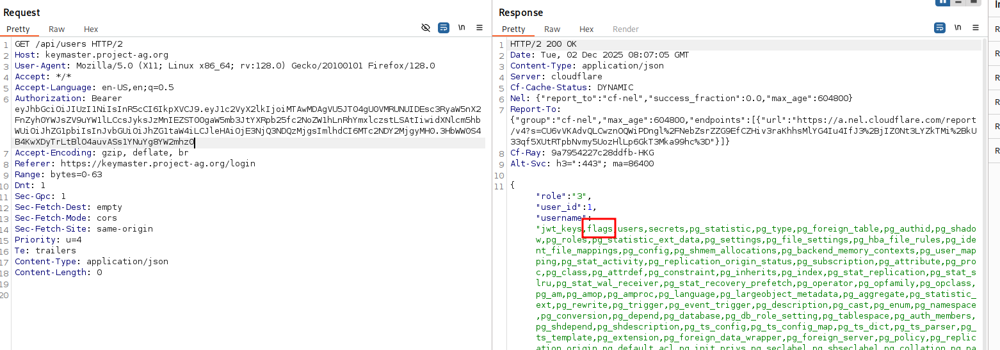

And then, as can be seen above, there's "flags" table that stands out a bit. So we tried querying its columns.

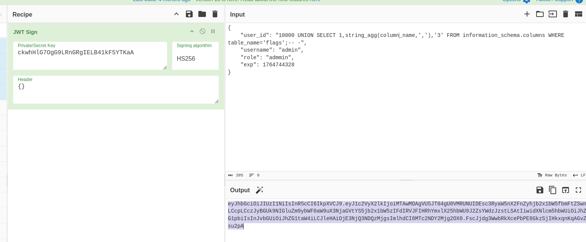

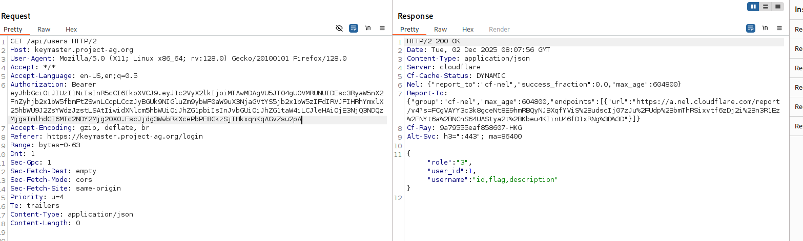

It has "id", "flag", and "description" columns. We can grab those directly.

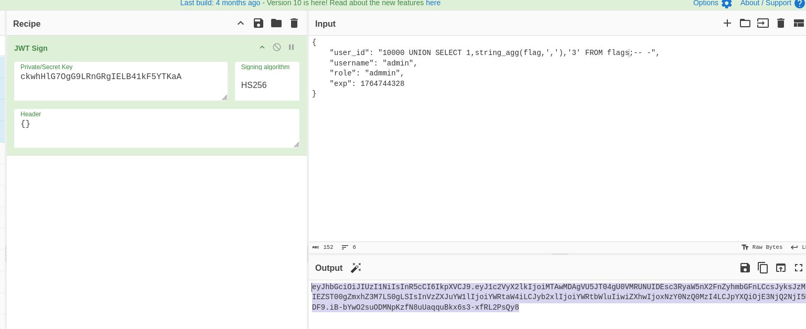

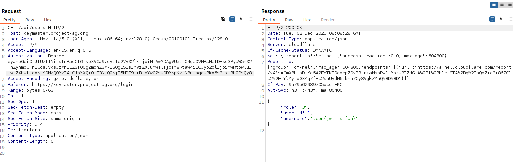

And we got the flag!

# [Web] Keymaster Part 2 - 100

The part requires another flag and when we dumped all the secret notes, we have also found a string that has a tcon flag format. We submitted it and it worked.

