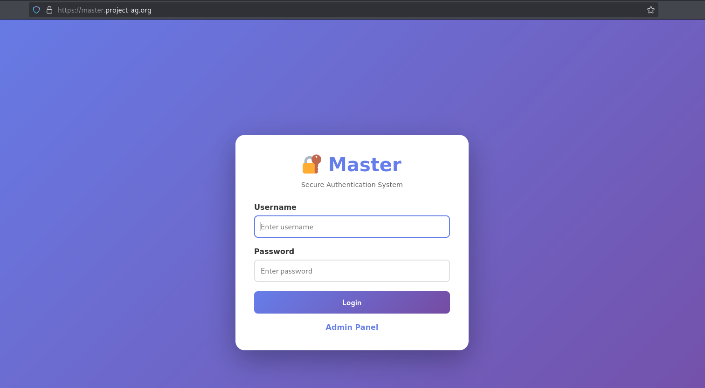
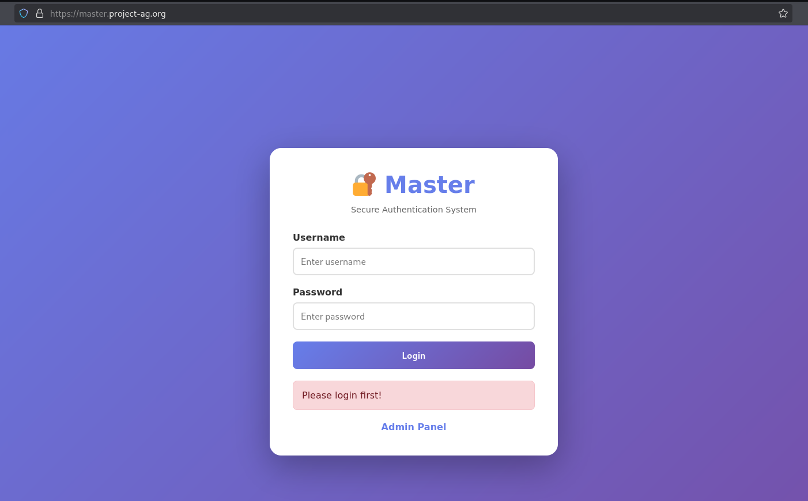
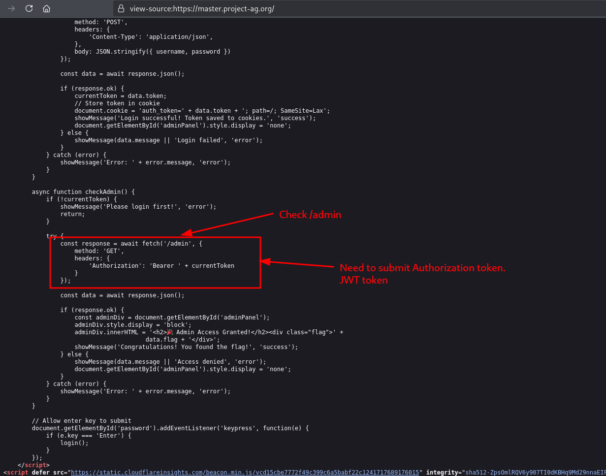
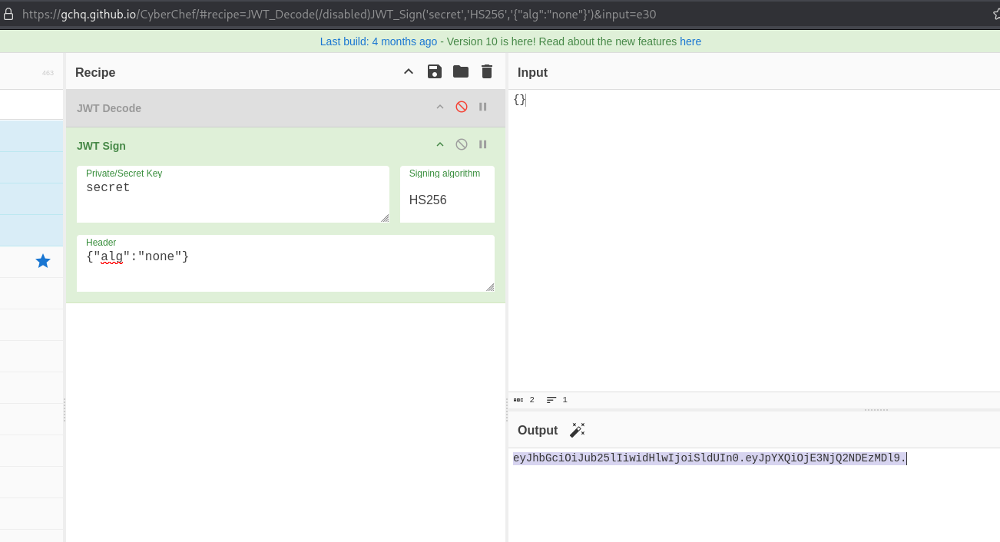
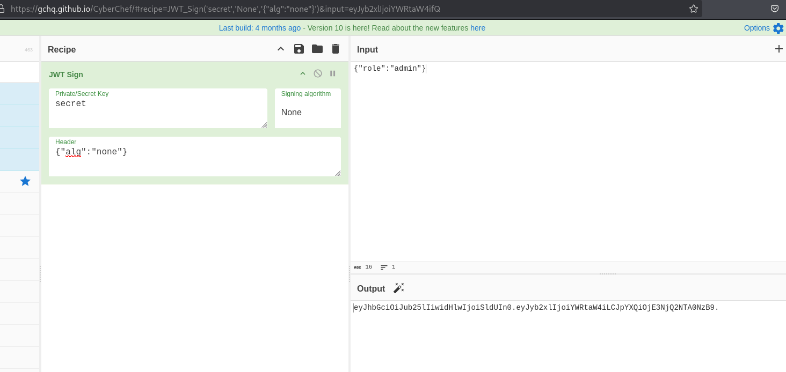
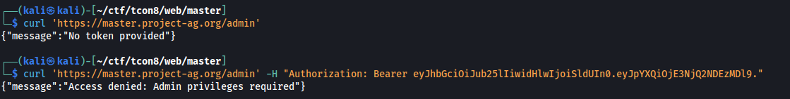
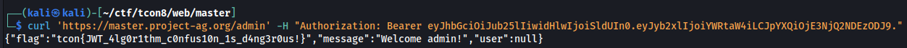

# [Web] Master - 200

We are given with the link to to https://master.project-ag.org

What stands out immediately is the admin panel. But we need to have valid creds, with admin privs, to access it.

Checking out the source HTML, we can see that an Authorization Bearer may be needed to access the admin. Possilby a JWT string.

So we tried to construct in Cyberchef but instead of using any Signing Algorithm, we just put `"alg":"none"` within the header. We also wanted to test if the `alg` header parameter is being taken into consideration.

The string above actually worked but with "Access Denied" due to insufficient privileges. So we tried different privilege parameters or usernames within the body of JWT. What had workd was `"role":"admin"`.

With this, we got the flag.

