# [Web] Portal - 150

We are given with the link to to https://portal.project-ag.org

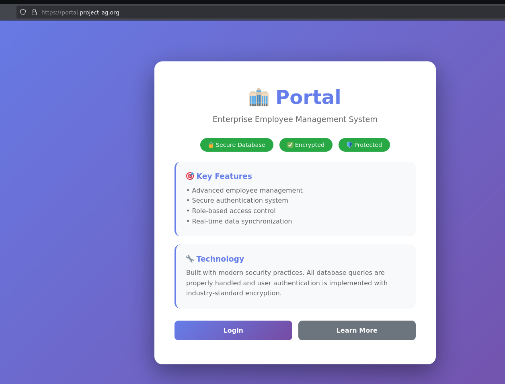

We can try clicking "Login" and a login page will be presented with working creds provided.

Upon logging in, we can see that its main functionality is searching for employees.

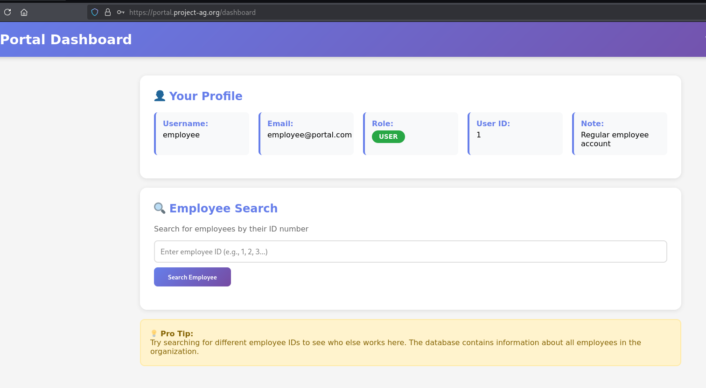

Searching for an employee with id of 1, it returns "employee@portal.com". Thus the functionality actually works and returns user.

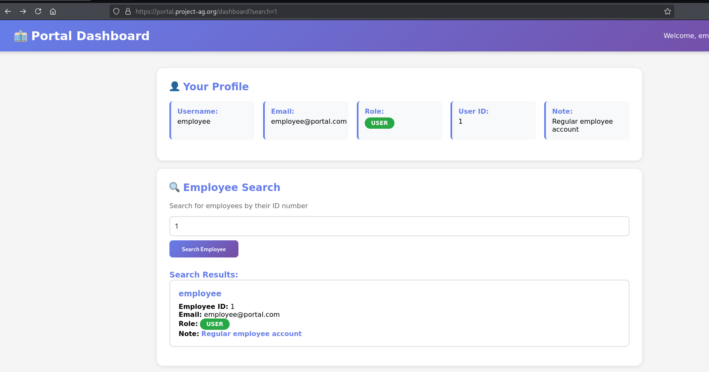

In these types of scenario, we can do a quick check for weaknesses in SQL injection. A payload like `2 OR 1=1-- -` can be a test case.

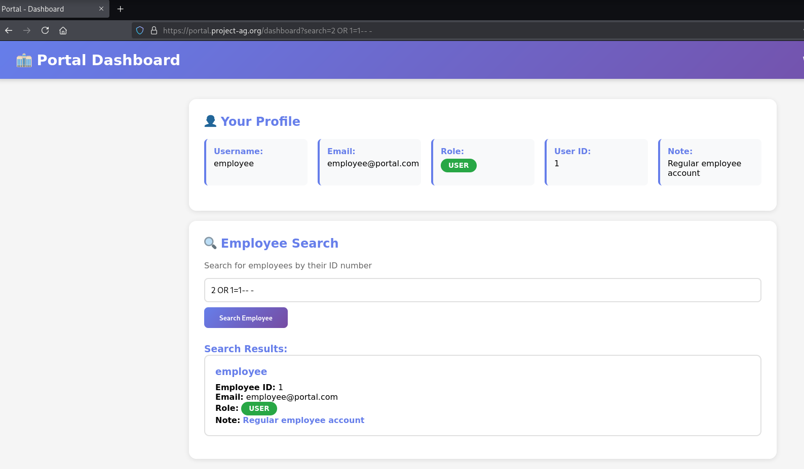

As can be seen above, it returns employee 1 even though our main search is 2. This means that `OR 1=1-- -` actually executed and returns all employees (Turns out there is only 1 employee).

What we can do next is to test for the number of columns we need to successfully do a UNION based attack.

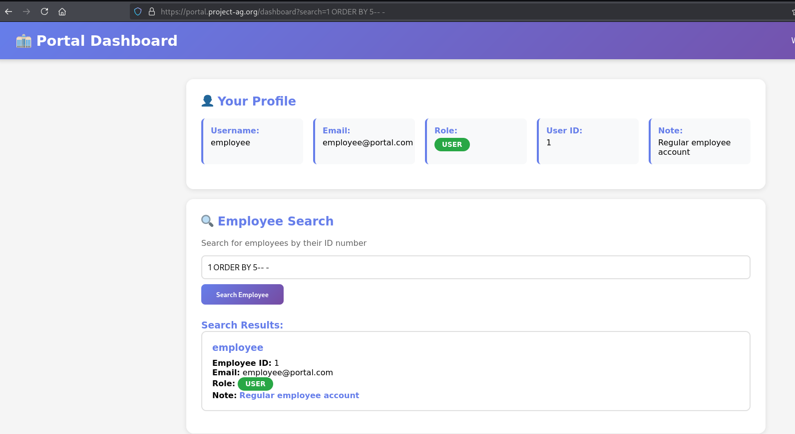

Screenshot above shows that it is 5 columns. Screenshot below also shows that doing a UNION with 1,2,3,4,5 values returns 2 rows already.

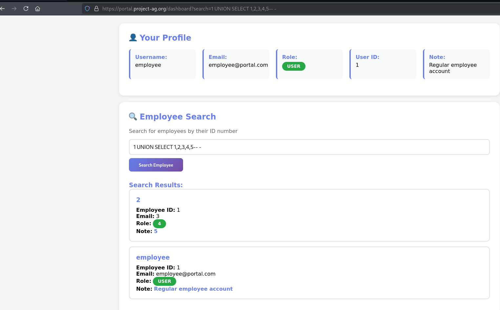

Next we need to search which column accepts a string. Screenshot below shows that the second column is the employee name thus accepts string.

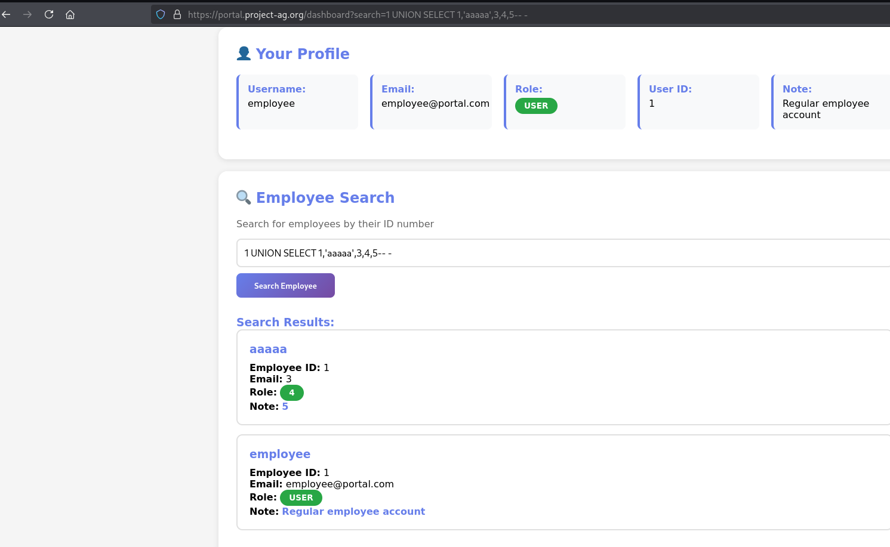

We can quickly get what database server we're dealing with. Turns out it is an SQLite version 3.46.1.

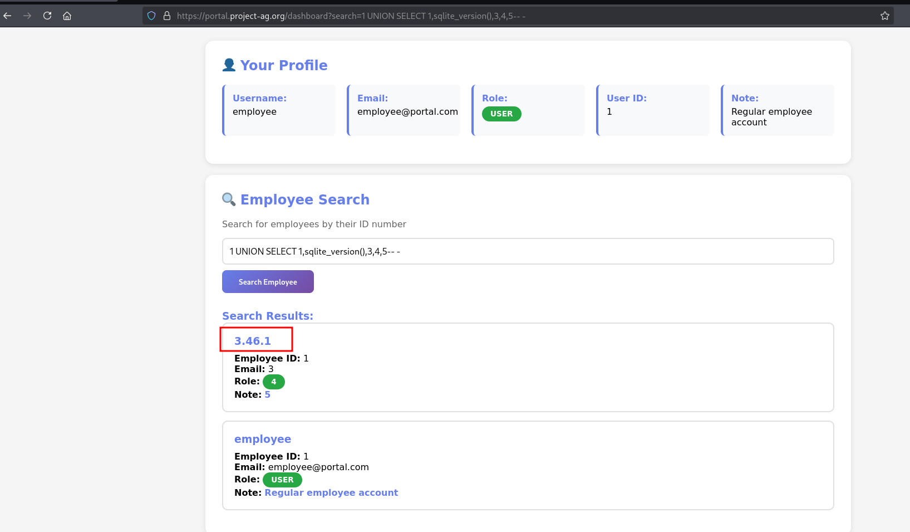

Then we proceeded dumping the tables with payload below:

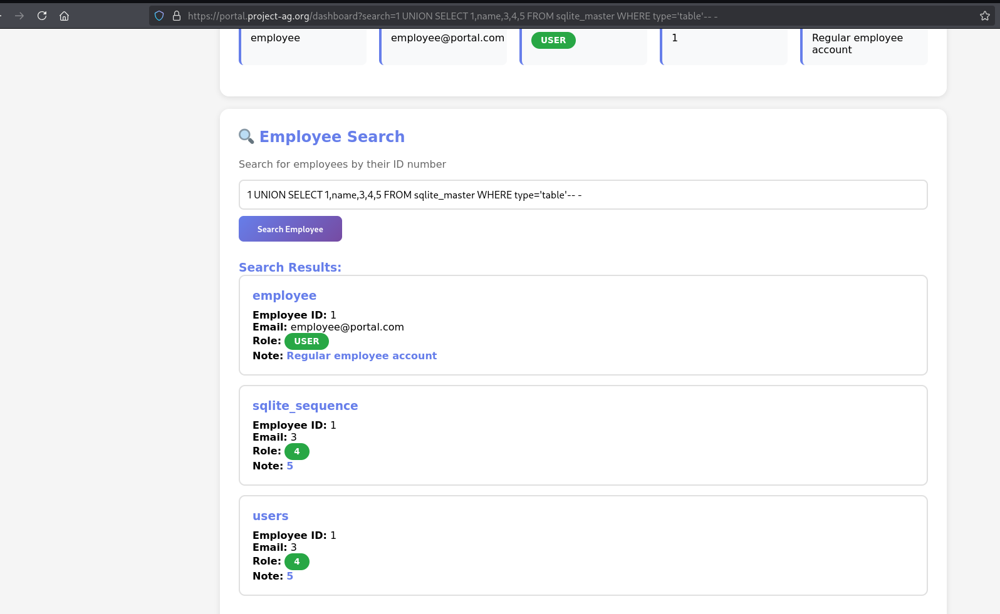

Then we dumped the columns for "users" table.

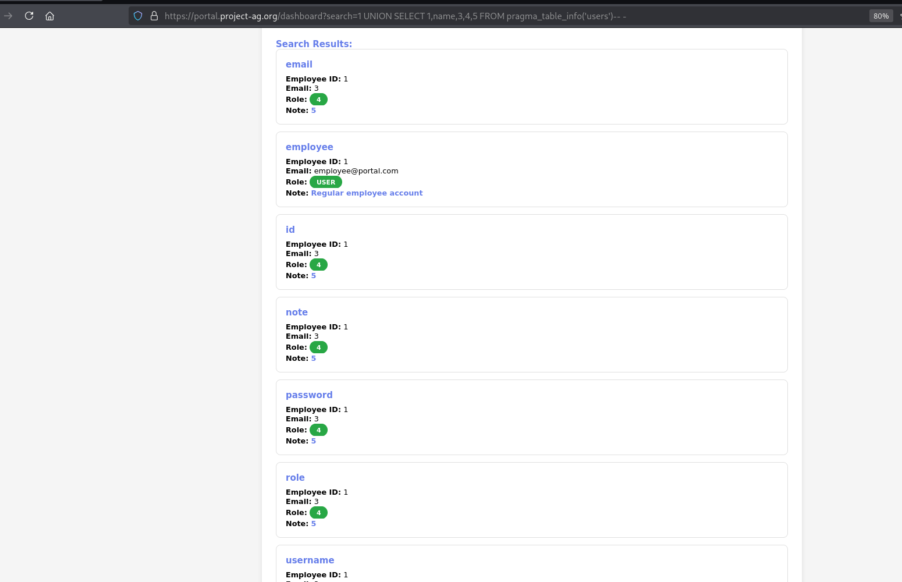

Then we dumped the "notes" columns of all users within the "users" table. Then we also got the flag.

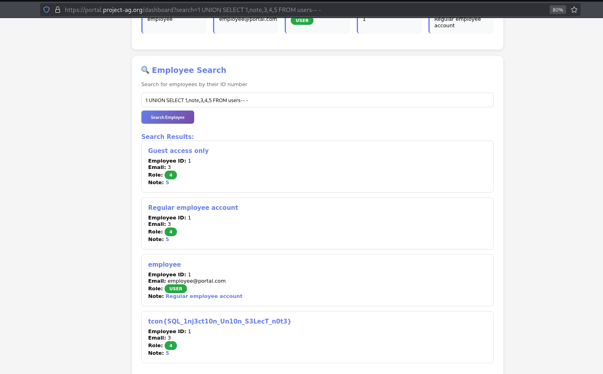
 
